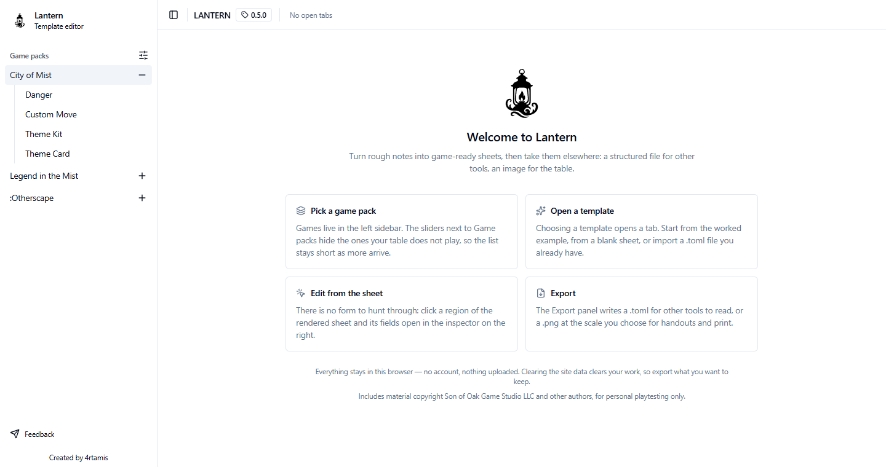
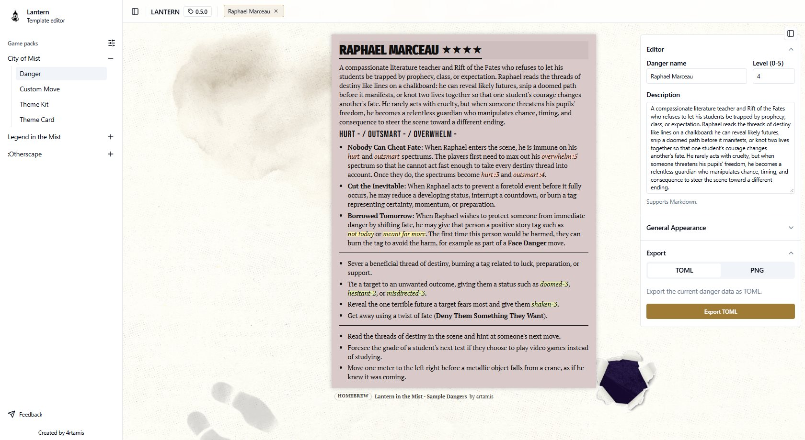
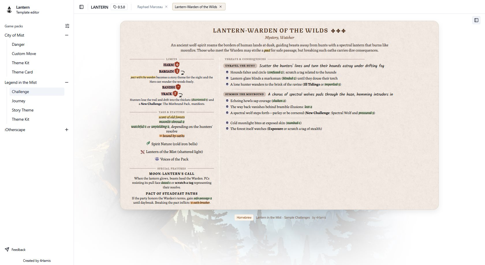
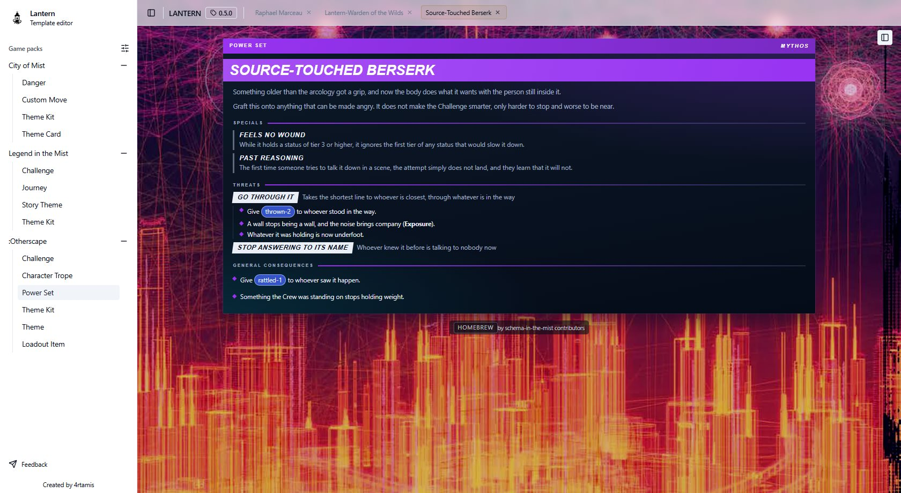

# Lantern

<p align="center">
  
</p>

<p align="center">
  <strong>Create beautiful, useful, mechanics-first tabletop content for session prep and play.</strong>
</p>

<p align="center">
  Lantern is a fan-made, unofficial, local-first web app for game masters who want to quickly build polished, interoperable material for Son of Oak's tabletop roleplaying games <strong>City of Mist</strong>, <strong>Legend in the Mist</strong>, and <strong>:Otherscape</strong>.
</p>

<p align="center">
  No account. No server. Your work stays in your browser and leaves it only when you export it.
</p>

> Lantern started life as **Lantern in the Mist**, a fork of [4rtamis/lantern-in-the-mist](https://github.com/4rtamis/lantern-in-the-mist) under the MIT licence. It is now developed independently and no change flows back upstream. The app is being widened beyond the Mist Engine, which is why it dropped the second half of its name.

## Overview

Lantern has one practical goal: turn rough notes into clean, game-ready material without fighting a layout tool.

The app is built around reusable template editors, so every supported game object offers:

- structured editing
- a live preview that reproduces the printed sheet
- TOML import/export for tool interoperability
- PNG export for sharing and printing
- local browser persistence, with no account

Games are grouped into **game packs** in the left sidebar. A pack can be hidden from the picker so the list stays readable as more games arrive; hiding one never touches the documents already open.

## Screenshots

The first screen: pick a game pack on the left, open a template, and it becomes a tab.



Editing is preview-driven - clicking a region of the rendered sheet opens its form in the inspector on the right. Each game keeps the look of its own book.

| Game               | Document  | Screenshot                                                                                              |
| ------------------ | --------- | ------------------------------------------------------------------------------------------------------- |
| City of Mist       | Danger    | [](docs/assets/screenshot-com.jpg)                 |
| Legend in the Mist | Challenge | [](docs/assets/screenshot-litm.jpg)      |
| :Otherscape        | Power Set | [](docs/assets/screenshot-otherscape.jpg)  |

## Why TOML

Lantern uses **TOML as an exchange format** so content can move between tools instead of being trapped inside one editor.

The documents validate against the Zod schemas published in [schema-in-the-mist](https://github.com/RebelliousSmile/schema-in-the-mist) — itself a fork of [4rtamis/schema-in-the-mist](https://github.com/4rtamis/schema-in-the-mist). That repository is the source of truth for the format: a schema is authored there first, then vendored into this app.

The shared format is meant to support tools such as:

- **Foundry VTT systems** for Mist Engine games, when implemented
- Obsidian plugins for Mist Engine vaults — [Brumes](https://github.com/4rtamis/obsidian-brumes) and its fork [Handbook](https://github.com/RebelliousSmile/obsidian-handbook)
- other community tools, scripts, converters, and publishing workflows

Where TOML gives a stable structured layer, **PNG export** makes sure the result can still be used anywhere: session notes, player handouts, VTT journals, chat, print, or a PDF assembled elsewhere.

## Local-First Workflow

- Everything is stored in your browser's `localStorage`; nothing is uploaded.
- No account is needed, and there is no backend to be offline from.
- Start a document from a worked example, from a blank sheet, or by importing a `.toml` file.
- Editing is preview-driven: click a region of the rendered sheet and its fields open in the inspector.
- Every template exports a `.toml` and a `.png` at the scale you choose.
- Clearing the site data clears the workspace, so export what you want to keep.

## Supported Content

- **City of Mist**: Danger Profiles, Custom Moves, Theme Kits, Theme Cards
- **Legend in the Mist**: Challenges, Story Themes, Journeys, Theme Kits
- **:Otherscape**: Challenges, Power Sets, Theme Kits, Themes, Loadout Items, Character Tropes

Every template listed in the app is implemented; there are no roadmap placeholders in the sidebar.

## Current Status

Early days. Expect active iteration, incomplete coverage, and format adjustments while the app and the shared schemas stabilise — a document exported today may need a re-import after a schema change.

The material this app reproduces is not all covered by its licence; see [License](#license) below before sharing anything you produce with it.

## Developer Docs

If you want to work on the editor itself, start here:

- [Codebase Architecture](docs/codebase-architecture.md)
- [Adding a Template](docs/adding-a-template.md)

## Run Locally

Use a recent Node.js LTS release and `npm`.

```bash
npm install
npm run dev
```

Then open the local Vite URL shown in the terminal.

Useful commands:

```bash
npm run build    # tsc -b && vite build — the only typecheck
npm run lint     # eslint
npm run preview  # serve a production build
npm run format   # prettier over ./src
```

There is no test suite. `npm run build` and `npm run lint` are the automated gates; anything visual is verified by hand against a real build.

## Project Notes

- Built with React, TypeScript, Vite, Zustand, Zod, Tailwind CSS, and a shared template runtime.
- Workspace tabs persist to `localStorage`, which is what keeps editing local and account-free.
- PNG export renders the live preview node with `@zumer/snapdom`, so what you see is what you export.
- Five display faces load from Google Fonts, which is the app's only runtime network call; the rest ship with the bundle.

## License

The source code in this repository is licensed under the **MIT License**, with two copyright lines: the original work and this fork's modifications.

This project also contains or references game-specific visual and textual material that is **not covered by MIT**. In particular:

> This work contains material that is copyright of Son of Oak Game Studio LLC and/or other authors.

That includes, for example, certain icons, background images, and other setting- or game-related material. Those assets remain the property of their respective copyright holders, must be treated separately from the open-source code, and are intended for personal playtesting use only.

## Acknowledgements

Lantern is an unofficial fan-made project. It grew out of [4rtamis](https://github.com/4rtamis)' Lantern in the Mist, itself inspired by the fantastic work of PixelTable for Darrington Press' [Daggerheart Card Creator](https://cardcreator.daggerheart.com/).
