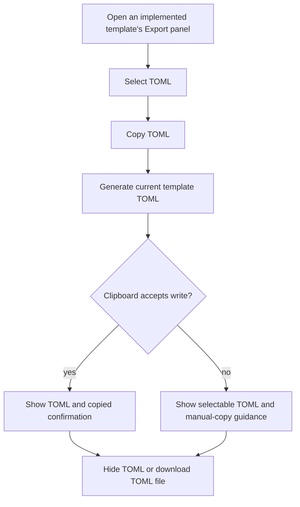
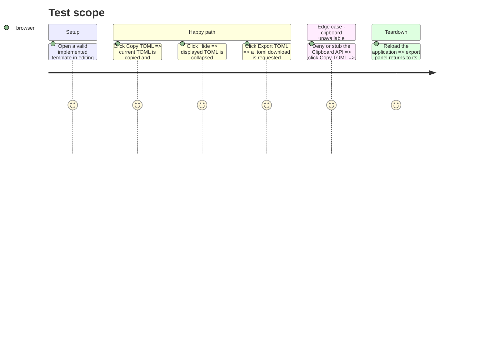

# Instruction: Shared TOML export experience

## Architecture projection

> Tree of the final files. ✅ create · ✏️ modify · ❌ delete

```txt
src/
  core/
    templates/
      shell/
        TemplateExportPanel.tsx  ✏️ (TOML generation, clipboard copy, visible text fallback, and secondary download control)
```

## User Journey



## Test Scope



## Wireframe

```txt
┌──────────────────────────────────┐
│ (1) Export action tabs            │
├──────────────────────────────────┤
│ (2) Selected action description   │
│                                  │
│ (3) Primary TOML control          │
│ (4) Secondary file control        │
│                                  │
│ (5) Generated TOML text block     │
│     (6) Collapse control           │
└──────────────────────────────────┘
```

1. Export action selector, unchanged from the current panel.
2. Context for the selected export action.
3. Primary control for the direct-paste workflow.
4. Lower-priority control for file download.
5. Read-only generated TOML available for inspection and manual selection in a bounded, scrollable region.
6. Control that removes the TOML text block from view.

## Tasks to do

### `1)` Add the TOML copy and reveal flow to the shared export panel

> Use the active template's existing TOML codec so every template gets the same interaction without rewriting its download action.

1. Detect the selected `toml` export action and its `activeTemplate.io.exportToml` codec in `TemplateExportPanel`.
2. On the primary control, serialize the active document, reveal that exact text in a read-only selectable text area, and attempt `navigator.clipboard.writeText` from the click handler.
3. Show a success toast only after clipboard write succeeds; on rejection, retain the revealed text and show a concise manual-copy failure toast.
4. Constrain the revealed TOML text area to a scrollable maximum height so a large document cannot push the inspector's controls outside the viewport.
5. Add a hide control that collapses the revealed text; reset the revealed TOML when the active tab or selected export action changes so one document's content cannot appear under another.
6. For TOML only, render the existing download `run` action as a visually secondary `Export TOML` control. Preserve the current PNG settings and one-button export flow unchanged.

### `2)` Verify the browser behavior and regression gates

> Exercise the primary Obsidian-oriented workflow and the browser fallback before static checks.

1. Manually verify copy, visible text, hide, and file download from a valid template in the running app.
2. Temporarily deny or replace clipboard access in browser developer tools and verify visible selectable TOML plus the failure notification.
3. Format only the modified shell directory, then run `npm run lint` and `npm run build`.

## Test acceptance criteria

| Task | Acceptance criteria |
| ---- | ------------------- |
| 1 | With TOML selected, the primary control reveals precisely the serialized active document and copies that same string when clipboard access is available. |
| 1 | The displayed TOML is read-only and selectable, hides only through its collapse control, and never carries over to a different tab or export action. |
| 1 | A long TOML document remains readable through the text area's own scroll area without obscuring the export controls. |
| 1 | Clipboard denial leaves the TOML visible and provides a failure notification; it does not trigger a file download. |
| 1 | `Export TOML` still requests the same `.toml` download, while PNG export controls and settings behave as before. |
| 2 | Manual browser checks cover successful copy, clipboard denial, hiding, and file download; lint and build exit successfully. |
