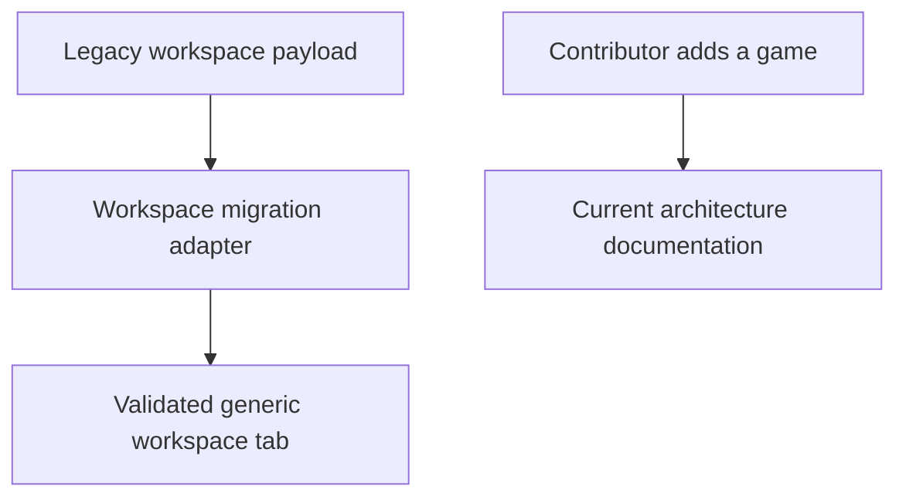
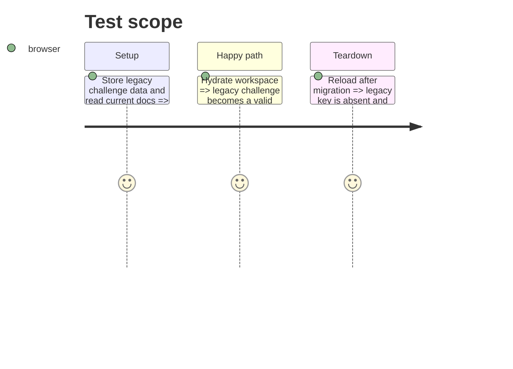

# Instruction: Generic workspace migration and documentation

## Architecture projection

> Tree of the final files. ✅ create · ✏️ modify · ❌ delete

```txt
.
├── src/core/workspace/store.ts                         ✏️ delegate legacy payload normalization without importing a template model
├── src/core/workspace/legacyMigration.ts               ✅ own the legacy challenge conversion at the workspace boundary
├── docs/codebase-architecture.md                       ✏️ describe every current game family and generic game IDs
└── docs/adding-a-template.md                           ✏️ remove the obsolete restricted game-path example
```

## User Journey



## Test Scope



## Tasks to do

### `1)` Restore the generic workspace boundary

> Preserve legacy migration while removing the template import from the core store.

1. Extract the normalizing conversion into a workspace-owned migration adapter with its contract validation.
2. Make `store.ts` consume the adapter’s generic tab-ready result only.
3. Update both developer documents for registry-derived, arbitrary game IDs and the current game families.

## Test acceptance criteria

| Task | Acceptance criteria |
| --- | --- |
| 1 | `src/core/workspace/store.ts` no longer imports a template model, while a valid legacy challenge still hydrates into the same editing tab. |
| 1 | Architecture and template documentation name the current generic game model and no longer imply only three supported game directories. |
