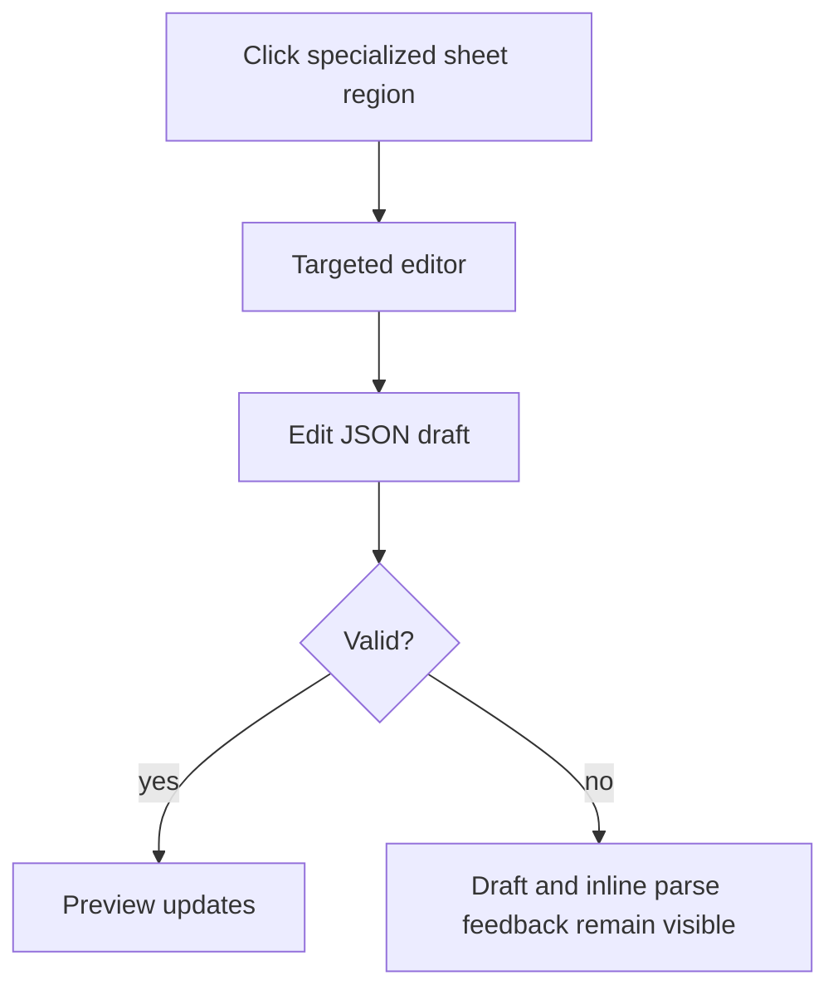
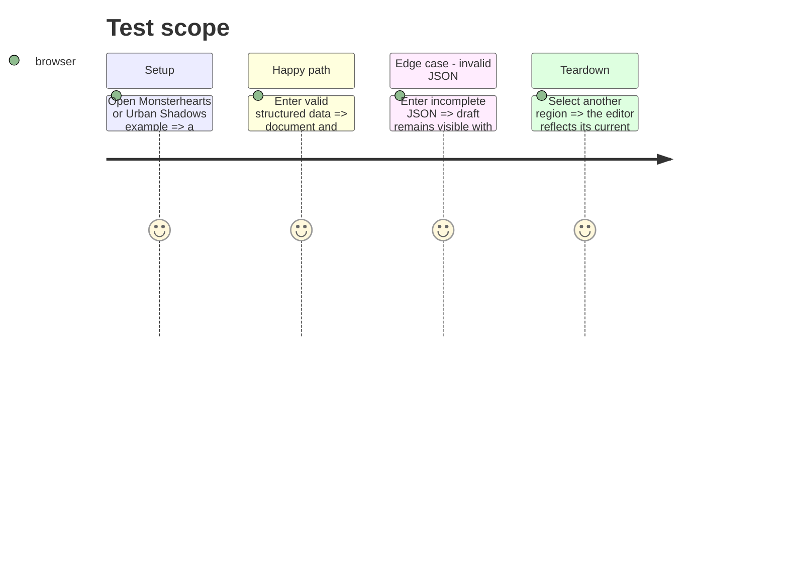

# Instruction: Specialized playbook editor cleanup

## Architecture projection

> Tree of the final files. ✅ create · ✏️ modify · ❌ delete

```txt
.
├── src/templates/monsterhearts/playbook/definition.tsx                 ✏️ format and split export/template helpers
├── src/templates/monsterhearts/playbook/editor/MonsterheartsPlaybookEditorPanel.tsx ✏️ route targets through readable forms and retain invalid drafts with feedback
├── src/templates/urban-shadows/playbook/editor/UrbanShadowsPlaybookEditorPanel.tsx ✏️ separate gating, target routing, and structured values
└── src/templates/shared/StructuredJsonEditor.tsx                       ✅ reusable local-draft JSON editor with parse feedback
```

## User Journey



## Test Scope



## Wireframe

```txt
┌──────────────────────────────┐
│ (1) Selected region label     │
├──────────────────────────────┤
│ (2) Structured draft editor   │
├──────────────────────────────┤
│ (3) Parse feedback            │
└──────────────────────────────┘
```

1. Region label identifies the current preview target.
2. Draft editor preserves user text until it can become document state.
3. Feedback explains why an invalid draft did not update the preview.

## Tasks to do

### `1)` Make structured editors reusable and explicit

> Eliminate duplicated parsing behavior without changing specialized document contracts.

1. Add a reusable local-draft editor with a parse error state and an `onValidValue` callback.
2. Refactor both specialized panels into target routing plus small identity and structured editor paths.
3. Reformat the Monsterhearts definition into named, testable helpers.

## Test acceptance criteria

| Task | Acceptance criteria |
| --- | --- |
| 1 | Invalid JSON is not persisted, remains visible, and names a parse error in both specialized editors. |
| 1 | Valid JSON updates only the selected specialized field and immediately re-renders its preview. |
| 1 | Both modules retain their existing codec keys, export actions, and game-definition handling. |
