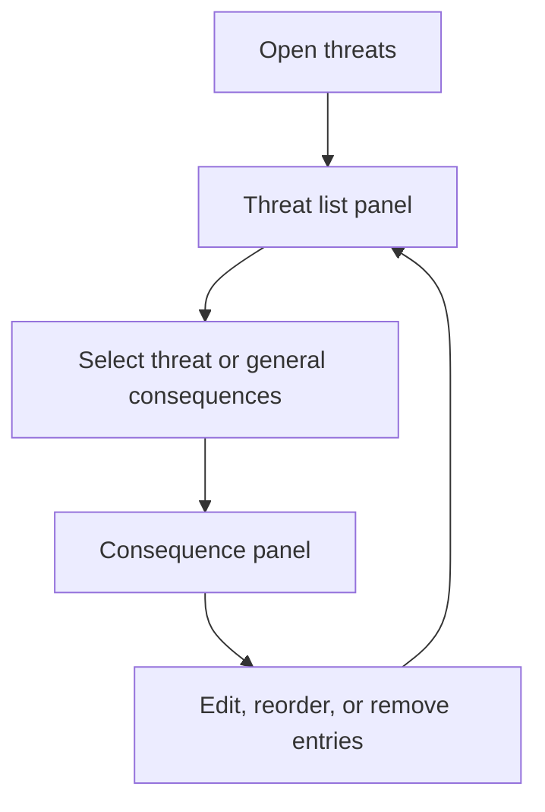
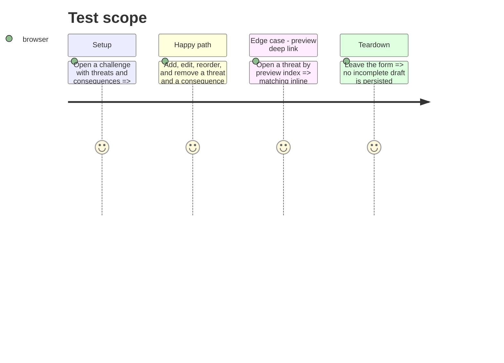

# Instruction: Challenge threats editor decomposition

## Architecture projection

> Tree of the final files. ✅ create · ✏️ modify · ❌ delete

```txt
.
└── src/templates/legend-in-the-mist/challenge/editor/forms/
    ├── ThreatsForm.tsx                              ✏️ retain panel state and compose extracted regions
    ├── ThreatListPanel.tsx                           ✅ own threat listing, inline threat edit, and threat DnD
    ├── ConsequencesPanel.tsx                         ✅ own selected/general consequence editing and DnD
    └── threatEditorPrimitives.tsx                    ✅ share rows and inline consequence controls
```

## User Journey



## Test Scope



## Tasks to do

### `1)` Split threats by panel responsibility

> Keep behavior stable while making the historical 1,001-line component composable.

1. Move list and consequence panel rendering plus their focused row primitives into dedicated files.
2. Retain the top-level panel state, deep-link behavior, store actions, and DnD semantics in clear interfaces.
3. Run the existing manual editor scenarios, lint, and build.

## Test acceptance criteria

| Task | Acceptance criteria |
| --- | --- |
| 1 | Threat and consequence create/edit/reorder/remove behavior remains available from the same form routes. |
| 1 | Preview deep links still open the requested threat editor. |
| 1 | `ThreatsForm.tsx` is a coordinator rather than a thousand-line mixed-responsibility component, and lint/build pass. |
