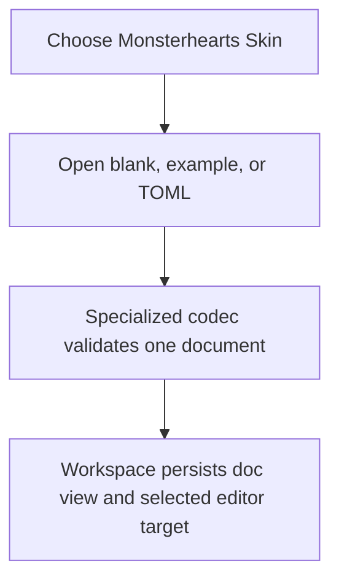
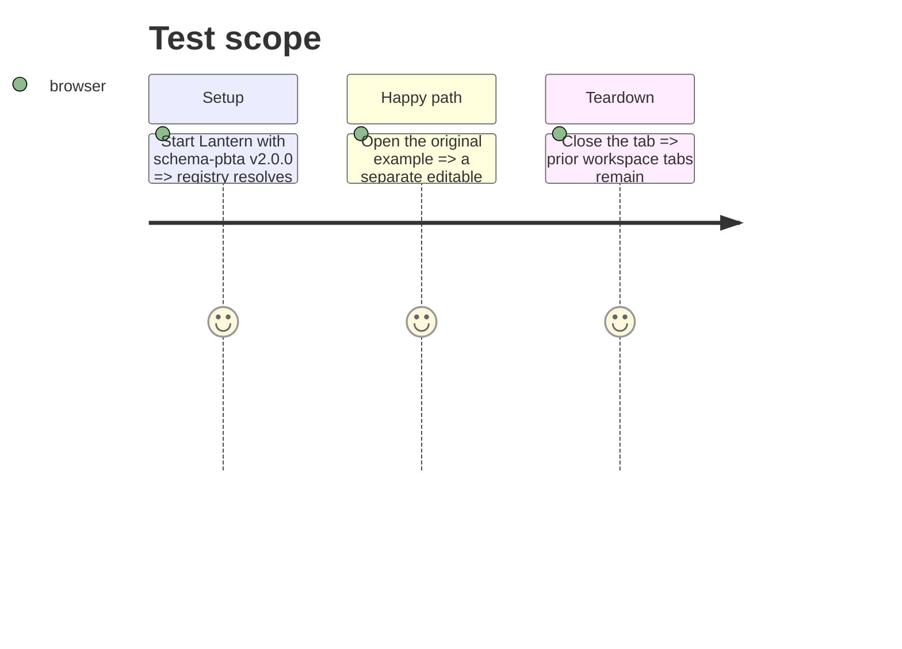

# Instruction: Monsterhearts template foundation

## Architecture projection

> Tree of the final files. ✅ create · ✏️ modify · ❌ delete

```txt
.
├── src/core/templates/registry.tsx                                    ✏️ register the dedicated Monsterhearts template
└── src/templates/monsterhearts/playbook/
    ├── definition.tsx                                                  ✅ bind launcher, codec key, panels, TOML and PNG actions
    ├── schema.ts                                                       ✅ type-only published MonsterheartsPlaybook export
    ├── model.ts                                                        ✅ normalize specialized document, view and sheet state
    ├── toml.ts                                                         ✅ use pbta/monsterhearts-playbook for canonical import/export
    ├── sample.ts                                                       ✅ original complete skin example
    ├── metadata.ts                                                     ✅ appearance section labels
    └── hooks.ts                                                        ✅ immutable workspace-backed state updates
```

## User Journey



## Test Scope



## Tasks to do

### `1)` Add the specialized document boundary

> Create a self-contained template without changing generic PbtA or Urban Shadows modules.

1. Model the shared fields and Monsterhearts-only strings, conditions, sex move, darkest self, backstory, advances and harm.
2. Use the published contract registry and canonical TOML helpers; make blank required sex move, darkest self and advances export-valid.
3. Add original sample data, workspace hooks and template registration.

## Test acceptance criteria

| Task | Acceptance criteria |
| --- | --- |
| 1 | A blank or example Monsterhearts skin opens separately and valid specialized TOML round-trips as one document. |
| 1 | Generic PbtA and Urban Shadows templates keep their existing contract keys and behavior. |
