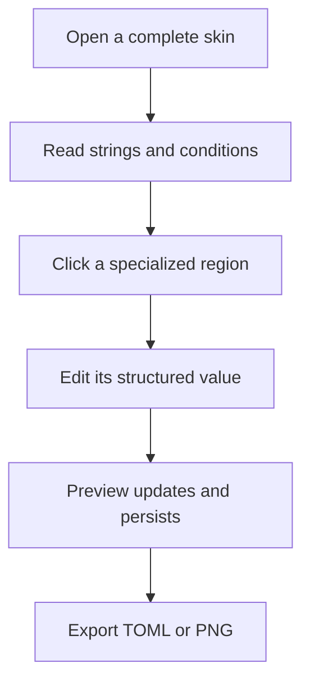
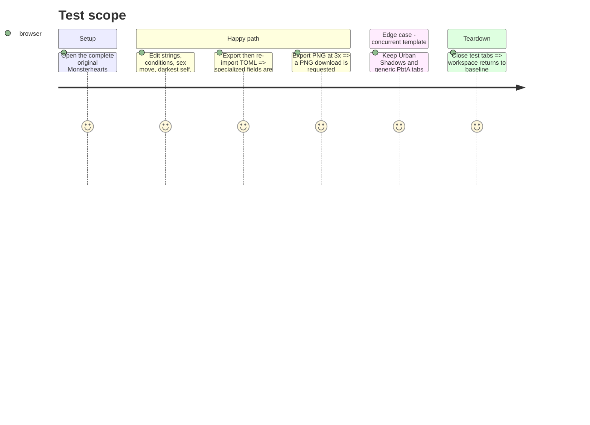

# Instruction: Skin renderer and verification

## Architecture projection

> Tree of the final files. ✅ create · ✏️ modify · ❌ delete

```txt
.
└── src/templates/monsterhearts/playbook/
    ├── editor/MonsterheartsPlaybookEditorPanel.tsx                     ✅ targeted identity and structured skin-section editing
    ├── editor/MonsterheartsPlaybookAppearancePanel.tsx                ✅ per-tab section visibility and width
    ├── editor/MonsterheartsPlaybookImageExportSettings.tsx            ✅ PNG scale selection
    └── preview/
        ├── MonsterheartsPlaybookPreview.tsx                            ✅ clickable skin regions
        └── monsterheartsPlaybookTheme.css                              ✅ original `.monsterhearts-doc` scoped styling
```

## User Journey



## Test Scope



## Wireframe

```txt
┌──────────────────────────────────────────────┐
│ (1) Skin identity                             │
├───────────────────────┬──────────────────────┤
│ (2) Strings            │ (3) Conditions       │
├───────────────────────┼──────────────────────┤
│ (4) Sex move           │ (5) Darkest self     │
├───────────────────────┴──────────────────────┤
│ (6) Backstory · moves · advances · harm       │
└──────────────────────────────────────────────┘
```

1. Identity: name and original skin summary.
2. Strings: capacity and starting value.
3. Conditions: named, optional described social markers.
4. Sex move: required skin mechanic.
5. Darkest self: required skin mechanic.
6. Backstory, moves, advances and harm: remaining selectable skin data.

## Tasks to do

### `1)` Deliver the original Monsterhearts sheet

> Render and expose every specialized field without stranding it outside the editor.

1. Create clickable preview regions and matching targeted editors for all specialized fields.
2. Apply immutable updates only after structured values parse and retain required blank values.
3. Scope every stylesheet depth-0 selector beneath `.monsterhearts-doc`.

### `2)` Verify isolation and local-first exports

> Prove the skin works without regressing existing PbtA templates.

1. Exercise import, edits, reload persistence, TOML round-trip and 3x PNG export.
2. Keep Urban Shadows and generic playbook tabs open while verifying CSS and state isolation.
3. Run `npm run lint` and `npm run build`.

## Test acceptance criteria

| Task | Acceptance criteria |
| --- | --- |
| 1 | Strings, conditions, sex move, darkest self, backstory, advances and harm visibly render and each opens an editor. |
| 1 | Monsterhearts preview CSS is limited to `.monsterhearts-doc` and contains only original resources and prose. |
| 2 | A complete skin retains all specialized fields through reload and single-TOML export/re-import; 3x PNG export succeeds. |
| 2 | Urban Shadows and generic PbtA playbooks remain unaffected, while lint and build pass. |
