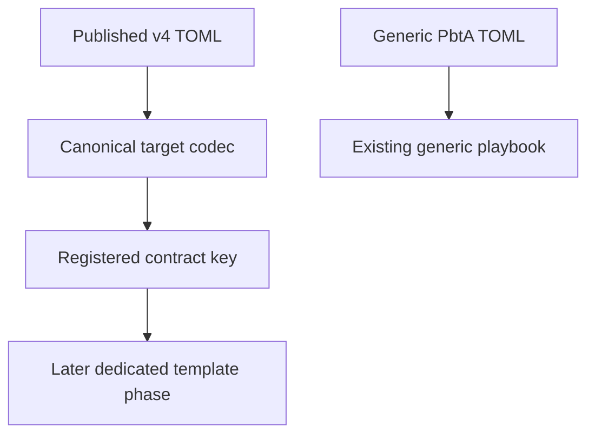
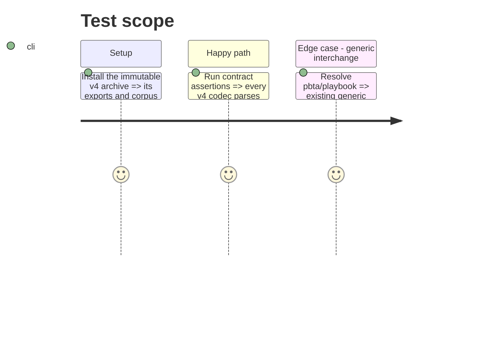

# Instruction: Adopt the published v4 contract and conformance corpus

## Architecture projection

> Tree of the final files. ✅ create · ✏️ modify · ❌ delete

```txt
.
├── package.json                                  ✏️ pin the immutable schema-pbta v4 archive
├── package-lock.json                             ✏️ lock the same published archive and integrity data
├── src/contracts/pbta.ts                         ✏️ retain the registry fold across the v4 codec table
└── tools/contractManifests.mjs                   ✏️ resolve the released v4 corpus manifest without package-path assumptions
```

## User Journey



## Test Scope



## Tasks to do

### `1)` Establish the v4 contract boundary

> Replace the v2 dependency with the published v4 archive and establish its contract boundary before any dedicated template is built.

1. Inspect the released export map, types, codecs, corpus manifest, and accepted/rejected fixtures before selecting model boundaries.
2. Pin the exact v4 release archive and update the package lock without changing contract data locally.
3. Confirm the registry fold and corpus normalizer resolve all v4 codecs and fixtures; defer Lantern-module mapping to the final verification phase.

## Test acceptance criteria

| Task | Acceptance criteria |
| --- | --- |
| 1 | All five published specialized contract keys resolve, and their accepted/rejected corpus witnesses parse with the released codecs. |
| 1 | Generic `pbta/playbook` continues to resolve independently and is not used as a fallback for a specialized document. |
| 1 | The dependency is pinned to the immutable published v4 archive; Lantern contains no copied schema or codec implementation. |
