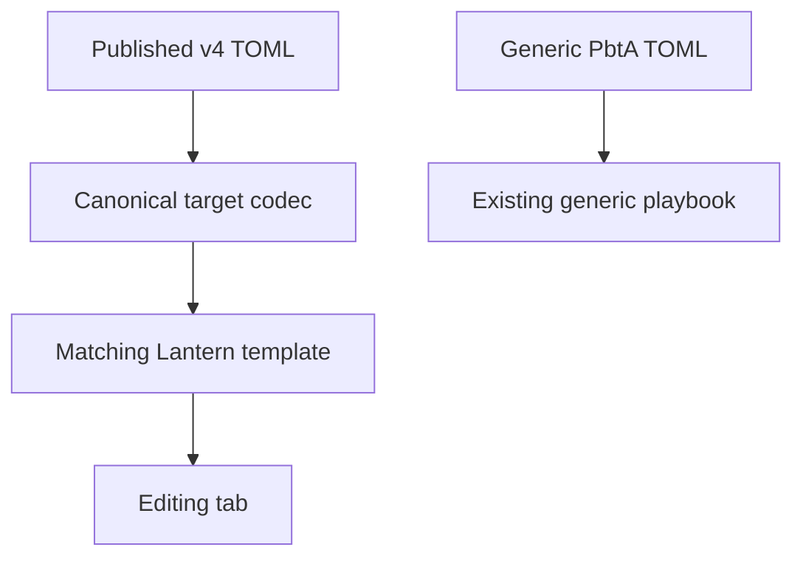
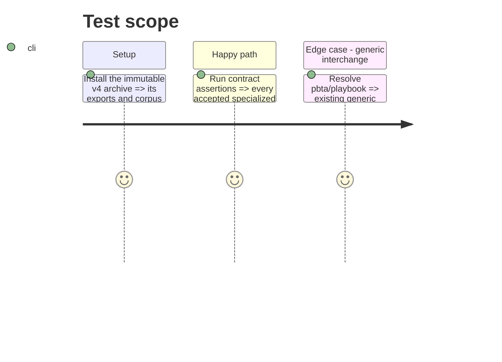

# Instruction: Adopt the published v4 contract and conformance corpus

## Architecture projection

> Tree of the final files. ✅ create · ✏️ modify · ❌ delete

```txt
.
├── package.json                                  ✏️ pin the immutable schema-pbta v4 archive
├── package-lock.json                             ✏️ lock the same published archive and integrity data
├── src/contracts/pbta.ts                         ✏️ expose every v4 codec through the contract registry
├── src/core/templates/registry.tsx               ✏️ register canonical target templates and preserve generic interchange
├── tools/contractManifests.mjs                   ✏️ keep v4 corpus resolution compatible with its published manifest
└── tools/assertContracts.harness.mts             ✏️ map every accepted canonical witness to its Lantern module
```

## User Journey



## Test Scope



## Tasks to do

### `1)` Establish the v4 contract boundary

> Replace the v2 dependency only after v4 is published, then make the registry and harness prove the five canonical targets.

1. Inspect the released export map, types, codecs, corpus manifest, and accepted/rejected fixtures before selecting model boundaries.
2. Pin the exact v4 release archive and update the package lock without changing contract data locally.
3. Extend registry and corpus-harness mappings for every specialized codec; keep generic `pbta/playbook` separate from canonical routing.

## Test acceptance criteria

| Task | Acceptance criteria |
| --- | --- |
| 1 | All five published specialized contract keys resolve, and their accepted corpus witnesses map to a Lantern module. |
| 1 | Generic `pbta/playbook` continues to resolve independently and is not used as a fallback for a specialized document. |
| 1 | The dependency is pinned to the immutable published v4 archive; Lantern contains no copied schema or codec implementation. |
