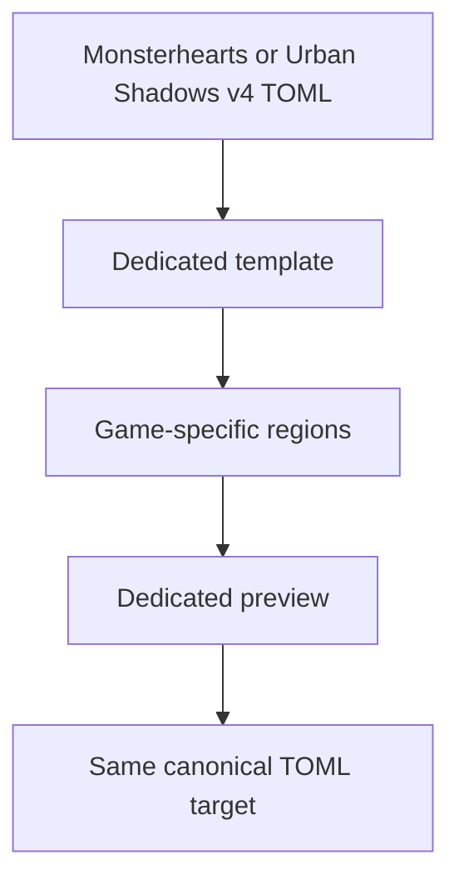
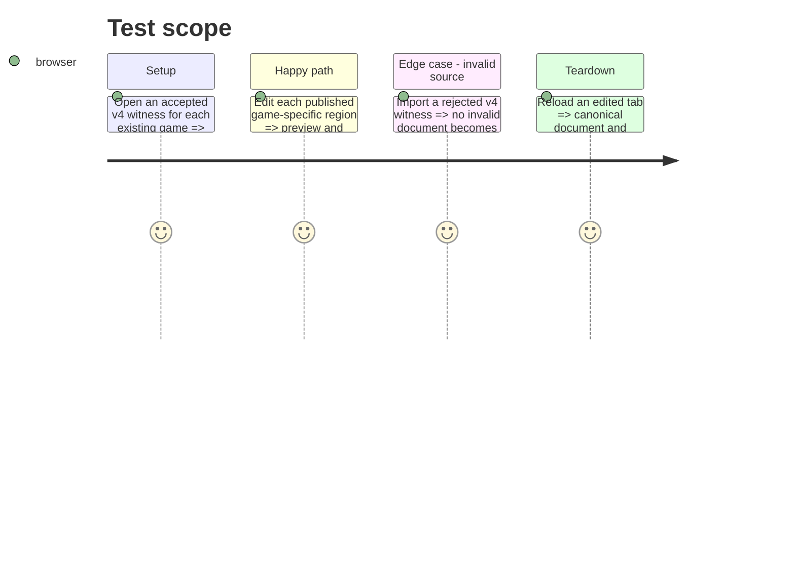

# Instruction: Migrate the existing Monsterhearts and Urban Shadows canonical sheets

## Architecture projection

> Tree of the final files. ✅ create · ✏️ modify · ❌ delete

```txt
.
├── src/templates/monsterhearts/playbook/          ✏️ align model, TOML I/O, sections, editor, preview, and samples to v4
├── src/templates/urban-shadows/playbook/          ✏️ align model, TOML I/O, sections, editor, preview, and samples to v4
└── src/templates/shared/                          ✏️ extract only genuinely shared specialized-playbook controls
```

## User Journey



## Test Scope



## Wireframe

```txt
┌──────────────────────────────────────────┐
│ (1) Canonical playbook heading            │
├─────────────────┬────────────────────────┤
│ (2) Sheet       │ (3) Editor panel        │
│ game-specific   │ selected region controls │
│ regions         │                          │
├─────────────────┴────────────────────────┤
│ (4) Export: canonical TOML · PNG          │
└──────────────────────────────────────────┘
```

1. Canonical heading identifies the target selected by the imported or created document.
2. Sheet preserves each game’s published editorial regions and mechanics.
3. Editor exposes controls for the selected region without flattening it to the generic form.
4. Export actions operate on the same canonical TOML document shown by the sheet.

## Tasks to do

### `1)` Reconcile existing specialized templates with v4

> Preserve the dedicated Monsterhearts and Urban Shadows experiences while deriving their fields and TOML behavior from the released v4 codecs.

1. Compare current models and samples with the released type and corpus fixtures; replace only fields or defaults that differ.
2. Update each dedicated editor and preview to expose every published mechanic and editorial region.
3. Keep import, persistence, export, and PNG actions bound to the matching specialized contract key.

## Test acceptance criteria

| Task | Acceptance criteria |
| --- | --- |
| 1 | Accepted v4 Monsterhearts and Urban Shadows TOML opens in its matching dedicated template and exports back to that target. |
| 1 | Every game-specific field published by v4 remains editable and visible in its dedicated preview. |
| 1 | Rejected fixtures cannot be persisted as a valid tab document. |
