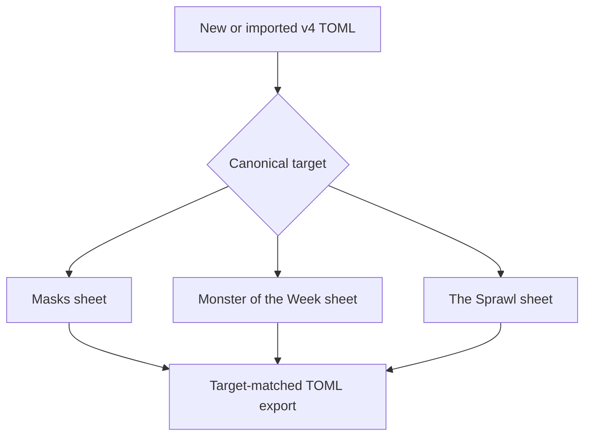
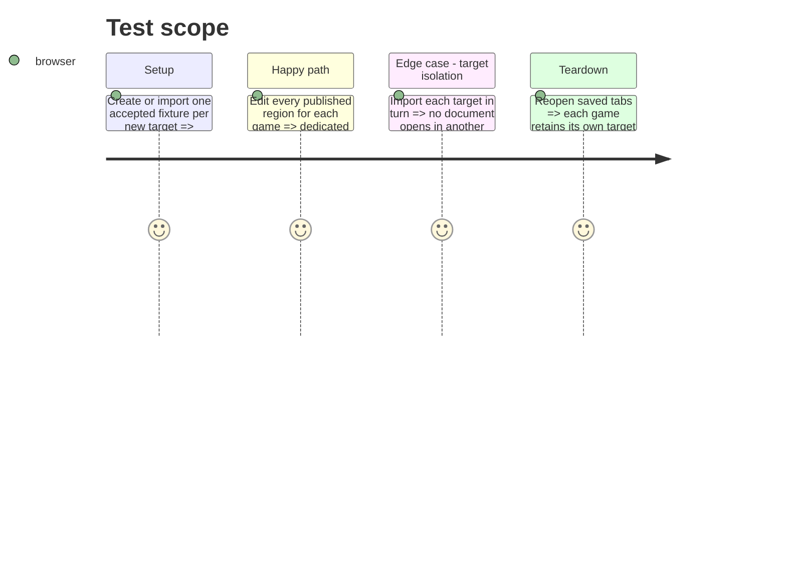

# Instruction: Add Masks, Monster of the Week, and The Sprawl canonical sheets

## Architecture projection

> Tree of the final files. ✅ create · ✏️ modify · ❌ delete

```txt
.
├── src/templates/masks/playbook/                  ✅ dedicated v4 model, TOML I/O, editor, preview, samples, and appearance
├── src/templates/monster-of-the-week/playbook/    ✅ dedicated v4 model, TOML I/O, editor, preview, samples, and appearance
├── src/templates/the-sprawl/playbook/             ✅ dedicated v4 model, TOML I/O, editor, preview, samples, and appearance
└── src/core/templates/registry.tsx                ✏️ expose the three new canonical template definitions
```

## User Journey



## Test Scope



## Wireframe

```txt
┌──────────────────────────────────────────┐
│ (1) Game-specific playbook identity       │
├─────────────────┬────────────────────────┤
│ (2) Published   │ (3) Region editor       │
│ mechanics and   │ focused controls for     │
│ editorial areas │ the selected sheet area  │
├─────────────────┴────────────────────────┤
│ (4) Canonical TOML and image export       │
└──────────────────────────────────────────┘
```

1. Identity distinguishes the selected canonical game target.
2. The preview lays out every mechanic and editorial area supplied by that game’s v4 type.
3. The editor follows the preview’s selected region rather than exposing a generic catch-all form.
4. Both exports operate on the canonical document currently open.

## Tasks to do

### `1)` Build the three missing canonical template families

> Add separate Masks, Monster of the Week, and The Sprawl template boundaries from the released v4 contract rather than cloning a generic playbook.

1. Create each target’s model, sample, TOML adapter, view/sheet state, template definition, dedicated editor, preview, CSS scope, and export settings from the published type and corpus.
2. Register all three definitions under their corresponding v4 contract keys and game groups.
3. Extract shared controls only where the released structures and interaction semantics truly match.

## Test acceptance criteria

| Task | Acceptance criteria |
| --- | --- |
| 1 | Each new canonical target creates, imports, persists, previews, and exports as one TOML document for that exact target. |
| 1 | Every v4 mechanic and editorial region for each game is editable and rendered without falling back to the generic sheet. |
| 1 | Target selection is isolated: a fixture always opens only its matching game-specific template. |
