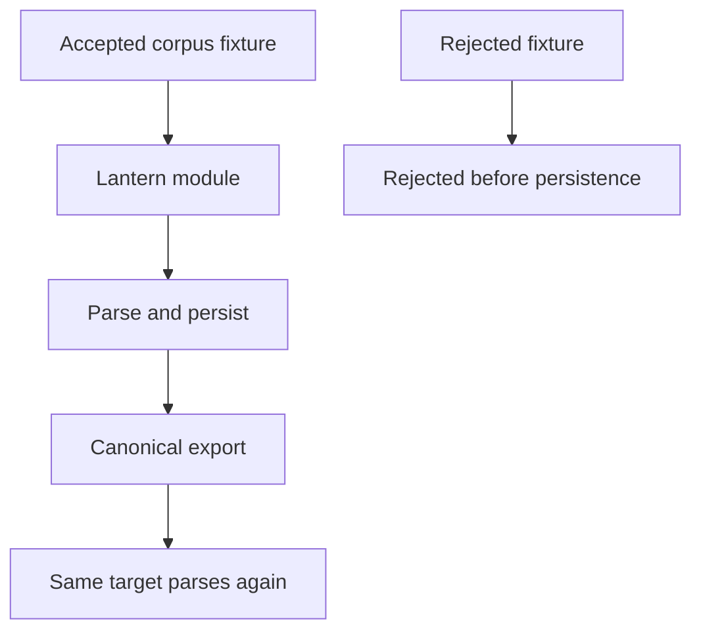
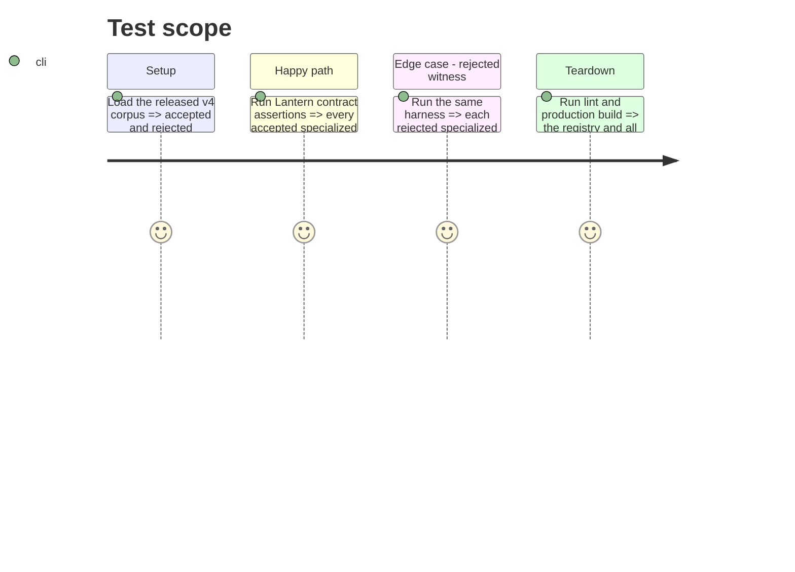

# Instruction: Prove canonical routing, round trips, and generic-workflow compatibility

## Architecture projection

> Tree of the final files. ✅ create · ✏️ modify · ❌ delete

```txt
.
├── tools/assertContracts.harness.mts              ✏️ assert all v4 accepted and rejected specialized witnesses through Lantern
├── tools/contractManifests.mjs                    ✏️ normalise any released v4 corpus-manifest dialect changes
├── src/contracts/registry.node.ts                 ✏️ expose the same registry used by browser and harness
├── docs/codebase-architecture.md                  ✏️ document canonical specialized versus generic interchange targets
└── docs/adding-a-template.md                      ✏️ document contract-first specialized template additions
```

## User Journey



## Test Scope



## Tasks to do

### `1)` Make canonical conformance observable

> Turn the released v4 corpus into a regression guard for every specialized target and document the generic/canonical boundary.

1. Extend the assertion harness so accepted witnesses must resolve to their exact Lantern module, round-trip through its serializer, and remain target-specific.
2. Assert rejected witnesses fail before persistence and generic interchange never masks a missing specialized implementation.
3. Update contributor-facing architecture guidance and run the complete lint, build, and contract checks.

## Test acceptance criteria

| Task | Acceptance criteria |
| --- | --- |
| 1 | The contract harness covers all five published specialized targets, including accepted round trips and rejected fixtures. |
| 1 | A missing specialized Lantern module fails the assertion even when generic `pbta/playbook` exists. |
| 1 | Documentation distinguishes canonical specialized sheets from the preserved generic PbtA workflow. |
