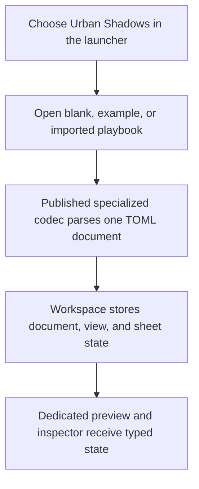
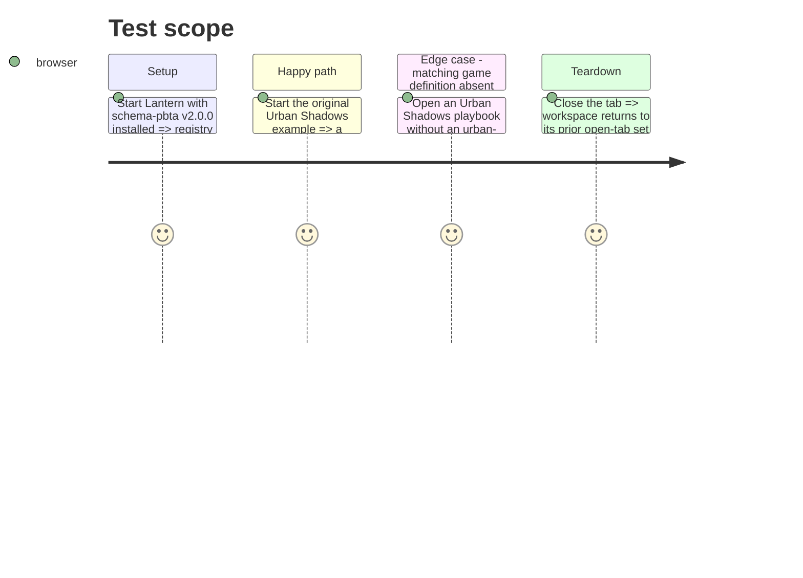

# Instruction: Urban Shadows template foundation

## Architecture projection

> Tree of the final files. ✅ create · ✏️ modify · ❌ delete

```txt
.
├── src/
│   ├── core/templates/registry.tsx                                      ✏️ import and register the dedicated Urban Shadows template
│   └── templates/urban-shadows/playbook/
│       ├── definition.tsx                                                ✅ bind template identity, launch actions, panels, and the specialized codec key
│       ├── schema.ts                                                     ✅ type-only re-export of UrbanShadowsPlaybook from schema-pbta
│       ├── model.ts                                                      ✅ normalize codec data and define document, view, sections, and sheet-target state
│       ├── toml.ts                                                       ✅ parse and stringify the atomic document through pbta/urban-shadows-playbook
│       ├── sample.ts                                                     ✅ original complete Urban Shadows example covering specialized fields
│       ├── metadata.ts                                                   ✅ sheet-section labels for appearance controls
│       ├── hooks.ts                                                      ✅ typed workspace selectors and immutable document/view/sheet updates
│       ├── editor/UrbanShadowsPlaybookEditorPanel.tsx                   ✅ route selected sheet targets and handle a missing matching game definition
│       ├── editor/UrbanShadowsPlaybookAppearancePanel.tsx               ✅ expose per-tab visibility and layout settings
│       ├── editor/UrbanShadowsPlaybookImageExportSettings.tsx           ✅ expose PNG scale setting
│       └── preview/UrbanShadowsPlaybookPreview.tsx                       ✅ assemble the dedicated preview regions and their editor targets
└── package.json                                                          — already pins schema-pbta v2.0.0; no dependency edit required
```

## User Journey



## Test Scope



## Tasks to do

### `1)` Establish the specialized template boundary

> Create a self-contained template that consumes the released Urban Shadows codec without changing the generic PbtA playbook.

1. Add the module under `src/templates/urban-shadows/playbook` and type-only re-export `UrbanShadowsPlaybook`.
2. Map every codec field to normalized editable state: shared playbook data plus Circles/statuses, mortal relationships, harm, scars, corruption, and end move; give the blank factory original non-empty defaults for required corruption (`trigger` and one advance) and `endMove`, then omit empty optional fields only when constructing the export payload.
3. Use `documentContracts.require('pbta/urban-shadows-playbook')`, `carryCanonicalSource`, and `stringifyCanonical` for import/export so all playbook data remains in one validated TOML document.
4. Define independent template, view, and sheet state, using the workspace store rather than a specialized persistence store.
5. Provide an original rich example and template metadata; wire TOML and shared PNG export actions into the definition.
6. Register `urban-shadows.playbook` beside the existing PbtA templates so the generic registry creates its game pack without shell changes.

### `2)` Connect foundation controls to the existing application boundaries

> Make the nascent module launchable, preview-driven, and safe when its game definition is not open.

1. Implement typed hooks that clone before every workspace write and expose view, document, and selected editor target updates.
2. Build the preview assembly with one clickable target per editable region and the same show/hide semantics as other templates.
3. Route targets through the dedicated editor panel; resolve the matching `urban-shadows` PbtA game definition and show a read-only explanation when it is absent.
4. Add appearance and image-export controls that affect only the active tab.

## Test acceptance criteria

| Task | Acceptance criteria |
| --- | --- |
| 1 | The launcher lists a separate Urban Shadows Playbook template; creating its blank or example opens a tab whose document is export-valid and whose example contains all specialized sections while `pbta.playbook` remains unchanged. |
| 1 | Importing valid specialized TOML and exporting it uses `pbta/urban-shadows-playbook` and produces one valid TOML document without view or sheet state. |
| 2 | Every foundation preview region opens its matching inspector target, and all writes persist through the shared workspace. |
| 2 | With no matching game definition tab open, the playbook remains readable but the inspector clearly disables game-dependent edits. |
