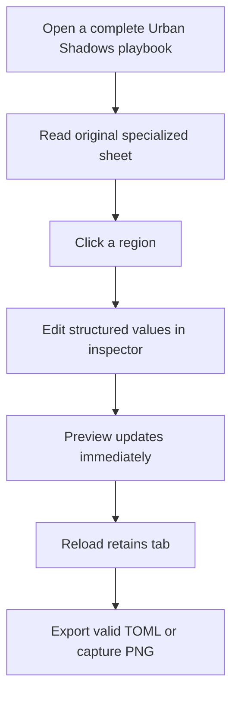
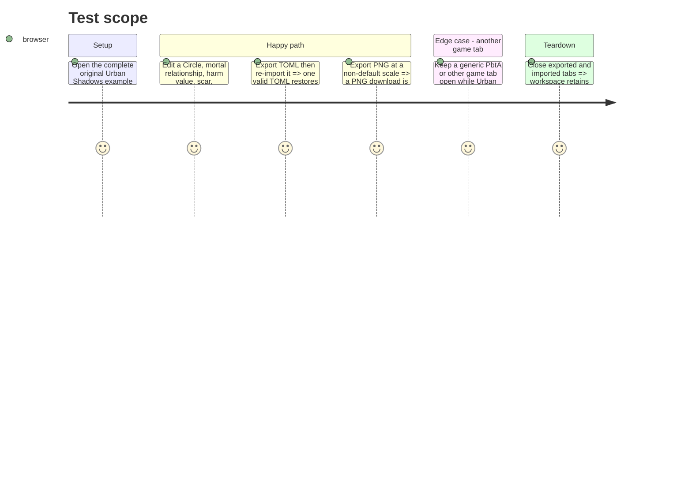

# Instruction: Structured sheet experience and verification

## Architecture projection

> Tree of the final files. ✅ create · ✏️ modify · ❌ delete

```txt
.
└── src/templates/urban-shadows/playbook/
    ├── editor/UrbanShadowsPlaybookEditorPanel.tsx                       ✏️ retain basic fields and make every specialized region editable as validated structured data
    ├── editor/UrbanShadowsPlaybookAppearancePanel.tsx                   ✏️ retain per-tab visibility and width controls
    ├── editor/UrbanShadowsPlaybookImageExportSettings.tsx               ✏️ retain PNG scale control
    └── preview/
        ├── UrbanShadowsPlaybookPreview.tsx                              ✏️ render all specialized regions with matching editor targets
        └── urbanShadowsPlaybookTheme.css                                ✏️ keep original, scoped, export-safe sheet styling
```

## User Journey



## Test Scope



## Wireframe

```txt
┌──────────────────────────────────────────────────────┐
│ (1) Identity and playbook summary                     │
├──────────────────────────┬───────────────────────────┤
│ (2) Circles and statuses │ (3) Mortal relationships   │
├──────────────────────────┼───────────────────────────┤
│ (4) Harm and scars       │ (5) Corruption / end move  │
├──────────────────────────┴───────────────────────────┤
│ (6) Moves                                             │
├────────────────────┬─────────────────────────────────┤
│ (7) Creation        │ (8) Gear and advancement        │
└────────────────────┴─────────────────────────────────┘
```

1. Identity: playbook name, game, description, and common context.
2. Circles: playbook stats, status values, and selected attributes.
3. Mortal relationships: structured named ties and optional descriptions.
4. Harm: armor and harm capacity alongside lasting scars.
5. Corruption: trigger, advances/moves, and the required end move.
6. Moves: playbook and starting moves in a readable list.
7. Creation: selectable original playbook setup choices.
8. Gear and advancement: equipment and future progression in adjacent compact regions.

## Tasks to do

### `1)` Render and edit every Urban Shadows-specific mechanic

> Deliver an original, complete playbook surface in which no structured field is stranded without an editor route.

1. Render common playbook information, Circles/statuses, mortal relationships, harm, scars, corruption, end move, moves, creation, gear, and advancement as independent clickable regions.
2. Keep identity fields direct and expose each nested region through a structured editor that applies immutable JSON updates only once the value parses; required corruption and end-move fields remain present in blank state.
3. Connect each preview region to its matching structured editor target and respect appearance visibility controls for optional regions.
4. Apply the `urban-shadows-doc` scope root to the preview wrapper; make every depth-0 stylesheet selector descend from it, prefix all owned classes, and use only original distributable visual treatment and copy.

### `2)` Validate the complete local-first workflow

> Prove the specialized sheet behaves as a first-class template without regressions to existing tabs.

1. Exercise blank, example, import, targeted edits, reload persistence, TOML export/re-import, and PNG export at a non-default scale.
2. Verify the missing-game-definition read-only state and a concurrent non-Urban-Shadows tab.
3. Format only the new module, then run `npm run lint` and `npm run build`.

## Test acceptance criteria

| Task | Acceptance criteria |
| --- | --- |
| 1 | The preview visibly renders structured Circles/statuses, mortal relationships, harm, scars, corruption, end move, moves, creation, gear, and advancement; each region opens an editor that can change its data once its structured value is valid. |
| 1 | All preview CSS descends from `.urban-shadows-doc` and uses original distributable resources, prose, and layout. |
| 2 | A complete Urban Shadows playbook survives reload and TOML export/re-import with the same specialized fields in one valid document. |
| 2 | PNG export succeeds at a non-default scale, other game tabs remain unaffected, and lint and build pass. |
