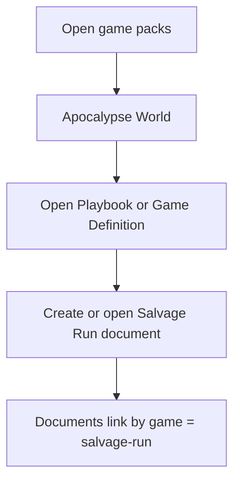
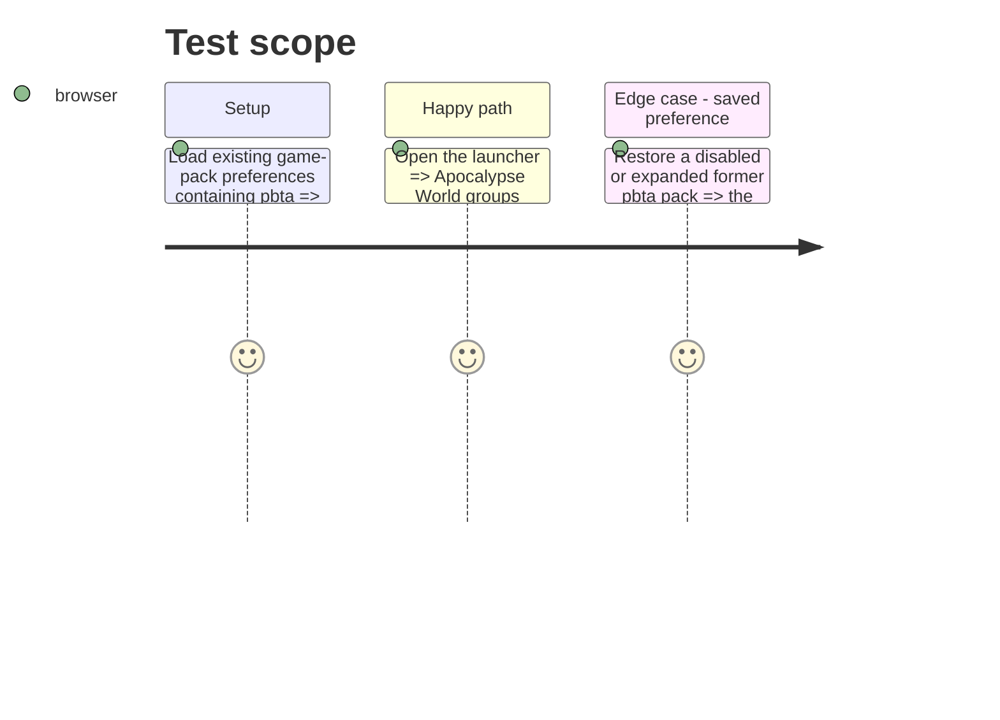

# Instruction: Clarify the Apocalypse World pack identity

## Architecture projection

> Tree of the final files. ✅ create · ✏️ modify · ❌ delete

```txt
src/templates/pbta/playbook/definition.tsx ✏️ Places the generic Playbook launcher entry in the Apocalypse World pack without changing its document contract.
src/templates/pbta/game-definition/definition.tsx ✏️ Places Game Definition in the same Apocalypse World pack and names its relationship to document games clearly.
src/core/gamePacks.ts ✏️ Migrates persisted launcher visibility and expansion state from the former pbta pack id.
src/templates/pbta/playbook/sample.ts ✏️ Describes Salvage Run as the original example game inside the Apocalypse World pack.
src/templates/pbta/game-definition/sample.ts ✏️ Uses the same terminology while retaining salvage-run as the example game id.
```

## User Journey



## Test Scope



## Wireframe

```txt
┌──────────────────────────────────────┐
│ (1) Game packs                        │
├──────────────────────────────────────┤
│ (2) Apocalypse World                  │
│     Playbook                           │
│     Game Definition                    │
└──────────────────────────────────────┘
```

1. The launcher names the pack, not a document’s game id.
2. The two generic Apocalypse World documents live together while each document can name Salvage Run.

## Tasks to do

### `1)` Separate pack and document-game names

> Make the sidebar taxonomy explicit without changing imported or exported document ids.

1. Move the two generic PbtA template definitions into an `apocalypse-world` launcher group labelled Apocalypse World.
2. Migrate stored enabled and expanded pack identifiers from `pbta` to `apocalypse-world` during game-pack loading.
3. Update sample and launcher wording to identify Salvage Run as the original example game, while preserving `game = "salvage-run"`.

## Test acceptance criteria

| Task | Acceptance criteria |
| --- | --- |
| 1 | The sidebar and pack selector show one Apocalypse World group containing Playbook and Game Definition. |
| 1 | A saved disabled or expanded `pbta` pack remains disabled or expanded after migration under `apocalypse-world`. |
| 1 | A Salvage Run playbook and game definition still link through the unchanged `salvage-run` document game id. |
