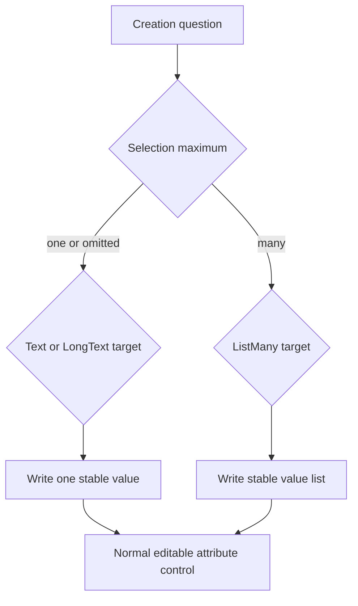
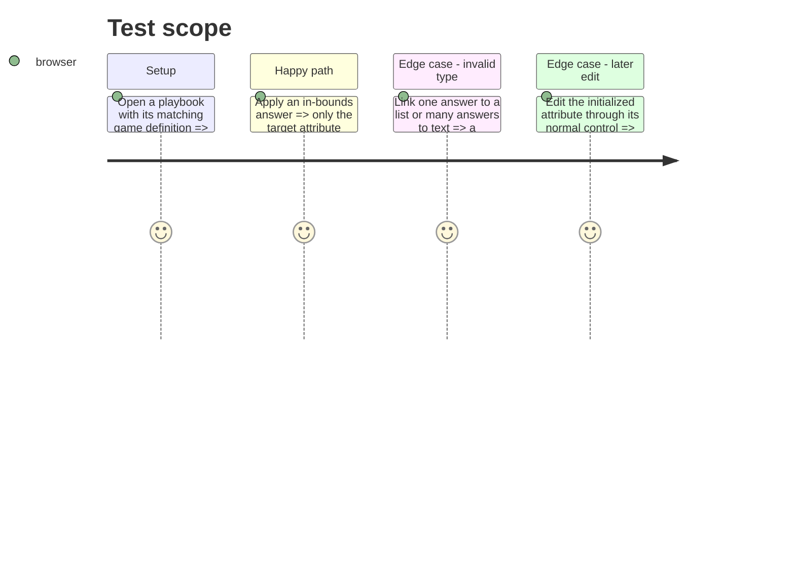

# Instruction: Apply scalar and ListMany creation destinations

## Architecture projection

> Tree of the final files. ✅ create · ✏️ modify · ❌ delete

```txt
src/templates/pbta/playbook/editor/forms/CreationForm.tsx ✏️ Applies stable scalar or list values only when a linked target’s type and setup bounds are valid.
src/templates/pbta/playbook/sample.ts ✏️ Adds the Salvage Run Text name and LongText look creation questions with structured and legacy options.
src/templates/pbta/game-definition/sample.ts ✏️ Defines the paired Text name and LongText look attributes.
tools/assertContracts.harness.mts ✏️ Asserts the canonical creation metadata survives the generic Lantern round trip unchanged.
```

## User Journey



## Test Scope



## Wireframe

```txt
┌──────────────────────────────────────────────┐
│ (1) Creation question                         │
│     [ ] editorial option                      │
│     [ ] editorial option                      │
│     [Apply selection]                         │
├──────────────────────────────────────────────┤
│ (2) Destination feedback                      │
├──────────────────────────────────────────────┤
│ (3) Normal attribute control                  │
└──────────────────────────────────────────────┘
```

1. Setup shows editorial labels but records stable values.
2. Invalid target and cardinality combinations have visible feedback.
3. The normal control is independent of setup bounds and option catalogues.

## Tasks to do

### `1)` Enforce destination shape only during setup

> Turn the published creation metadata into a safe initialization flow.

1. Treat omitted selection as exactly one choice; accept Text or LongText only for that scalar path.
2. Accept ListMany only when `selection.max` is greater than one, and enforce inclusive min/max bounds before Apply.
3. Write a scalar stable value or an array of stable values to the linked attribute only; keep answers component-local and leave unlinked questions informational.
4. Show a read-only diagnostic for missing, unavailable, incompatible, or out-of-bounds destinations and preserve existing attributes.
5. Extend paired Salvage Run samples with Text and LongText destinations and retain structured-option metadata in the contract assertion.

## Test acceptance criteria

| Task | Acceptance criteria |
| --- | --- |
| 1 | Legacy options persist their label as the selected value; structured options persist `value` while displaying `label`. |
| 1 | An omitted selection or `{ min: 1, max: 1 }` writes one value only to a matching Text or LongText attribute. |
| 1 | An in-bounds `{ min, max }` multiple selection writes exactly the selected stable values to a matching ListMany attribute. |
| 1 | Setup bounds and option catalogues do not constrain subsequent AttributeField edits. |
| 1 | Invalid target type, missing target, and out-of-bounds answers are visible and make no write. |
