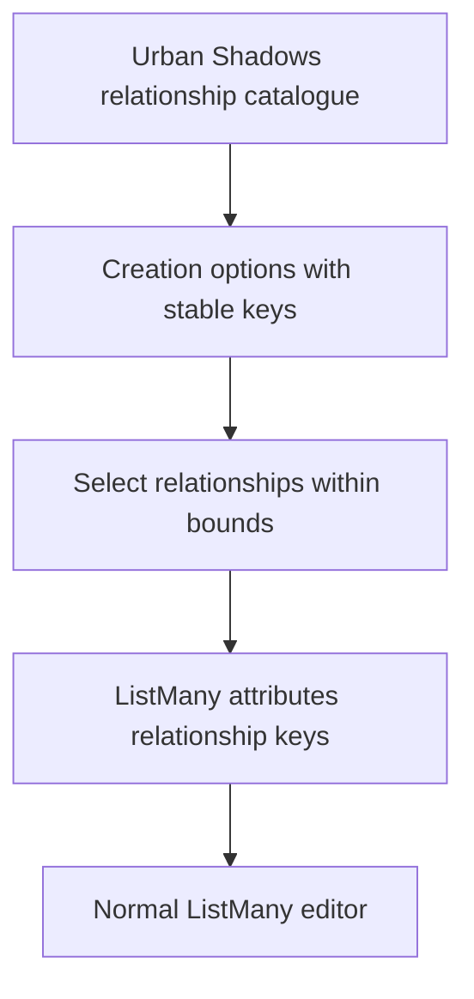
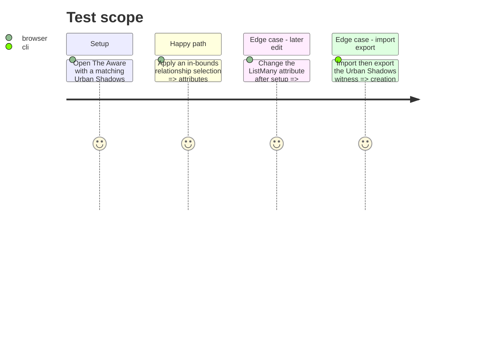

# Instruction: Render Urban Shadows relationship creation

## Blocker

`schema-pbta` v5.0.0 declares the Urban Shadows schema, but its published
canonical witness does not yet carry the required relationship catalogue,
ListMany destination, or linked creation question. Lantern must wait for that
published witness rather than recreating those semantics locally.

## Architecture projection

> Tree of the final files. ✅ create · ✏️ modify · ❌ delete

```txt
package.json ✏️ Pins the schema-pbta release that closes schema-pbta#7 before the specialized UI consumes its definitions.
package-lock.json ✏️ Records the exact released schema package that carries the Urban Shadows fixture and witness.
src/templates/urban-shadows/playbook/model.ts ✏️ Represents the published v5 creation options and keyed mortal-relationship editorial entries without narrowing imported metadata.
src/templates/urban-shadows/playbook/editor/UrbanShadowsPlaybookEditorPanel.tsx ✏️ Renders the linked multi-select creation flow and the normal ListMany attribute control.
src/templates/urban-shadows/playbook/preview/UrbanShadowsPlaybookPreview.tsx ✏️ Displays keyed relationship labels and descriptions from the editorial catalogue.
src/templates/urban-shadows/playbook/sample.ts ✏️ Provides The Aware three-key relationship catalogue and linked ListMany creation question.
tools/assertContracts.harness.mts ✏️ Covers the Urban Shadows v5 creation metadata path in addition to generic playbooks.
```

## User Journey



## Test Scope



## Wireframe

```txt
┌──────────────────────────────────────────────┐
│ (1) Mortal relationship choices               │
│     [ ] relationship label                    │
│         editorial description                 │
│     [ ] relationship label                    │
│         editorial description                 │
│     [Apply selection]                         │
├──────────────────────────────────────────────┤
│ (2) Mortal relationship attribute             │
│     [ ] stable relationship key                │
└──────────────────────────────────────────────┘
```

1. Catalogue labels and descriptions guide setup without becoming character state.
2. The persisted ListMany value is an editable list of stable keys.

## Tasks to do

### `1)` Preserve and apply keyed relationship choices

> Bring the specialized Urban Shadows UI up to the v5 creation contract.

1. Pin the schema-pbta release that closes schema-pbta#7, then consume its Urban Shadows definition and witness; stop if they are absent rather than adding local keys, bounds, or attribute semantics.
2. Type creation entries as v5 options and type mortal relationships by stable key, label, and optional description.
3. Render relationship creation options from the editorial catalogue, apply their stable keys to the linked ListMany attribute after published-bounds validation, and show invalid-destination feedback.
4. Render the linked ListMany attribute through the normal editable AttributeField without carrying creation bounds forward.
5. Update The Aware sample and focused contract assertion to prove keyed catalogue and linked creation metadata round trip.

## Test acceptance criteria

| Task | Acceptance criteria |
| --- | --- |
| 1 | The Urban Shadows creation UI displays relationship labels and descriptions while storing only selected relationship keys in `attributes`. |
| 1 | Exactly three available relationship keys can be selected only within the creation bounds and initialize the linked ListMany destination. |
| 1 | The normal ListMany control remains editable after initialization without creation-bound enforcement. |
| 1 | Import/export retains structured creation metadata and keyed relationship editorial data. |
| 1 | The implementation has no consumer-local fallback when the published Urban Shadows definition is unavailable. |
