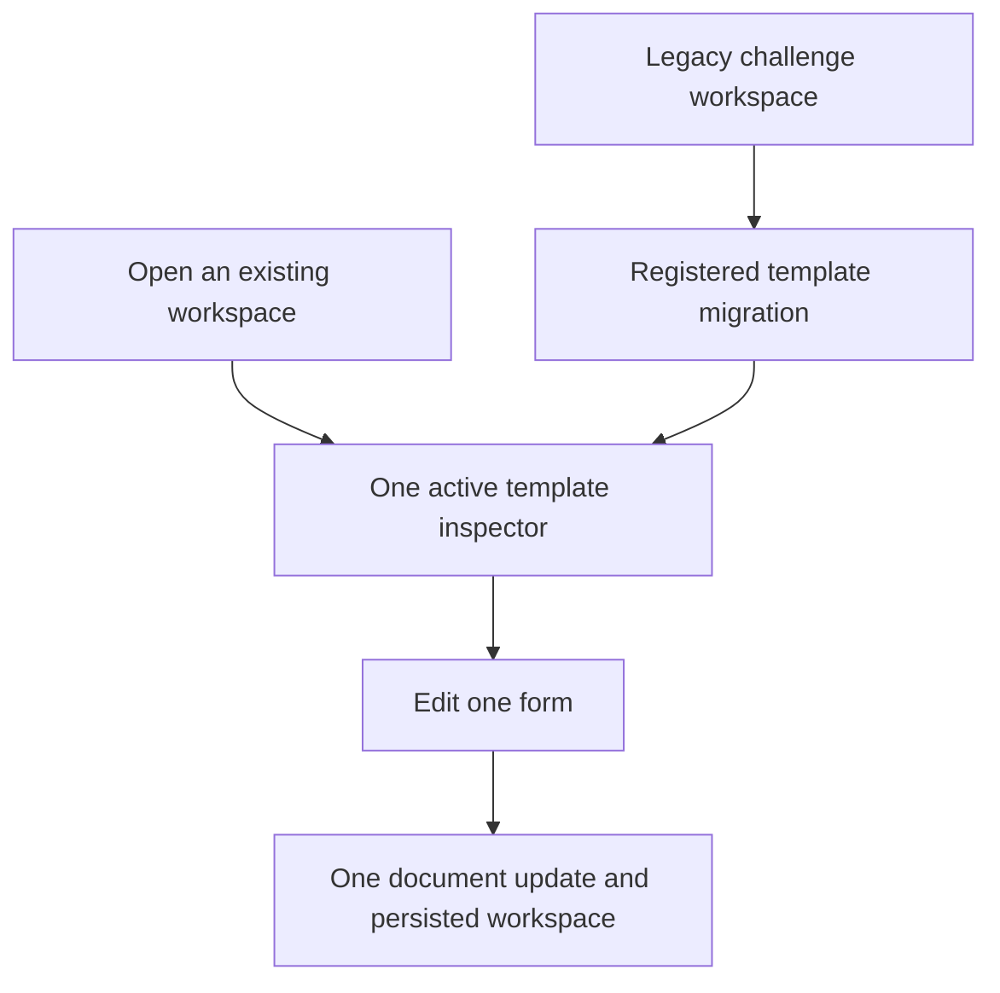
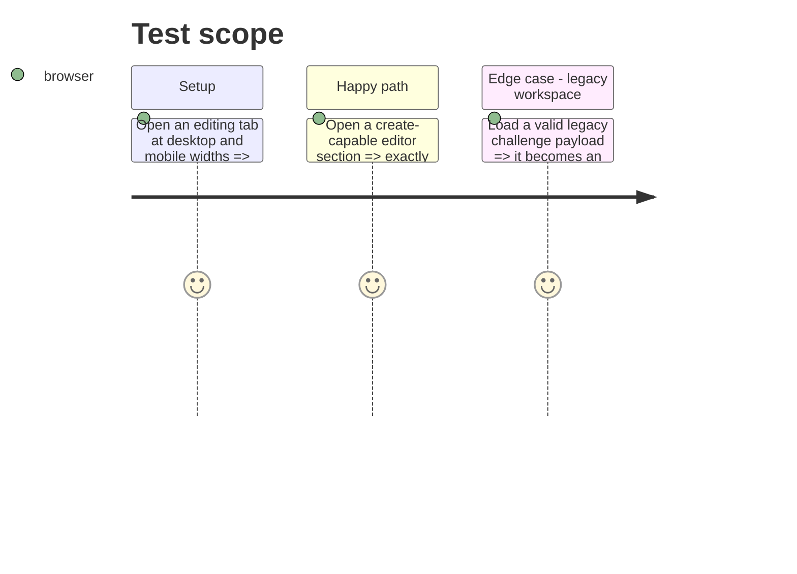

# Instruction: Restore workspace and inspector boundaries

## Architecture projection

> Tree of the final files. ✅ create · ✏️ modify · ❌ delete

```txt
.
├── src/app/AppEditingView.tsx ✏️ Receives the single inspector presentation instead of mounting a second inspector.
├── src/app/AppDesktopInspector.tsx ✏️ Hosts the one inspector instance across responsive layouts.
├── src/App.tsx ✏️ Coordinates the inspector’s single responsive placement.
├── src/core/workspace/store.ts ✏️ Consumes a generic migration result and removes the unused persistence action.
├── src/core/workspace/legacyMigration.ts ✏️ Discovers registered legacy descriptors and builds generic workspace snapshots without importing a game contract.
├── src/templates/legend-in-the-mist/challenge/definition.tsx ✏️ Supplies the legacy storage key, parser, and document normalizer at the template boundary.
├── src/core/templates/types.ts ✏️ Defines the optional descriptor with a storage key, template identity, and safe raw-payload-to-document converter.
├── tools/assertWorkspace.harness.mts ✅ Exercises valid and invalid registered legacy payloads without the browser shell.
├── tools/assert-workspace.mjs ✅ Runs the workspace regression harness with the project’s existing toolchain.
└── package.json ✏️ Exposes the workspace regression assertion.
```

## User Journey



## Test Scope



## Tasks to do

### `1)` Make the inspector singular

> Mount exactly one template inspector for the active editing tab while retaining desktop and mobile access.

1. Move responsive inspector presentation behind one React mount point and retain the current open/close controls.
2. Verify all declared form IDs and create-on-open effects occur once at either viewport.

### `2)` Move migration ownership out of the generic store

> Let the relevant template provide its legacy conversion while the workspace owns only generic persistence and tab construction.

1. Define an optional template-contract descriptor containing the legacy storage key, target template identity, and a converter that returns a valid document or `null`.
2. Replace the hard-coded Mist imports and challenge normalizer in the store with that generic capability.
3. Remove `persistWorkspace` unless the refactor establishes a documented caller.

## Test acceptance criteria

| Task | Acceptance criteria |
| --- | --- |
| 1 | At every responsive width, an active editing tab mounts one inspector and opening a create-capable target adds one entry only. |
| 1 | The existing desktop sidebar and mobile editor control both keep the inspector reachable. |
| 2 | `src/core/workspace/store.ts` imports no concrete game contract or template normalizer. |
| 2 | A valid legacy Legend in the Mist challenge still hydrates to the same editable document shape, while invalid legacy data is ignored safely. |
| 2 | No unused public persistence action remains in the workspace store. |
| 2 | A deterministic workspace harness proves both valid and invalid legacy payload outcomes without relying on a manually seeded browser. |
