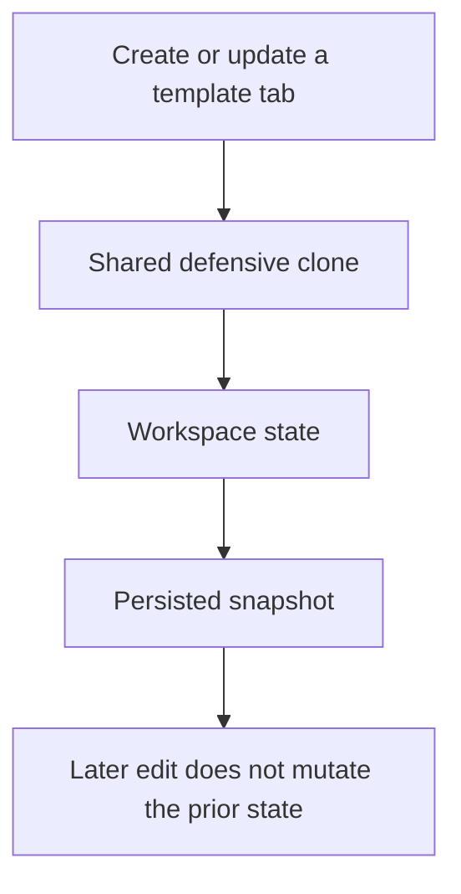
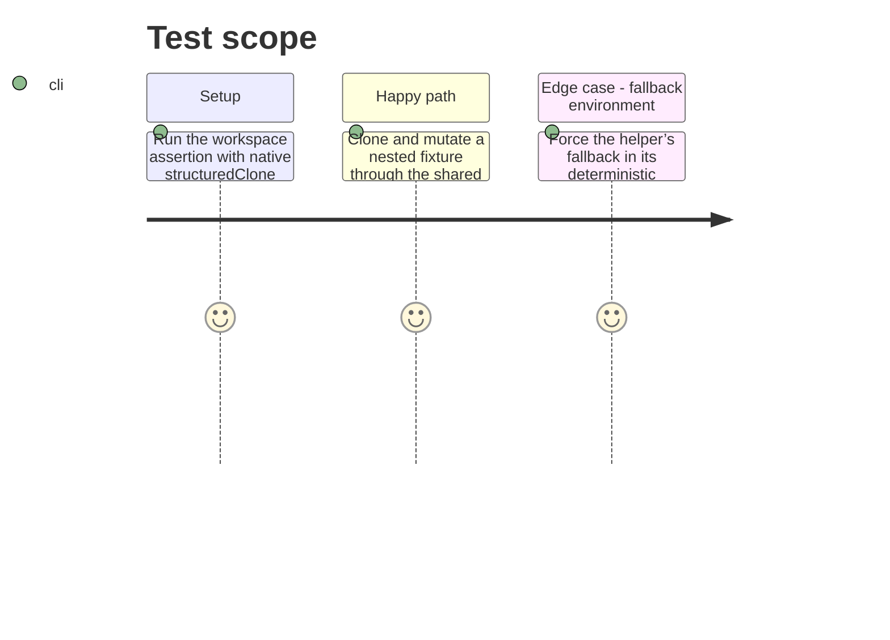

# Instruction: Centralize defensive cloning

## Architecture projection

> Tree of the final files. ✅ create · ✏️ modify · ❌ delete

```txt
.
├── src/utils/clone.ts ✅ Owns the shared structured-clone and JSON fallback helper.
├── src/core/workspace/store.ts ✏️ Imports the shared helper for all workspace snapshots and updates.
├── src/templates/**/definition.tsx ✏️ Replaces local initial-state clone helpers with the shared helper.
├── src/templates/**/hooks.ts ✏️ Replaces local document, view, and sheet clone helpers with the shared helper.
└── tools/assertWorkspace.harness.mts ✏️ Proves native and fallback clone paths produce independent nested values.
```

## User Journey



## Test Scope



## Tasks to do

### `1)` Establish one clone primitive

> Provide one tested, browser-safe cloning primitive for JSON-compatible workspace values.

1. Move the existing `structuredClone`-first, JSON-fallback behavior into a utility with a generic return type.
2. Preserve the current behavior for all serializable document, view, and sheet data.

### `2)` Remove local clone copies

> Route every template definition and workspace-backed hook through the shared primitive.

1. Replace all local `cloneValue` declarations in definition and hook modules.
2. Keep template-specific state shaping and ownership unchanged.

## Test acceptance criteria

| Task | Acceptance criteria |
| --- | --- |
| 1 | The shared helper returns an independent copy using `structuredClone` when available and its existing fallback when it is not. |
| 2 | No duplicate local structured-clone/JSON-fallback implementation remains in workspace, template definition, or template hook modules. |
| 2 | Creating, replacing, updating, and persisting a tab retains the current document/view/sheet behavior. |
| 2 | The workspace assertion verifies both clone paths with a nested value and is included in the repository’s automated validation commands. |
