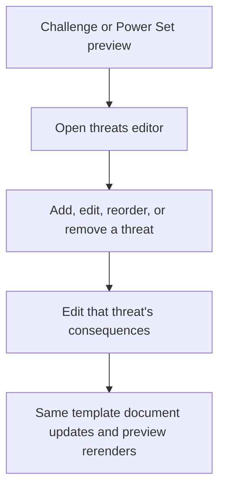
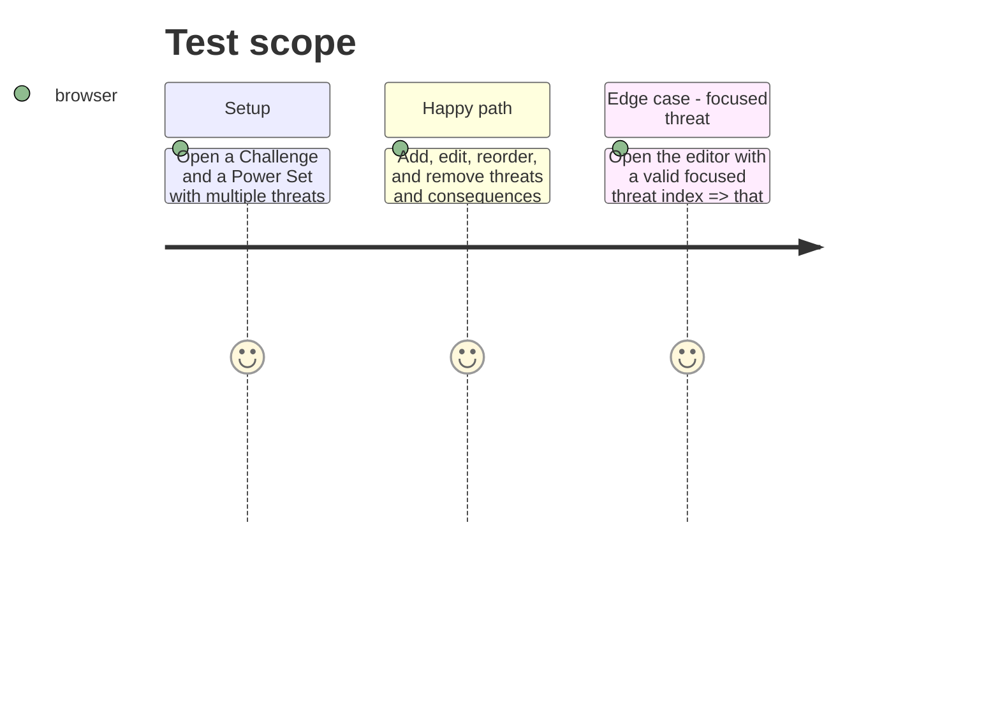

# Instruction: Share the Otherscape threats editor

## Architecture projection

> Tree of the final files. ✅ create · ✏️ modify · ❌ delete

```txt
.
├── src/templates/otherscape/shared/ThreatsEditor.tsx ✅ Owns the common threat list, consequence panel, validation, drag interactions, and adapter types.
├── src/templates/otherscape/challenge/editor/forms/ThreatsForm.tsx ✏️ Binds Challenge data, actions, and labels to the shared editor.
└── src/templates/otherscape/power-set/editor/forms/ThreatsForm.tsx ✏️ Binds Power Set data, actions, and labels to the shared editor.
```

## User Journey



## Test Scope



## Tasks to do

### `1)` Extract the common editor behavior

> Consolidate the identical two-panel workflow without widening either document model.

1. Define a narrow adapter with the current threat collection, focused index, store actions, and per-template nouns/placeholders; do not import either template model or hook.
2. Move DnD setup, inline drafts, validation, focus behavior, and rendering into the Otherscape shared component.

### `2)` Bind each template through an adapter

> Keep document-specific stores and vocabulary at the template edge.

1. Reduce each `ThreatsForm` to its store adapter and Challenge/Power Set labels.
2. Preserve preview deep links, empty-threat behavior, consequence edits, and markdown rendering.

## Test acceptance criteria

| Task | Acceptance criteria |
| --- | --- |
| 1 | The shared editor has no direct dependency on either Challenge or Power Set hook or model. |
| 2 | Both templates retain their existing threat and consequence add, edit, reorder, remove, focus, and validation behavior. |
| 2 | A change made in one template does not alter the other template’s document or vocabulary. |
