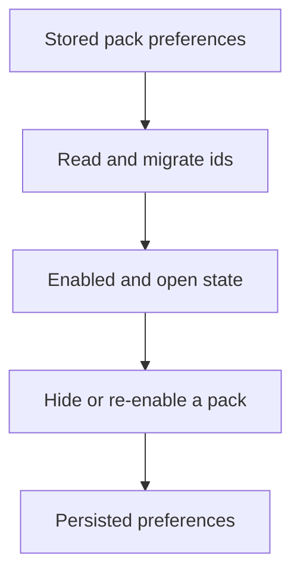
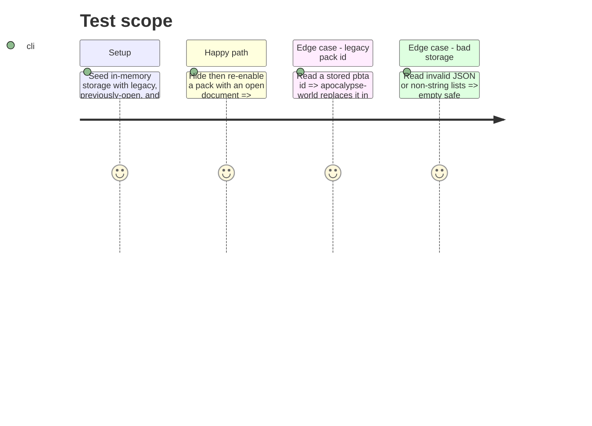

# Instruction: Make game-pack state testable and assert its persistence contract

## Architecture projection

> Tree of the final files. ✅ create · ✏️ modify · ❌ delete

```txt
src/core/gamePacks.ts ✏️ Exposes a small storage-independent state seam, persists only disabled filters, and starts every launch with collapsed packs.
tools/assertWorkspace.harness.mts ✏️ Adds deterministic game-pack migration, hide/re-enable, open-state, and malformed-storage assertions.
```

## User Journey



## Test Scope



## Tasks to do

### `1)` Isolate deterministic pack preference behavior

> Allow the store to be exercised without a browser while preserving its localStorage behavior in the app.

1. Extract or export the minimal parsing, migration, and store-construction seam needed by the harness.
2. Keep the production Zustand hook and disabled-filter storage key, but stop reading or writing unfolded-pack state across launches.

### `2)` Cover pack preference invariants

> Make regressions in migration and visibility state fail `npm run assert:workspace`.

1. Assert legacy-id migration, de-duplication, malformed storage recovery, disabled-filter persistence, and ignored legacy open state.
2. Assert disabling a pack does not affect an already-open workspace tab, and enabling restores visibility without unfolding it.

## Test acceptance criteria

| Task | Acceptance criteria |
| --- | --- |
| 1 | Browser startup still reads and writes the existing pack preference key. |
| 2 | Legacy `pbta` disabled filters migrate to `apocalypse-world`; legacy unfolded state is discarded. |
| 2 | Every startup begins with no pack open, including when legacy storage contains an `open` list. |
| 2 | Hiding then restoring a pack retains its filter state and does not unfold it or affect another pack. |
| 2 | Hiding a pack does not close, mutate, or make inaccessible a workspace tab already created from that pack. |
| 2 | Invalid persisted values cannot prevent the store from initializing. |
