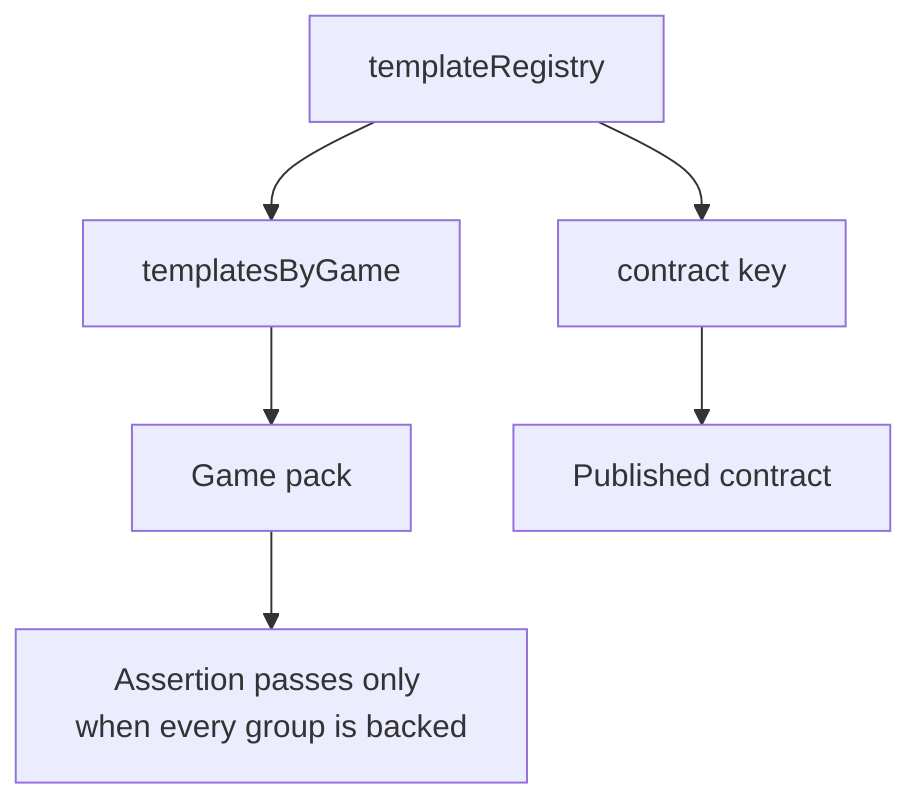
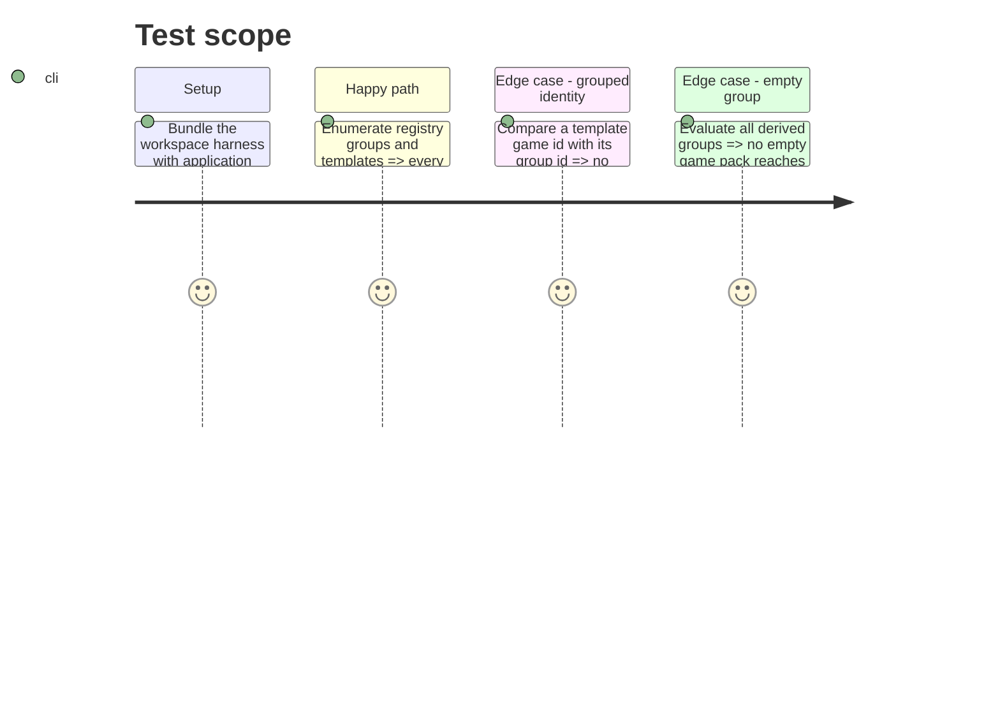

# Instruction: Assert pack-to-template-to-contract coverage

## Architecture projection

> Tree of the final files. ✅ create · ✏️ modify · ❌ delete

```txt
src/core/templates/registry.tsx ✏️ Exposes a pure registry-integrity assertion and validates shipped registry-derived groups without changing launcher ownership.
tools/assertWorkspace.harness.mts ✏️ Imports the registry with stylesheet stubs and proves every visible pack has unique registered templates and resolved contracts.
tools/assert-workspace.mjs ✏️ Bundles the registry assertion with the existing browser-safe CSS loader configuration.
```

## User Journey



## Test Scope



## Tasks to do

### `1)` Make the registry importable by the existing harness

> Reuse the project’s Node assertion infrastructure despite preview CSS imports.

1. Configure esbuild’s CSS loader consistently with the workspace harness’ alias setup.
2. Avoid browser rendering and do not add a second source of pack metadata.

### `2)` Assert registry-derived pack coverage

> Fail the workspace assertion on an orphaned, duplicated, empty, or contractless pack/template entry.

1. Extract a pure validator and check unique template ids, non-empty game ids/labels, non-empty groups, and template-to-group identity.
2. Verify each template contract key resolves through the contract registry.
3. Pass deliberately duplicated, empty, mismatched, and unresolved fixtures to the validator so each invariant has a failing witness.

## Test acceptance criteria

| Task | Acceptance criteria |
| --- | --- |
| 1 | `npm run assert:workspace` bundles and runs registry assertions without resolving preview CSS as browser assets. |
| 2 | Every launcher pack is derived from at least one registered template and every member’s `gameId` equals its pack id. |
| 2 | Deliberately duplicated template ids, empty groups, mismatched game ids, and unresolved contract keys fail with the offending identity. |
