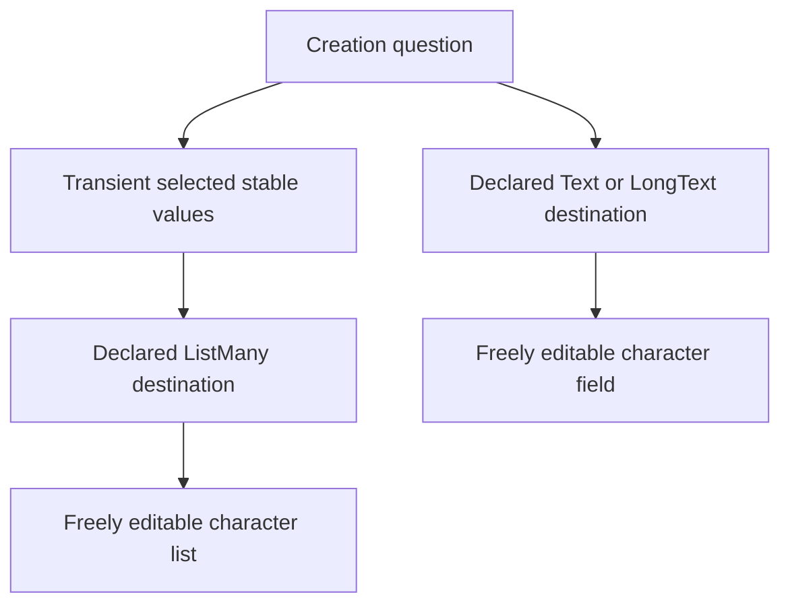
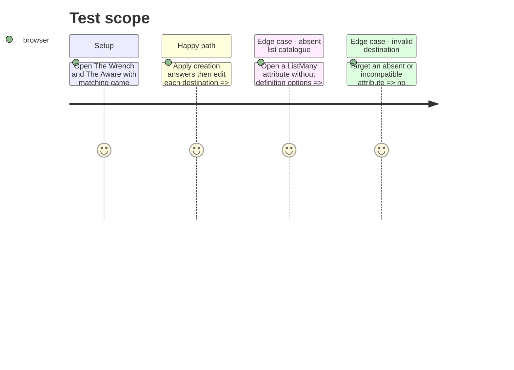

# Instruction: Preserve free editing after creation

## Architecture projection

> Tree of the final files. ✅ create · ✏️ modify · ❌ delete

```txt
src/templates/pbta/shared/attributeField.tsx ✏️ Reuses the editable string-list control for an unrestricted ListMany destination when its game definition supplies no option catalogue.
src/templates/urban-shadows/playbook/editor/UrbanShadowsPlaybookEditorPanel.tsx ✏️ Uses mortal-relationship metadata for setup labels only, without turning it into a later destination restriction.
```

## User Journey



## Test Scope



## Wireframe

```txt
┌──────────────────────────────────────────────┐
│ (1) Question de création                     │
├──────────────────────────────────────────────┤
│ (2) Options proposées                         │
│     ( ) valeur scalaire / [ ] valeurs liste  │
├──────────────────────────────────────────────┤
│ (3) Destination liée                          │
│     champ Text, LongText ou ListMany          │
└──────────────────────────────────────────────┘
```

1. Question éditoriale issue du playbook.
2. Options transitoires, distinctes du document de personnage.
3. Attribut résultant, vérifié après application puis après édition libre.

## Tasks to do

### `1)` Separate editorial offers from destination editing

> Keep setup selection constrained while leaving the resulting character field unconstrained afterwards.

1. Distinguish an absent ListMany option catalogue from a declared finite catalogue in `AttributeField`; leave explicit empty lists to the published codec's rejection path.
2. Reuse `StringListEditor` for the absent-catalogue free-list case without synthesizing options from creation metadata.
3. Remove the Urban Shadows relationship catalogue override from the persisted destination control while retaining it in the creation form’s labels and descriptions.
4. Preserve legacy scalar behavior for string and `{ value, label }` options, including invalid-target diagnostics.

## Test acceptance criteria

| Task | Acceptance criteria |
| --- | --- |
| 1 | Applying a scalar answer writes exactly one stable string to its Text or LongText destination and the field remains freely editable. |
| 1 | Applying bounded relationship answers writes only stable keys to `mortalRelationships`, and the resulting ListMany value can later gain or lose values outside the creation catalogue. |
| 1 | A declared finite ListMany option list retains its existing behavior, while an explicit empty list is never reinterpreted as unrestricted. |
| 1 | The creation option catalogue and transient selections never enter exported character data. |
| 1 | Missing or incompatible destinations remain non-applicable and cannot overwrite an attribute. |
