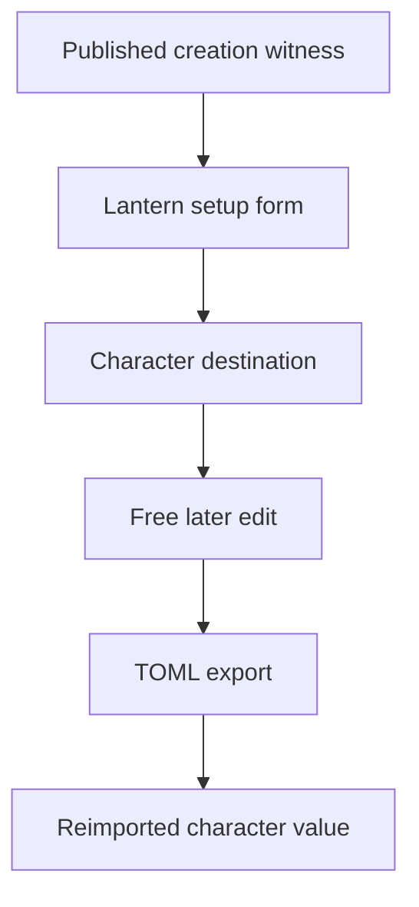
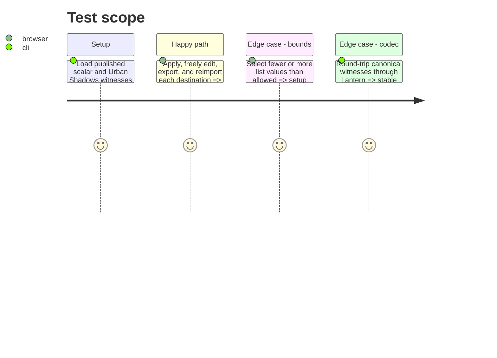

# Instruction: Assert both destination journeys

## Architecture projection

> Tree of the final files. ✅ create · ✏️ modify · ❌ delete

```txt
tools/assertContracts.harness.mts ✏️ Proves import/export retains creation metadata and only the resulting scalar or list attribute values.
Browser creation journeys ✏️ Exercise The Wrench scalar target and The Aware free-list target through setup, edit, export, and reimport.
```

## User Journey



## Test Scope



## Wireframe

```txt
┌──────────────────────────────────────────────┐
│ (1) Setup answers                             │
├──────────────────────────────────────────────┤
│ (2) Editable destination                      │
├──────────────────────────────────────────────┤
│ (3) Export and reimport result                │
└──────────────────────────────────────────────┘
```

1. Selected answers exist only while setup is open.
2. Resulting attribute is the only editable character state.
3. Export confirms that no setup-session state is serialized.

## Tasks to do

### `1)` Prove document and UI boundaries

> Demonstrate that the published document contract and Lantern’s transient setup state remain separate.

1. Extend the contract harness with focused scalar and ListMany assertions for the published witnesses.
2. Verify the exported TOML contains stable attribute values and retains creation metadata without serializing answer selections.
3. Run browser journeys for The Wrench and The Aware: valid setup, unrestricted later edit, export, reimport, and selection-bound rejection.
4. Run `npm run build` and `npm run assert:contracts` after the behavior and assertions are in place.

## Test acceptance criteria

| Task | Acceptance criteria |
| --- | --- |
| 1 | The contract harness proves scalar and ListMany creation metadata and resulting attributes survive Lantern import/export without synthetic setup state. |
| 1 | The Wrench and The Aware each complete setup, accept a later unrestricted destination edit, and retain that edit after export and reimport. |
| 1 | Selection bounds prevent only invalid setup writes; they do not constrain later attribute editing. |
| 1 | Build and contract assertions pass against the exact published schema-pbta dependency. |
