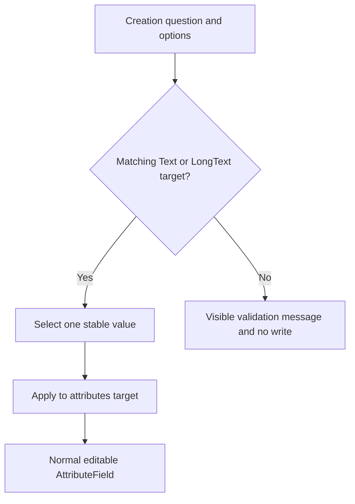
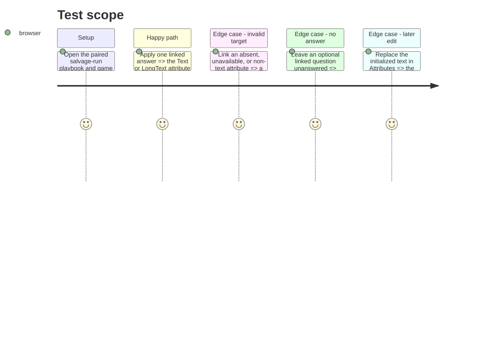

# Instruction: Apply linked text destinations in the creation flow

## Architecture projection

> Tree of the final files. ✅ create · ✏️ modify · ❌ delete

```txt
src/templates/pbta/playbook/editor/forms/CreationForm.tsx ✏️ Validates a linked destination, shows a diagnostic for an invalid one, and applies exactly one stable value to Text or LongText.
src/templates/pbta/playbook/sample.ts ✏️ Defines an original linked creation question with stable option values and display labels.
src/templates/pbta/game-definition/sample.ts ✏️ Defines the paired `name` Text attribute for the existing `salvage-run` example.
```

## User Journey



## Test Scope



## Wireframe

```txt
┌──────────────────────────────────────────────┐
│ (1) Creation question                         │
│     ( ) option                                │
│     ( ) option                                │
│     [Apply]                                   │
├──────────────────────────────────────────────┤
│ (2) Destination status                        │
│     target validation feedback                │
├──────────────────────────────────────────────┤
│ (3) Attributes                                │
│     editable text control                     │
└──────────────────────────────────────────────┘
```

1. One-answer creation setup using the contract’s stable values.
2. Validation feedback before any persisted write.
3. Existing unrestricted AttributeField after initialization.

## Tasks to do

### `1)` Validate, apply, and demonstrate a creation destination

> Make valid linked setup explicit, while keeping answer state out of character persistence.

1. Resolve the target from the matching open game definition and accept only a Text or LongText target for an omitted or single-selection question.
2. Make invalid, unavailable, missing, and non-text targets visible and non-applicable; keep questions without `attribute` informational.
3. Enable Apply only when exactly one stable option is selected, so an optional unanswered question cannot clear an existing attribute; write only that value to `attributes[attribute]`.
4. Rely on the existing Stats/Attributes `AttributeField` for later free-form edits and leave all subsequent manual or progression writes unconstrained by creation options.
5. Add `name` as a Text attribute to the existing `salvage-run` game sample and make the paired playbook sample target it with structured creation options.

## Test acceptance criteria

| Task | Acceptance criteria |
| --- | --- |
| 1 | The paired `salvage-run` samples expose a valid `name` Text destination for the structured Name question. |
| 1 | A valid selected answer writes only `attributes[attribute]`; neither answer selections nor option references enter persisted state. |
| 1 | Missing, non-text, or unavailable destinations visibly fail validation and cannot overwrite an attribute. |
| 1 | An unanswered optional linked question cannot overwrite an existing attribute. |
| 1 | The initialized Text or LongText value remains freely editable through the existing Attributes control and accepts subsequent progression writes outside the creation options. |
