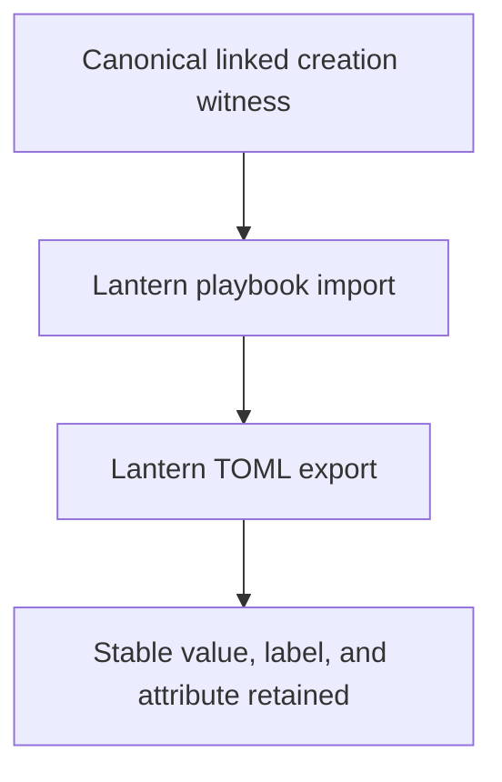
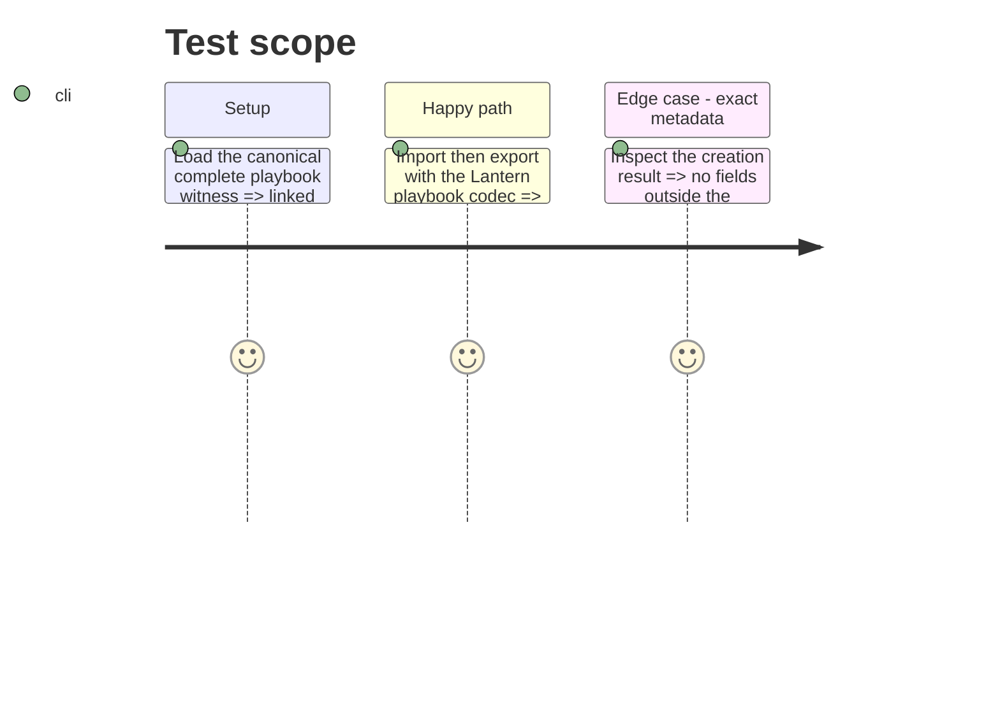

# Instruction: Assert linked creation metadata round trips

## Architecture projection

> Tree of the final files. ✅ create · ✏️ modify · ❌ delete

```txt
tools/assertContracts.harness.mts ✏️ Adds a focused assertion that the canonical playbook witness preserves a linked structured creation option and its destination through Lantern import/export.
```

## User Journey



## Test Scope



## Tasks to do

### `1)` Add a focused linked-creation round-trip assertion

> Make the v5 creation metadata contract visible in the local compatibility suite.

1. Locate the canonical accepted playbook fixture with structured creation options and an attribute destination.
2. Assert the Lantern codec retains the stable value, display label, selection bounds, and destination attribute after import/export.
3. Keep the generic corpus coverage intact and run the contract command.

## Test acceptance criteria

| Task | Acceptance criteria |
| --- | --- |
| 1 | The focused assertion proves a structured creation option retains its stable value and label through Lantern import/export. |
| 1 | The destination attribute and selection metadata remain present after the same round trip. |
| 1 | The contract suite continues to validate all published and Lantern codec witnesses. |
