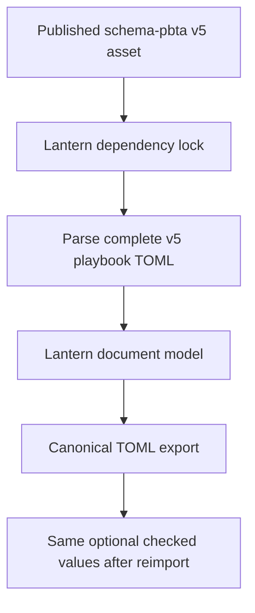
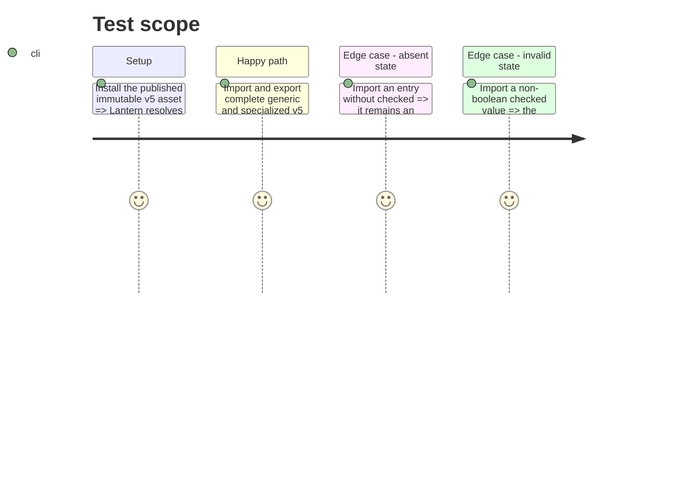

# Instruction: Adopt the released v5 contract and preserve all document data

## Architecture projection

> Tree of the final files. ✅ create · ✏️ modify · ❌ delete

```txt
package.json ✏️ Pins the published immutable schema-pbta v5 tarball.
package-lock.json ✏️ Records the exact released dependency graph.
src/templates/pbta/playbook/model.ts ✏️ Carries optional acquisition state for owned moves and structured advancements without adding it to choice offers.
src/templates/pbta/playbook/model.ts ✏️ Carries structured creation options, selection bounds, destinations, and stat profiles without inventing defaults.
src/templates/pbta/playbook/sample.ts ✏️ Exercises checked and unchecked generic playbook entries.
src/templates/urban-shadows/playbook/model.ts ✏️ Preserves v5 carried moves, creation catalogue, and `corruption.advances` acquisition fields in the dedicated document and blank state.
src/templates/urban-shadows/playbook/sample.ts ✏️ Exercises checked and unchecked Urban Shadows entries.
src/templates/monsterhearts/playbook/model.ts ✏️ Makes the blank specialized document conform to the v5 structured advances type.
src/templates/monsterhearts/playbook/sample.ts ✏️ Exercises checked and unchecked Monsterhearts entries.
tools/assertContracts.harness.mts ✏️ Covers the generic `pbta/playbook` adapter as well as the dedicated playbook adapters during corpus round trips.
```

## User Journey



## Test Scope



## Tasks to do

### `1)` Consume the immutable v5 release

> Upgrade only after the official `schema-pbta-5.0.0.tgz` asset is published and verify the lockfile resolves that artifact.

1. Verify the release asset and checksum from the schema repository, then replace the v4 dependency URL and regenerate the lockfile.
2. Run the typecheck/build and the published-contract assertion to establish the package boundary before UI work.

### `2)` Carry every v5 playbook shape through the document adapters

> Adapt Lantern’s local document shapes without broadening the schema’s ownership rules.

1. Add optional `checked` to generic owned move branches and structured advancement entries; retain `choiceSets` and standalone move shapes exactly as they are.
2. Add typed creation options, bounds, optional destination, and stat profiles; preserve absent values and never derive mechanics from `statsDetail`.
3. Align Urban Shadows and Monsterhearts blank/sample documents with their v5 published types, including their specialized advancement locations.
4. Extend the contract harness to round-trip the generic adapter and prove all supported playbook adapters preserve v5 fields.

## Test acceptance criteria

| Task | Acceptance criteria |
| --- | --- |
| 1 | The installed dependency is the published, immutable v5 release asset; no source branch, local schema copy, or consumer fallback is used. |
| 1 | Lantern rejects a playbook whose `checked` value is not boolean before it reaches workspace persistence. |
| 2 | Generic, Urban Shadows, and Monsterhearts TOML exports preserve checked entries and do not add `checked` to omitted entries, standalone moves, or choice-set offers. |
| 2 | The contract harness fails if any supported playbook adapter drops acquisition state during an import/export cycle. |
