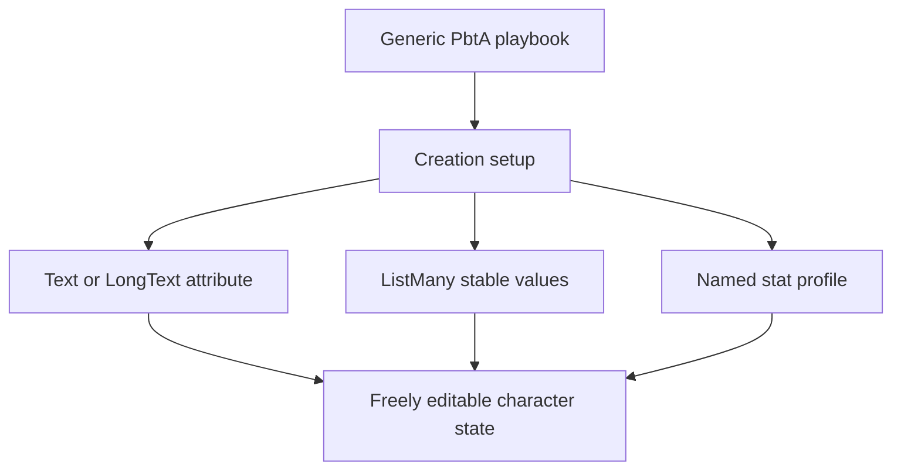
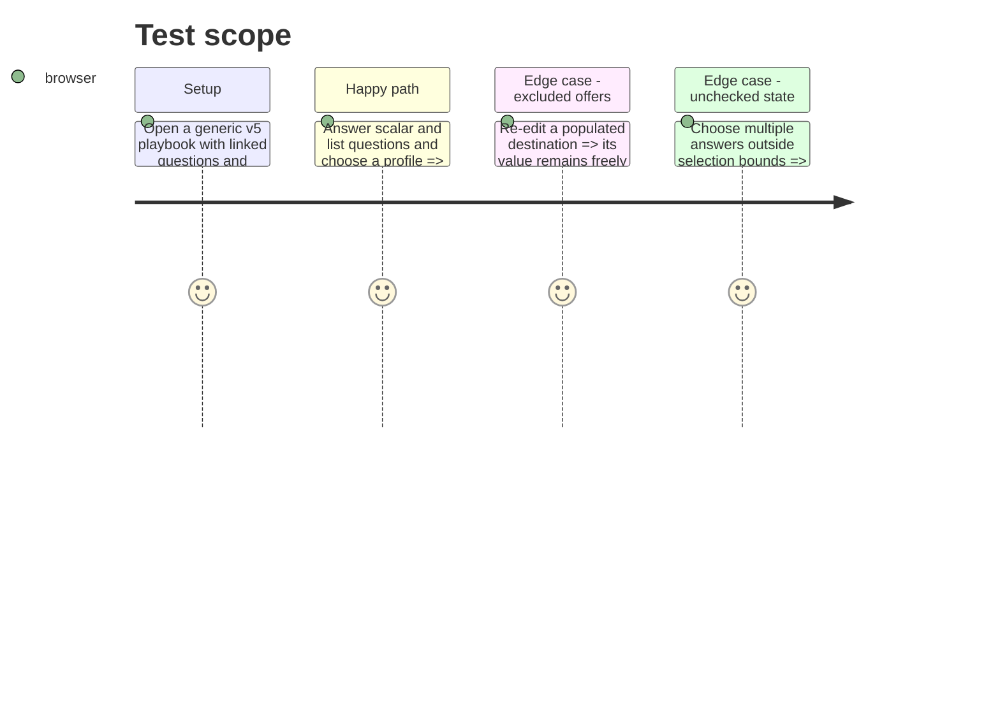

# Instruction: Run generic PbtA playbook character creation

## Architecture projection

> Tree of the final files. ✅ create · ✏️ modify · ❌ delete

```txt
src/templates/pbta/playbook/editor/CreationEntriesEditor.tsx ✏️ Edits the v5 editorial question metadata, stable values, bounds, and destinations.
src/templates/pbta/playbook/editor/forms/CreationForm.tsx ✏️ Renders setup answers and applies their values only to linked attributes.
src/templates/pbta/playbook/editor/forms/StatsForm.tsx ✏️ Renders stat profiles and atomically copies the selected profile into editable stats.
src/templates/pbta/playbook/preview/blocks/CreationBlock.tsx ✏️ Presents setup questions and selected values without serializing answer metadata as character state.
src/templates/pbta/playbook/hooks.ts ✏️ Holds in-memory creation answers only for the active setup session and clears them after their destination values are applied.
```

## User Journey



## Test Scope



## Wireframe

```txt
┌──────────────────────────────────────────────┐
│ (1) Generic Playbook creation                  │
├──────────────────────────────────────────────┤
│ (2) Creation questions                         │
│     ( ) scalar answer                           │
│     [ ] multi-value answer                      │
├──────────────────────────────────────────────┤
│ (3) Starting stat profiles                      │
│     ( ) named profile                           │
└──────────────────────────────────────────────┘
```

1. Existing generic playbook editing and preview surface.
2. Setup-only questions with their declared selection cardinality.
3. Named starting-stat spreads, separate from prose in `statsDetail`.

## Tasks to do

### `1)` Apply linked creation answers

> Initialize only the linked editable attributes from setup answers.

1. Keep selected answer keys in explicit non-persistent setup-session state; do not add them to the workspace document, TOML payload, or view preferences.
2. Support legacy string and `{ value, label }` options, omitted single-choice bounds, and explicit bounded multi-choice answers.
3. Validate the target against the open game definition, write scalar values to Text or LongText and stable multi-values to ListMany, then leave the AttributeField normally editable.

### `2)` Apply explicit stat profiles

> Initialize editable stats from structured profile data without interpreting prose.

1. Render named profiles during setup and copy the selected complete map atomically into `playbook.stats`.
2. Keep `statsDetail` presentation-only and allow later normal stat edits.

## Test acceptance criteria

| Task | Acceptance criteria |
| --- | --- |
| 1 | A single answer initializes only a linked Text or LongText attribute, while a bounded multiple answer writes only stable values to its linked ListMany attribute. |
| 1 | Editing an initialized attribute later is unrestricted by the original option catalogue, and questions without a target remain informational. |
| 1 | Reloading or exporting a playbook retains only its resulting attributes and stats, never an answer selection or a reference to its option catalogue. |
| 2 | Choosing a named profile atomically replaces the editable stats map with that profile’s map. |
| 2 | `statsDetail` remains display text and cannot affect the selected or subsequently edited stats. |
