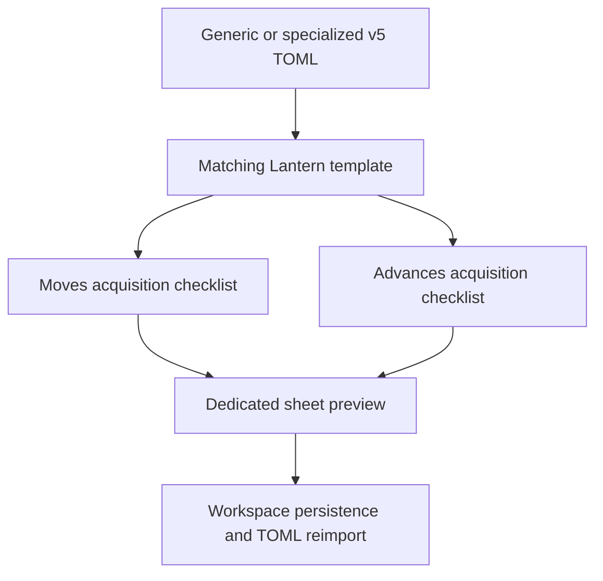
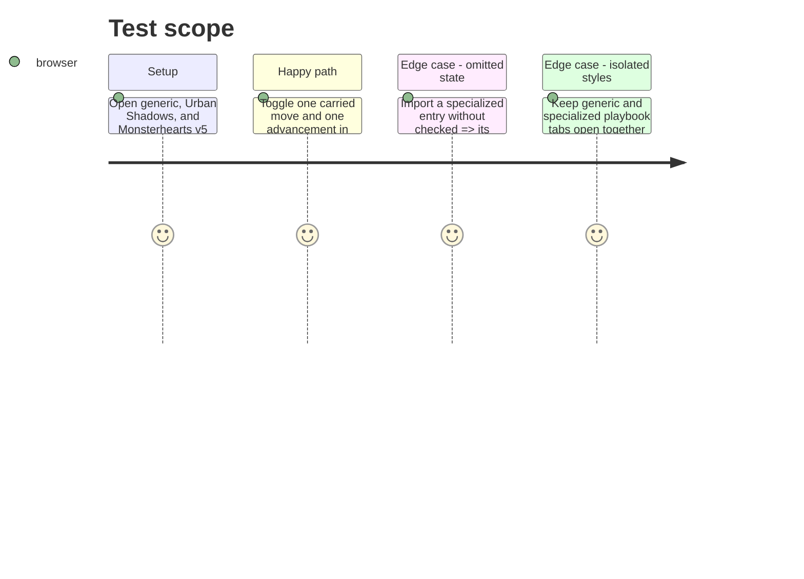

# Instruction: Render acquisitions across generic and specialized playbooks

## Architecture projection

> Tree of the final files. ✅ create · ✏️ modify · ❌ delete

```txt
src/templates/urban-shadows/playbook/editor/UrbanShadowsPlaybookEditorPanel.tsx ✏️ Replaces raw JSON editing for carried moves, inherited advancement, and corruption advances with checked-aware controls.
src/templates/urban-shadows/playbook/preview/UrbanShadowsPlaybookPreview.tsx ✏️ Renders carried moves, inherited advancement, and corruption advances as acquisition checklists.
src/templates/urban-shadows/playbook/preview/urbanShadowsPlaybookTheme.css ✏️ Styles specialized checklist rows within the existing scoped sheet.
src/templates/monsterhearts/playbook/editor/MonsterheartsPlaybookEditorPanel.tsx ✏️ Replaces raw JSON editing for carried moves, inherited advancement, and advances with checked-aware controls.
src/templates/monsterhearts/playbook/preview/MonsterheartsPlaybookPreview.tsx ✏️ Renders carried moves, inherited advancement, and advances as acquisition checklists instead of JSON.
src/templates/monsterhearts/playbook/preview/monsterheartsPlaybookTheme.css ✏️ Styles specialized checklist rows within the existing scoped sheet.
src/templates/shared/AcquisitionChecklist.tsx ✅ Shares presentation and controlled list primitives where the three playbook contracts align.
src/templates/pbta/playbook/editor/MovesEditor.tsx ✏️ Adds a checkbox only to carried generic moves.
src/templates/pbta/playbook/editor/AdvancementEditor.tsx ✅ Edits generic `{ label, checked? }` rows.
src/templates/pbta/playbook/preview/blocks/MovesBlock.tsx ✏️ Renders generic acquisition state.
src/templates/pbta/playbook/preview/blocks/AdvancementBlock.tsx ✏️ Renders generic advancement state.
```

## User Journey



## Test Scope



## Wireframe

```txt
┌──────────────────────────────────────────────┐
│ (1) Generic or specialized playbook sheet      │
├──────────────────────────────────────────────┤
│ (2) Moves                                     │
│     [ ] move label                             │
│     [x] move label                             │
├──────────────────────────────────────────────┤
│ (3) Advances                                  │
│     [ ] advancement label                      │
│     [x] advancement label                      │
└──────────────────────────────────────────────┘
```

1. Existing dedicated Urban Shadows or Monsterhearts sheet.
2. Specialized playbook moves with persistent acquisition state.
3. Specialized advancement entries with persistent acquisition state.

## Tasks to do

### `1)` Give every supported template focused acquisition controls

> Replace the move and advancement JSON blobs with validated, readable controls derived from the published v5 document shapes.

1. Route generic moves/advancement plus every inherited and specialized advancement-entry location in Urban Shadows and Monsterhearts to reusable checked-aware list controls while retaining raw structured editing for unrelated document sections.
2. Keep labels and entries typed by their published schema shapes; do not add an acquisition state to any unrelated specialized field.

### `2)` Render sheet checklists and verify isolation

> Make acquisition state usable in the dedicated previews without leaking styles or semantics to other tabs.

1. Render dedicated moves and advancement/advances sections as read-only checklists with the existing section click targets.
2. Scope the new styling under each template root and verify concurrent generic and specialized tabs remain independent.

## Test acceptance criteria

| Task | Acceptance criteria |
| --- | --- |
| 1 | Generic, Urban Shadows, and Monsterhearts users can change a carried move and every applicable inherited or specialized advancement acquisition state without editing raw JSON, and all unrelated fields retain their existing editor. |
| 1 | The specialized editors never offer `checked` on fields outside their published owned moves and advancement entries. |
| 2 | Dedicated previews show the same checked/unchecked state that their editors store and that their TOML exports reimport. |
| 2 | Dedicated checklist styling does not change another open template’s preview. |
