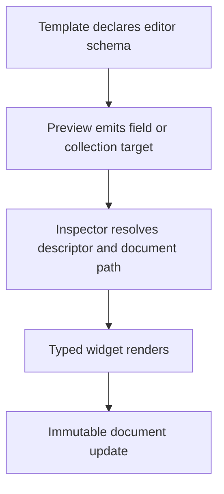
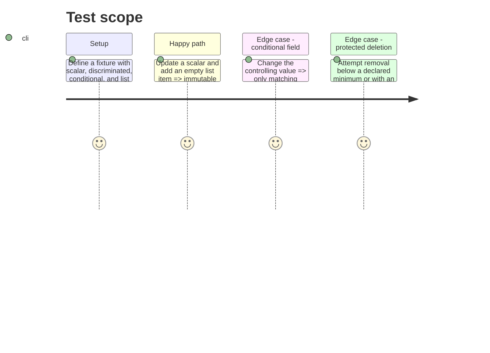

# Instruction: Establish the editor-schema contract and generic renderer

## Architecture projection

> Tree of the final files. ✅ create · ✏️ modify · ❌ delete

```txt
src/core/editor-schema/types.ts ✅ Declares field, object, collection, variant, condition, path, and empty-value factory descriptors.
src/core/editor-schema/SchemaEditor.tsx ✅ Renders scalar fields, nested objects, variants, conditional fields, and collections from descriptors.
src/core/editor-schema/path.ts ✅ Applies immutable path reads and writes and resolves descriptor ids plus array-index element locators.
src/core/editor-schema/CollectionEditor.tsx ✅ Provides add, element selection, reorder when enabled, and guarded deletion for declared collections.
src/core/templates/types.ts ✏️ Lets a template expose its editor schema without making the shell template-specific.
tools/assertContracts.harness.mts ✏️ Exercises descriptor path updates, conditions, variants, and empty collection factories.
```

## User Journey



## Test Scope



## Wireframe

```txt
┌──────────────────────────────────────────────┐
│ (1) Collection title             [Add item]  │
├──────────────────────────────────────────────┤
│ (2) Item list                               │
│  ┌────────────────────────────────────────┐ │
│  │ (3) Item fields                    [×] │ │
│  └────────────────────────────────────────┘ │
└──────────────────────────────────────────────┘
```

1. Collection-level label and declared create action.
2. Ordered rendered collection entries.
3. Type-selected element form and locally scoped destructive action.

## Tasks to do

### `1)` Define the UI description of a document

> Make the mapping from data path and type to editor behavior explicit and type-safe.

1. Model scalar widgets, objects, lists, tagged variants, field conditions, labels, read-only state, and deletion/minimum constraints; preserve a hidden conditional value unless its descriptor explicitly declares a pruning policy.
2. Require every collection descriptor to provide a valid empty-item factory and every conditional descriptor to state its controlling path.
3. Add the optional descriptor at the template contract boundary; do not put template rules in `App.tsx`, workspace state, or the inspector shell.

### `2)` Implement reusable descriptor-driven editing

> Render the declared field shape and write only cloned document paths.

1. Build path and locator helpers that resolve descriptor ids and current array indices, and update nested values without mutating the object returned by workspace selectors or persisting UI-only identifiers.
2. Render input, textarea, boolean, number, select, object, variant, and collection descriptors; make condition evaluation recursive.
3. Centralize collection add/remove/reorder affordances and enforce declared constraints before a document update.
4. Add deterministic harness witnesses for the descriptor runtime.

## Test acceptance criteria

| Task | Acceptance criteria                                                                                                                                               |
| ---- | ----------------------------------------------------------------------------------------------------------------------------------------------------------------- |
| 1    | A template can declare the editor for a nested field, a discriminated union, and a collection without a shared-shell branch.                                      |
| 1    | An undeclared or invalid path cannot silently update a different document value.                                                                                  |
| 1    | A sheet target identifies one descriptor and one current list element without adding an editor id to exported TOML.                                               |
| 2    | Adding a collection item creates the descriptor’s empty valid value exactly once.                                                                                 |
| 2    | A condition consistently controls the matching field in every nesting level, preserves its hidden value by default, and prunes only when that policy is declared. |
| 2    | Collection constraints prevent invalid removal and preserve document order unless reordering is enabled.                                                          |
