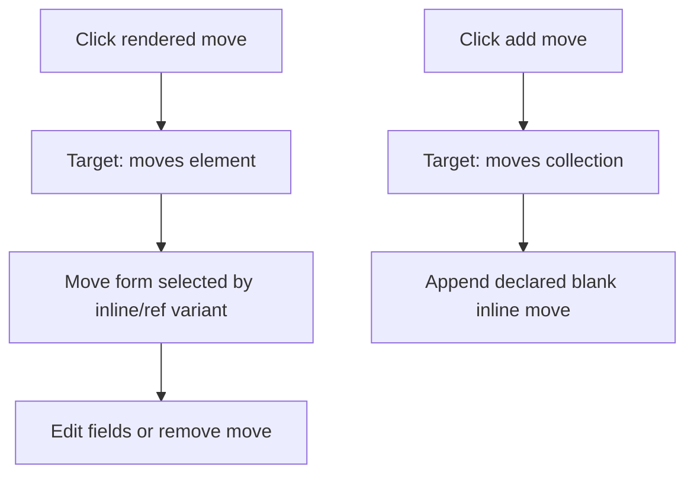
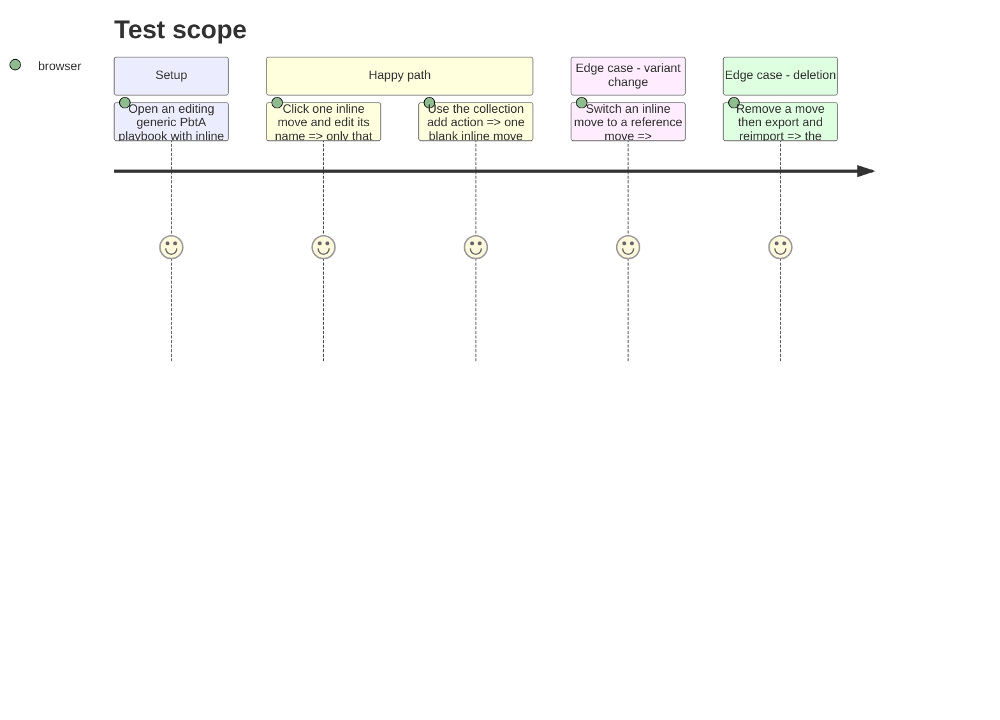

# Instruction: Make the generic PbtA playbook element-addressable

## Architecture projection

> Tree of the final files. ✅ create · ✏️ modify · ❌ delete

```txt
src/templates/pbta/playbook/editorSchema.ts ✅ Declares generic playbook fields, move branches, lists, and conditional move fields.
src/templates/pbta/playbook/model.ts ✏️ Replaces section-only targets with path and element-aware targets and exports safe empty values where needed.
src/templates/pbta/playbook/hooks.ts ✏️ Opens and resolves field, collection, and element sheet targets without mutating workspace reads.
src/templates/pbta/playbook/preview/PlaybookPreview.tsx ✏️ Opens collection actions from section controls and passes precise targets into blocks.
src/templates/pbta/playbook/preview/blocks/MovesBlock.tsx ✏️ Makes each rendered move individually editable while retaining the collection target.
src/templates/pbta/playbook/editor/PlaybookEditorPanel.tsx ✏️ Resolves the active target through the generic schema renderer.
src/templates/pbta/playbook/editor/MovesEditor.tsx ✏️ Is retired or reduced to a thin schema-specific extension once its list behavior is generic.
src/templates/pbta/playbook/editor/ChoiceSetsEditor.tsx ✏️ Is retired or reduced to only domain-specific presentation.
src/templates/pbta/playbook/editor/CreationEntriesEditor.tsx ✏️ Is retired or reduced to only domain-specific presentation.
src/templates/pbta/playbook/editor/GearEditor.tsx ✏️ Is retired or reduced to only domain-specific presentation.
```

## User Journey



## Test Scope



## Wireframe

```txt
┌──────────────────────────────────────────────┐
│ (1) Playbook preview                          │
│   Moves                                       │
│   (2) [Move A]  (3) [Move B]    (4) [+]       │
├──────────────────────────────────────────────┤
│ (5) Inspector                                 │
│   (6) Move A fields                 (7) [×]  │
└──────────────────────────────────────────────┘
```

1. Existing printed playbook view.
2. Individually addressable rendered element.
3. A second independently addressable element.
4. Collection-level creation entry point.
5. Existing editor inspector.
6. Form selected from the move’s declared variant and fields.
7. Element-level removal action.

## Tasks to do

### `1)` Declare the generic playbook editing shape

> Give every generic playbook datum a path, widget, and collection/variant behavior.

1. Describe basic data, stats, moves, choice sets, advancement, creation, gear, and their nested elements; declare a blank inline move as the single empty move factory, with the reference branch available only by an explicit variant change.
2. Express inline versus reference move behavior and conditional roll/result fields declaratively.
3. Preserve the published PbtA contract’s optional-field serialization rules in model adapters.

### `2)` Connect preview interactions to exact targets

> Preserve the printed layout while separating collection and element actions.

1. Extend sheet targets with a path and locator; keep section actions as collection or object targets.
2. Make move rows, choice entries, gear entries, and other visible list items open their own targets.
3. Add the collection-level create affordance without coupling the preview to an editor component.

### `3)` Replace duplicated PbtA list forms with the generic runtime

> Reuse the descriptor runtime while retaining explicit PbtA-only semantics where the schema needs them.

1. Route the editor panel through the active descriptor and retire copied add/remove/reorder code.
2. Keep narrowly necessary extensions (for example game-definition references) as descriptor callbacks rather than new panel switches.
3. Verify import/export and the existing contract harness continue to preserve generic playbook documents.

## Test acceptance criteria

| Task | Acceptance criteria |
| --- | --- |
| 1 | The generic playbook’s field and collection forms derive from one declared editing shape rather than a panel `switch` plus duplicated list forms. |
| 2 | Clicking a rendered move edits that one move; clicking the Moves heading or add control addresses the collection instead. |
| 2 | Adding a move appends one declared blank inline move (not a branch-selection prompt) and never duplicates it because the inspector is mounted twice. |
| 3 | Users can add, edit, remove, and, where declared, reorder moves, choice entries, creation entries, and gear without JSON editing. |
| 3 | TOML round trips retain all unaffected values and the published schema remains the validity boundary. |
