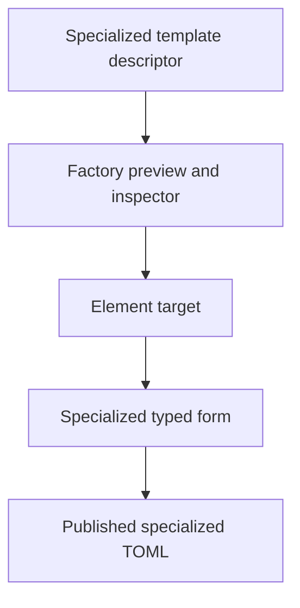
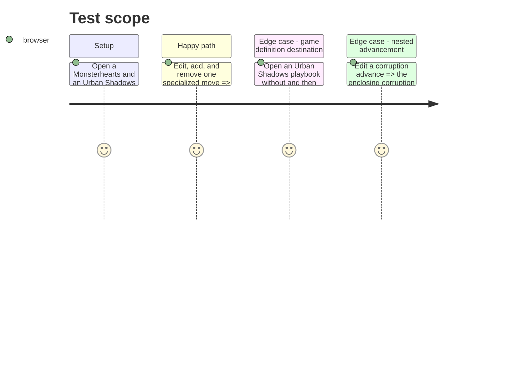

# Instruction: Remove JSON fallbacks from specialized playbooks

## Architecture projection

> Tree of the final files. ✅ create · ✏️ modify · ❌ delete

```txt
src/templates/pbta/specialized/definitionFactory.tsx ✏️ Accepts and uses a per-template declarative editor schema instead of serializing sections as JSON.
src/templates/monsterhearts/playbook/editorSchema.ts ✅ Declares Monsterhearts fields, moves, advances, and conditional data.
src/templates/monsterhearts/playbook/editor/MonsterheartsPlaybookEditorPanel.tsx ✏️ Resolves schema targets and removes JSON fallback editing.
src/templates/monsterhearts/playbook/preview/MonsterheartsPlaybookPreview.tsx ✏️ Emits individual list-element targets and collection creation targets.
src/templates/urban-shadows/playbook/editorSchema.ts ✅ Declares Urban Shadows fields, moves, advancement, corruption, relationships, and creation data.
src/templates/urban-shadows/playbook/editor/UrbanShadowsPlaybookEditorPanel.tsx ✏️ Routes common fields through descriptors and retains only the game-definition destination extension.
src/templates/urban-shadows/playbook/preview/UrbanShadowsPlaybookPreview.tsx ✏️ Emits individual list-element targets and collection creation targets.
src/templates/masks/playbook/definition.tsx ✏️ Supplies an editing descriptor to the specialized factory.
src/templates/monster-of-the-week/playbook/definition.tsx ✏️ Supplies an editing descriptor to the specialized factory.
src/templates/the-sprawl/playbook/definition.tsx ✏️ Supplies an editing descriptor to the specialized factory.
```

## User Journey



## Test Scope



## Wireframe

```txt
┌──────────────────────────────────────────────┐
│ (1) Specialized playbook preview              │
│ (2) Specialized collection rows       (3) [+] │
├──────────────────────────────────────────────┤
│ (4) Inspector                                 │
│ (5) Type-specific fields              (6) [×] │
└──────────────────────────────────────────────┘
```

1. Existing game-specific preview is retained.
2. Rendered collection elements have precise targets.
3. Descriptor-owned empty element creation.
4. Shared inspector container.
5. Published specialized fields rendered by descriptors and callbacks.
6. Guarded item removal.

## Tasks to do

### `1)` Teach the specialized factory about editor schemas

> Replace its generic JSON surface without losing its compact template configuration.

1. Require/accept an editor descriptor in factory configuration and use common preview target and editor resolution helpers.
2. Remove `StructuredJsonEditor` from the factory and ensure each consumer gives all rendered sections an editing description.

### `2)` Migrate Monsterhearts and Urban Shadows

> Make their moves and nested lists type-directed and individually editable.

1. Declare their published document shapes, empty element factories, and conditions.
2. Split preview clicks between element and collection targets.
3. Preserve Urban Shadows’ game-definition-aware relationship and creation destination behavior as an explicit extension.

### `3)` Migrate factory consumers

> Give Masks, Monster of the Week, and The Sprawl typed forms in place of JSON blobs.

1. Add descriptors and focused preview target wiring for each configured section.
2. Verify their contract keys continue to parse and stringify through the existing published codecs.

## Test acceptance criteria

| Task | Acceptance criteria |
| --- | --- |
| 1 | No specialized playbook exposes raw JSON as its normal editing UI. |
| 2 | Monsterhearts and Urban Shadows users can target, add, edit, and remove an individual move from the preview-driven flow. |
| 2 | An Urban Shadows dependency failure explains the unavailable destination control without hiding unrelated editable fields. |
| 3 | Every specialized-factory playbook supplies a descriptor for each visible editable section. |
