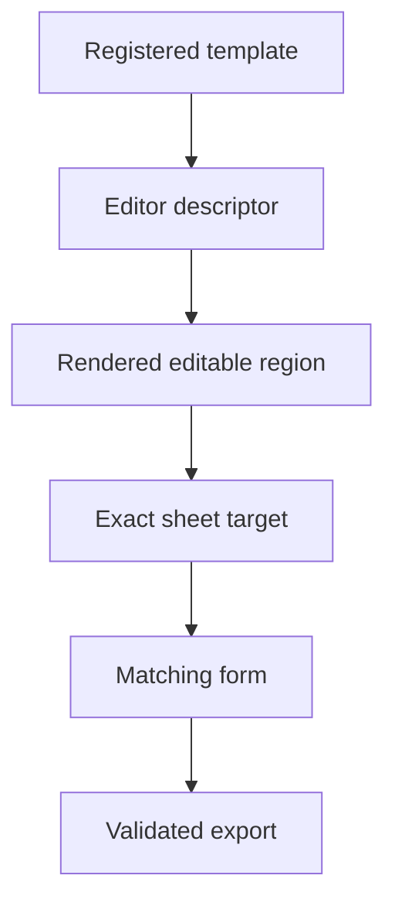
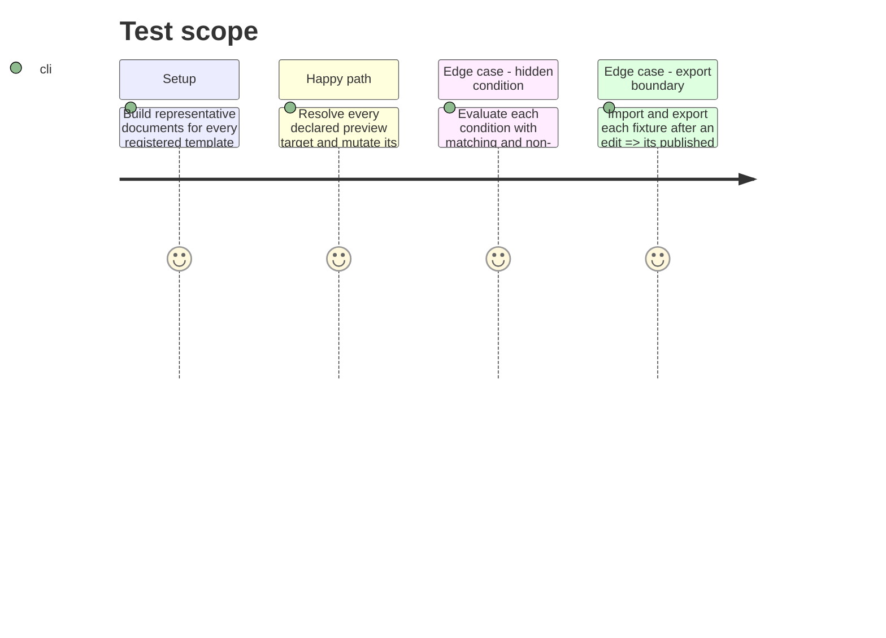

# Instruction: Migrate the remaining template families and prove the contract

## Architecture projection

> Tree of the final files. ✅ create · ✏️ modify · ❌ delete

```txt
src/templates/city-of-mist/**/editorSchema.ts ✅ Adds declarative mappings for City of Mist template families that currently duplicate form/list logic.
src/templates/legend-in-the-mist/**/editorSchema.ts ✅ Adds declarative mappings for Legend in the Mist template families that currently duplicate form/list logic.
src/templates/otherscape/**/editorSchema.ts ✅ Adds declarative mappings for Otherscape template families that currently duplicate form/list logic.
src/templates/adrenaline/**/editorSchema.ts ✅ Adds declarative mappings for Adrenaline template families where their published types can be described.
src/templates/**/editor/**/* ✏️ Delegates declared scalar, collection, and conditional behavior to the common runtime and retains only true domain extensions.
src/templates/**/preview/**/* ✏️ Emits exact field/element/collection targets for every editable rendered region.
src/templates/shared/StructuredJsonEditor.tsx ❌ Removes the raw JSON fallback after all consumers are migrated.
tools/assertContracts.harness.mts ✏️ Checks every registered template descriptor against representative document fixtures and contract round trips.
docs/codebase-architecture.md ✏️ Documents the schema-to-preview-to-inspector ownership boundary and target invariant.
docs/adding-a-template.md ✏️ Requires a descriptor, element target wiring, and collection empty factories for new templates.
```

## User Journey



## Test Scope



## Tasks to do

### `1)` Migrate remaining families in bounded batches

> Replace copied list/form mechanics while keeping each game’s preview styling and document module ownership intact.

1. Migrate City of Mist, Legend in the Mist, Otherscape, and Adrenaline one family at a time, starting with forms that currently perform their own add/remove/create behavior.
2. Start each family with a checked inventory of registered templates, rendered editable regions, and editor descriptors; use it as the completion gate before retiring its copied forms.
3. For every rendered editable datum, wire an exact target; for every collection, declare the empty factory, deletion guard, and ordering capability.
4. Delete superseded duplicated forms and the JSON fallback only after its final consumer is gone.

### `2)` Make traceability mechanically verifiable

> Prevent a future preview region or schema field from silently losing its editor mapping.

1. Extend the contract harness to enumerate registered template descriptors and representative targets.
2. Fail the assertion when a declared editable target lacks a renderer, a collection lacks an empty factory, a condition names an invalid path, or an edited fixture fails its published contract.
3. Record the ownership boundary in contributor documentation.

## Test acceptance criteria

| Task | Acceptance criteria |
| --- | --- |
| 1 | All registered templates use typed form controls for normal editing; no raw JSON fallback remains. |
| 1 | Every preview-visible collection distinguishes a collection create target from its individual element edit targets. |
| 1 | Each migrated collection supports only the declared add, remove, and reorder behaviors. |
| 1 | The migration inventory accounts for every registered template and every preview region declared editable before that family is marked complete. |
| 2 | The automated contract assertion fails on a broken schema/path/target/form linkage. |
| 2 | `npm run build`, `npm run lint`, and `npm run assert:contracts` pass for the completed migration. |
