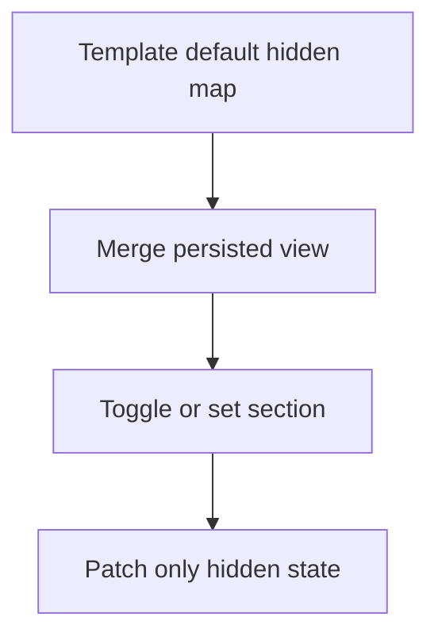
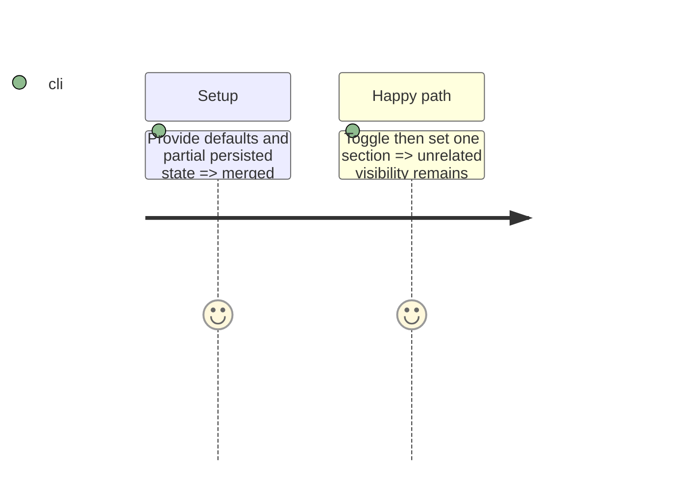

# Instruction: Specify and test the protocol

## Architecture projection

```txt
src/templates/shared/visibility.ts       ✅ typed merge, toggle and set helper
tools/assertWorkspace.harness.mts        ✏️ assert merge and mutation invariants
```

## User Journey



## Test Scope



## Tasks to do

### `1)` Create the generic visibility operations

1. Define typed merge, toggle and set operations for a keyed boolean map.
2. Preserve immutability and expose no template-specific state.
3. Add harness witnesses for defaults, partial persisted views and immutable mutations.

## Test acceptance criteria

| Task | Acceptance criteria |
| --- | --- |
| 1 | Every operation preserves unrelated keys and never mutates its input maps. |
