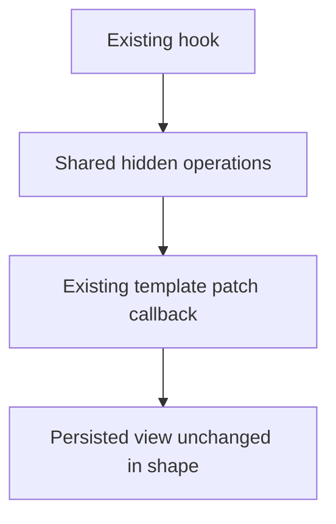
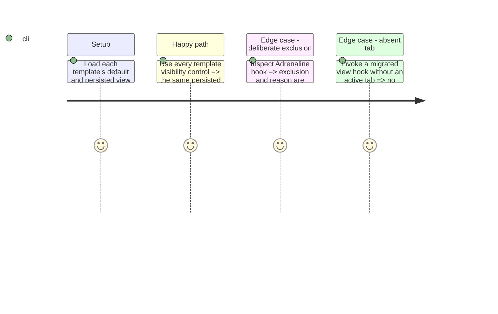

# Instruction: Migrate template hooks

## Architecture projection

```txt
src/templates/{city-of-mist,otherscape,legend-in-the-mist,pbta,urban-shadows,monsterhearts}/**/hooks.ts  ✏️ consume shared visibility operations
src/templates/adrenaline/shared/hooks.ts                                                               ✏️ document exclusion: no hidden view protocol
```

## User Journey



## Test Scope



## Tasks to do

### `1)` Replace duplicated protocol bodies

1. Migrate all 18 hooks found to the helper without changing public hook APIs.
2. Keep template-specific reset and view fields local; preserve each hook's existing no-active-tab behavior.
3. Document the Adrenaline exclusion beside its hook.

## Test acceptance criteria

| Task | Acceptance criteria |
| --- | --- |
| 1 | No migrated hook duplicates hidden merge, toggle or set logic. |
