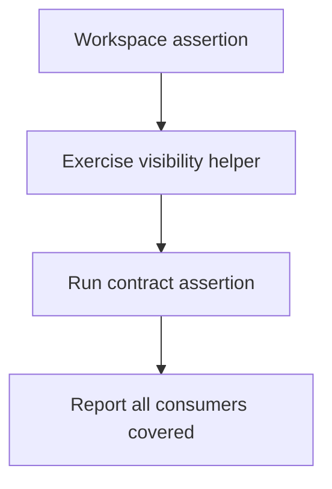
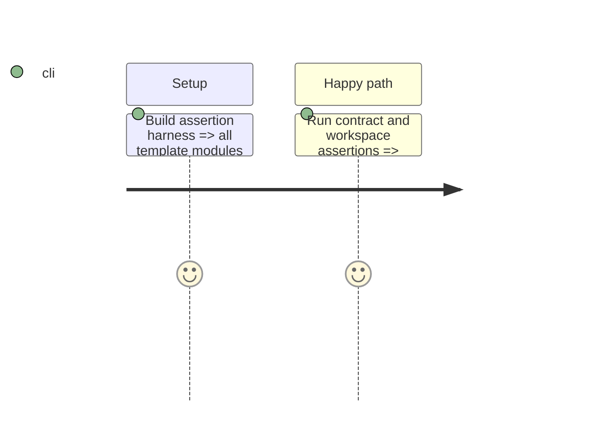

# Instruction: Prove registry-wide conformance

## Architecture projection

```txt
tools/assertVisibilityProtocol.mjs  ✅ statically enumerate shared-protocol consumers and exclusions
tools/assertWorkspace.harness.mts   ✏️ exercise the helper's behavioral invariants
package.json                         ✏️ expose the dedicated assertion command
```

## User Journey



## Test Scope



## Tasks to do

### `1)` Lock the migration in assertions

1. Add a static assertion with an explicit 18-hook allowlist and the documented Adrenaline exclusion; it verifies each consumer imports the helper and owns no duplicated operation.
2. Keep behavioral helper witnesses in the workspace harness, rather than attempting to infer behavior from source text.
3. Run the dedicated, contract and workspace assertions after the migration.

## Test acceptance criteria

| Task | Acceptance criteria |
| --- | --- |
| 1 | A future duplicated or omitted consumer is detected by the dedicated static assertion, while behavioral regressions fail the workspace harness. |
