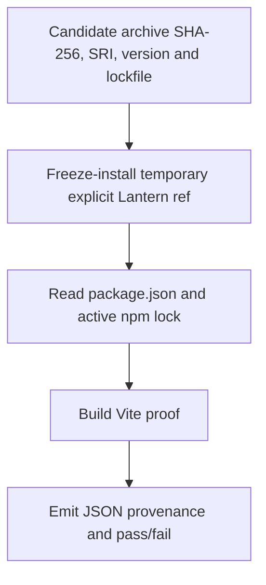
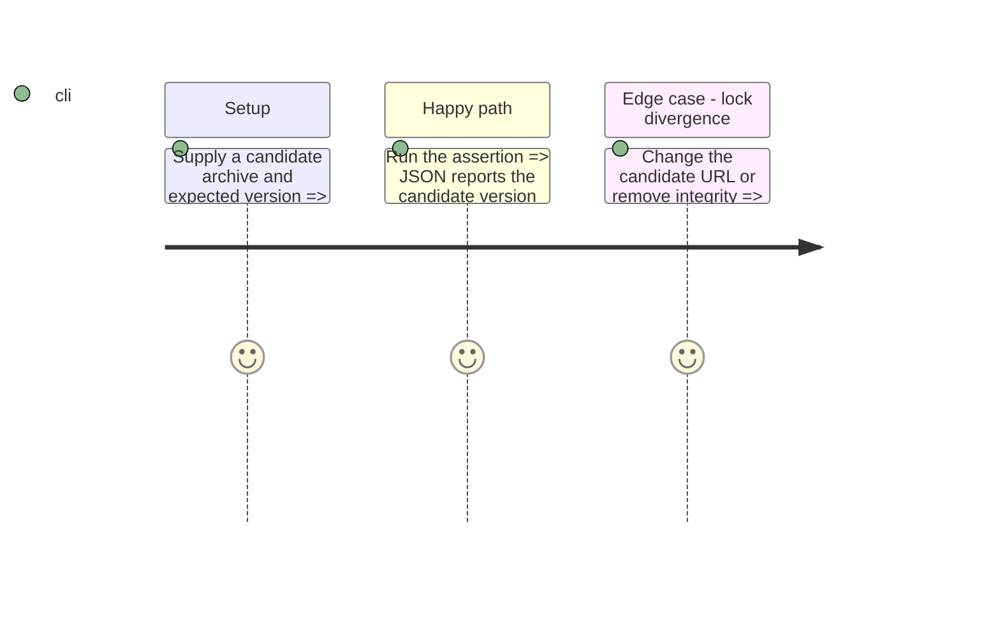

# Instruction: Build the candidate-adoption proof

## Architecture projection

```txt
.
├── tools/assertSchemaPbtaCandidate.mjs             ✅ validate the active npm lock and emit the machine-readable adoption result
├── tools/assertSchemaPbtaCandidate.harness.mts     ✅ import the candidate appearance API in a Vite-visible proof surface
├── package.json                                    ✏️ expose the assertion command
└── package-lock.json                               ✏️ record the candidate URL and integrity selected for the proof fixture
```

## User Journey



## Test Scope



## Tasks to do

### `1)` Prove active dependency adoption

1. Accept one relative JSON manifest with `candidate.releaseUrl`, `candidate.sha256`, `candidate.integrity`, `candidate.finalTag` and `consumer.ref`; validate it matches the Handbook release-train contract.
2. Add a controlled Lantern lock generator accepting the PbtA, Mist and Adrenaline URL/SRI pairs. It may normalize only these three direct archive entries, rejects any version or transitive dependency drift, then proves `pnpm install --frozen-lockfile` in a clean store. The adoption branch commits package.json and pnpm-lock.yaml; the release runner never mutates that ref.
3. Parse package.json and the active lockfile after the frozen install, rejecting divergent URL, version, integrity, package-manager selection or a competing npm/pnpm lock.
4. Emit a sibling evidence JSON containing ref, resolved package version, archive URL, SHA-256, SRI, Vite proof results and pass/fail status.

### `2)` Prove browser asset adoption

1. Exercise the published Monsterhearts appearance URL API in a production Vite build.
2. Assert base and drowned-lake asset URLs are present in the generated asset graph without a local resource-path map.
3. Assert variants remain outside the TOML codec boundary.

## Test acceptance criteria

| Task | Acceptance criteria |
| --- | --- |
| 1 | The command fails deterministically for an archive SHA-256 or lockfile SRI mismatch, package/lock URL or version disagreement, missing integrity, unknown candidate version, active competing lock, or any lock drift outside the three direct schema archives. |
| 1 | Passing output is machine-readable and names the exact ref, archive and resolved version. |
| 2 | The production build contains candidate-derived base and drowned-lake resources. |
| 2 | The proof uses schema-pbta exports only and does not add appearance data to TOML. |

## Progress

The adoption branch now contains the controlled three-archive generator and its stable pnpm lockfile. The generator runs pnpm resolution, rejects any graph drift outside those direct entries, restores the previous lockfile on failure, and proves a clean-store frozen install before its output can be committed.
