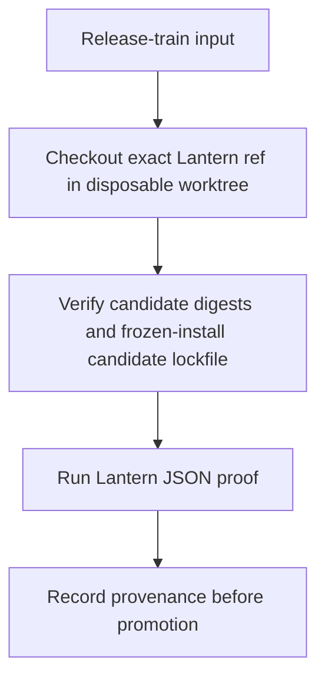
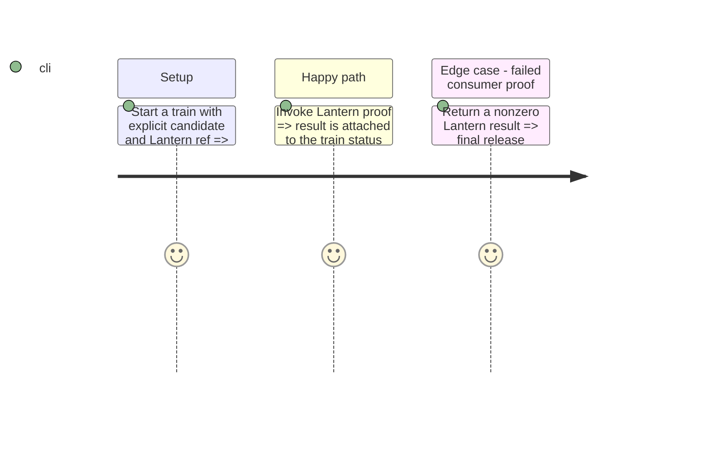

# Instruction: Wire the release-train invocation

## Architecture projection

```txt
schema-pbta/
└── release-train orchestration                         ✏️ invoke Lantern's proof at the explicit candidate archive and Lantern ref
```

## User Journey



## Test Scope



## Tasks to do

### `1)` Consume the Lantern proof from the central train

1. In schema-pbta, create disposable consumer worktrees at their declared refs, verify the candidate archive SHA-256 and each lockfile SRI, place the pre-generated candidate lockfile, and freeze-install before invoking each proof. For Handbook's pnpm lock, read SRI from the resolved package entry rather than its importer, which does not carry it. Do not reuse the daily pinned matrix, a dependency overlay or `--no-save`.
2. Preserve the command's JSON output, including its resolved lockfile identity and both digests, as provenance and fail the train on any false check.
3. Keep the existing daily cross-tool gate independent and unchanged.

## Test acceptance criteria

| Task | Acceptance criteria |
| --- | --- |
| 1 | The orchestrator runs the candidate proof only at the declared Lantern ref and records its JSON provenance. |
| 1 | A failed proof blocks final release promotion without changing the daily pinned gate. |
