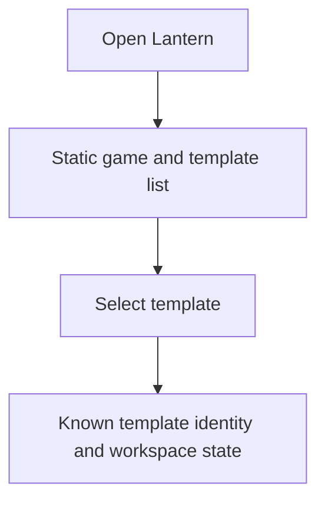
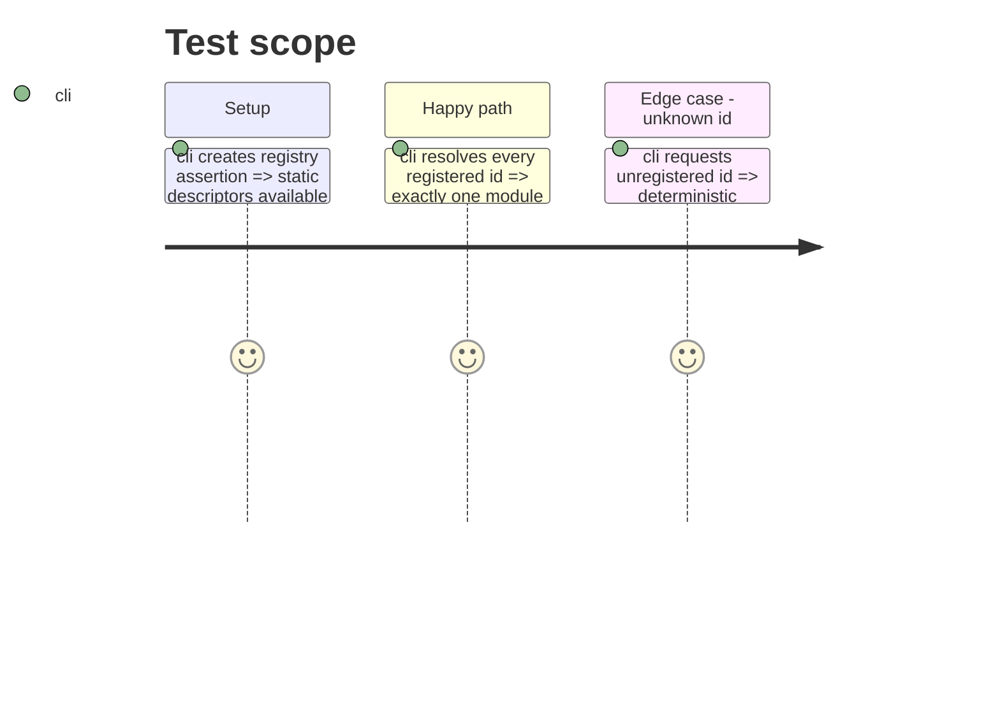

# Instruction: Separate registry descriptors from template modules

## Architecture projection

```txt
src/core/templates/
├── registry.tsx ✏️ static descriptors and literal module loaders
├── types.ts ✏️ distinguish static descriptor from resolved render definition
└── templateLoader.ts ✨ resolve and cache a definition by template id
src/templates/**/descriptor.ts ✨ non-React identity, document factories, codecs and metadata
src/templates/**/definition.tsx ✏️ import its descriptor and supply only render factories
```

## User Journey



## Test Scope



## Tasks to do

### `1)` Split descriptor and renderer responsibilities

1. Extract identity, labels, sections, document factories and tab titles from every `definition.tsx` into a sibling non-React descriptor/static module; keep schema-backed TOML codecs lazy.
2. Make every `definition.tsx` compose that descriptor with React preview, editor, appearance and export-settings factories.
3. Register descriptors statically and one literal dynamic loader for every current template id.
4. Preserve registry integrity assertions and reject any descriptor without a corresponding loader.

## Test acceptance criteria

| Task | Acceptance criteria |
| --- | --- |
| 1 | Sidebar grouping, hydration and template factories are available without importing a render module. |
| 1 | Each current template id resolves one lazy module; unknown ids never trigger an arbitrary import. |
