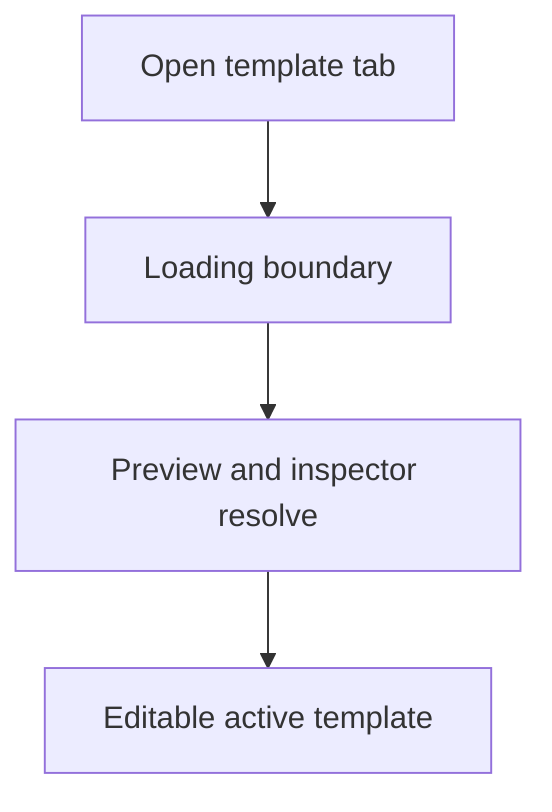
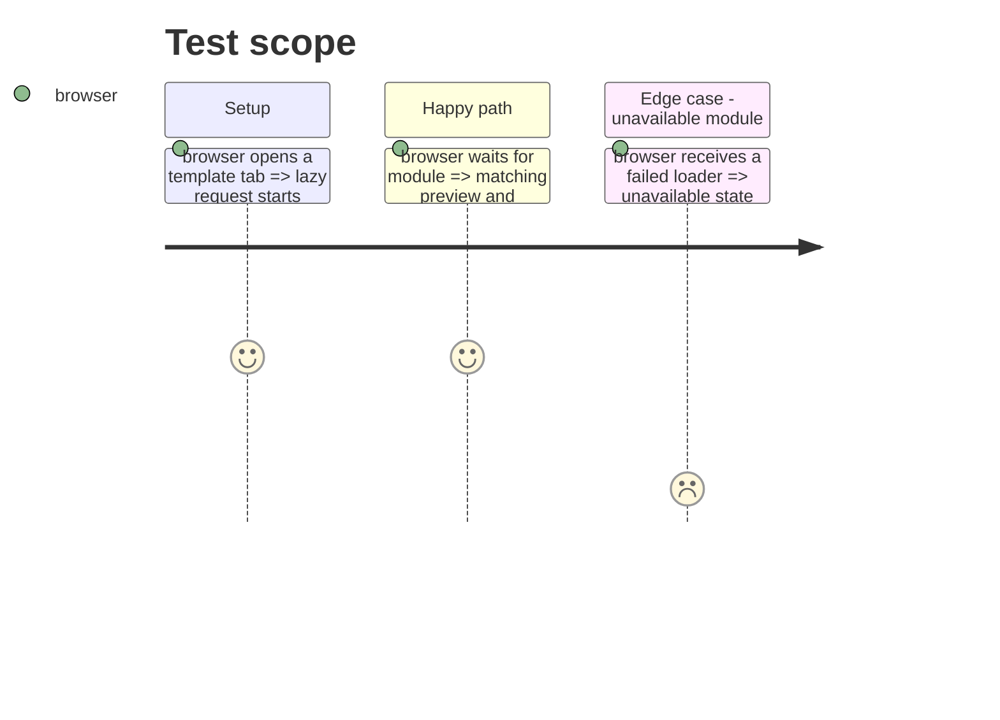

# Instruction: Load the active module behind a visible boundary

## Architecture projection

```txt
src/app/
├── App.tsx ✏️ provide the active resolved module to both columns
├── useAppShellState.ts ✏️ expose the active static descriptor
├── AppMainContent.tsx ✏️ render preview through the shared boundary
└── TemplateLoadingState.tsx ✨ consistent preview and inspector placeholder
src/core/templates/activeTemplateModule.tsx ✨ shared loader, Suspense and failure state
src/core/templates/shell/TemplateInspector.tsx ✏️ consume the shared resolved module
```

## User Journey



## Test Scope



## Wireframe

```txt
┌────────────────────────────────────────────┐
│ (1) App chrome                             │
├────────────────────────────────────────────┤
│ (2) Template loading region                │
│     preview placeholder                    │
└────────────────────────────────────────────┘
```

1. Existing navigation remains visible while the selected module loads.
2. One bounded loading region replaces the preview and inspector until resolution.

## Tasks to do

### `1)` Add a single active-template loading state

1. Resolve the active template module from its static descriptor in a shared provider mounted by `App`.
2. Put preview and inspector behind consumers of that provider so both render the same module state.
3. Preserve existing unavailable-template handling and tab routing.

## Test acceptance criteria

| Task | Acceptance criteria |
| --- | --- |
| 1 | Opening every implemented template reaches its existing preview and editor after a visible loading state. |
| 1 | A failed or unavailable loader does not blank navigation or corrupt the active workspace tab. |
