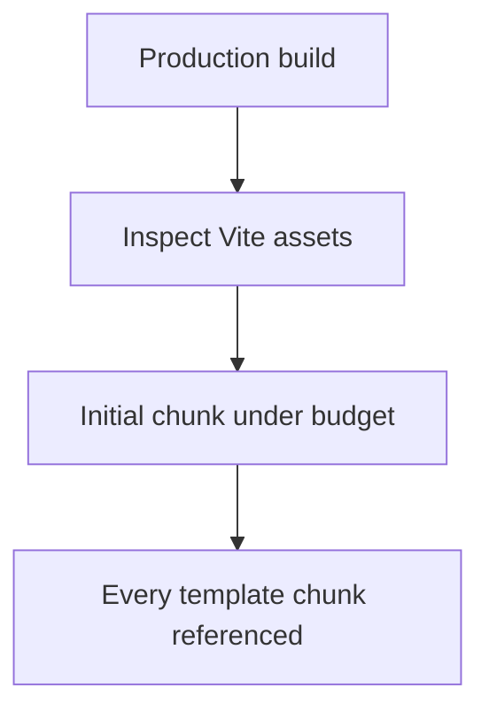
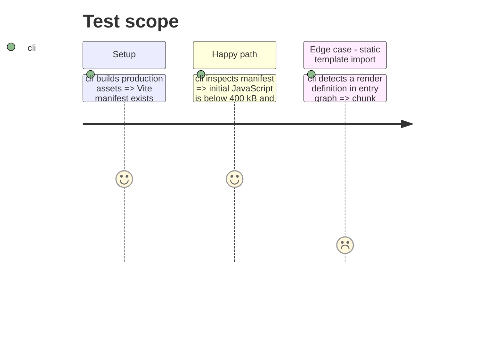

# Instruction: Prove chunk budget and all-template availability

## Architecture projection

```txt
tools/
└── assert-template-chunks.mjs ✨ inspect Vite manifest and template loader coverage
package.json ✏️ expose the chunk assertion
vite.config.ts ✏️ enable production manifest output
```

## User Journey



## Test Scope



## Tasks to do

### `1)` Make the performance contract executable

1. Enable Vite's production manifest and inspect it after build.
2. Assert the entry JavaScript budget, that definitions are excluded from the entry dependency graph, and one dynamic chunk exists for every id in the static registry.
3. Retain existing TypeScript, workspace and contract assertions.

## Test acceptance criteria

| Task | Acceptance criteria |
| --- | --- |
| 1 | The first JavaScript payload is below 400 kB. |
| 1 | Adding a 25th registry id requires a matching non-entry loader chunk and does not add a definition to the entry graph. |
| 1 | The build and every registered template remain reachable. |
