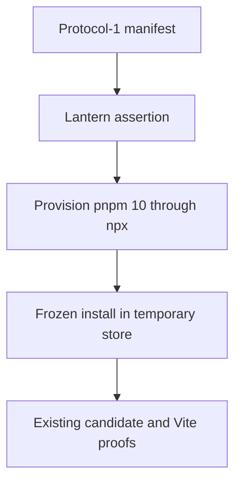
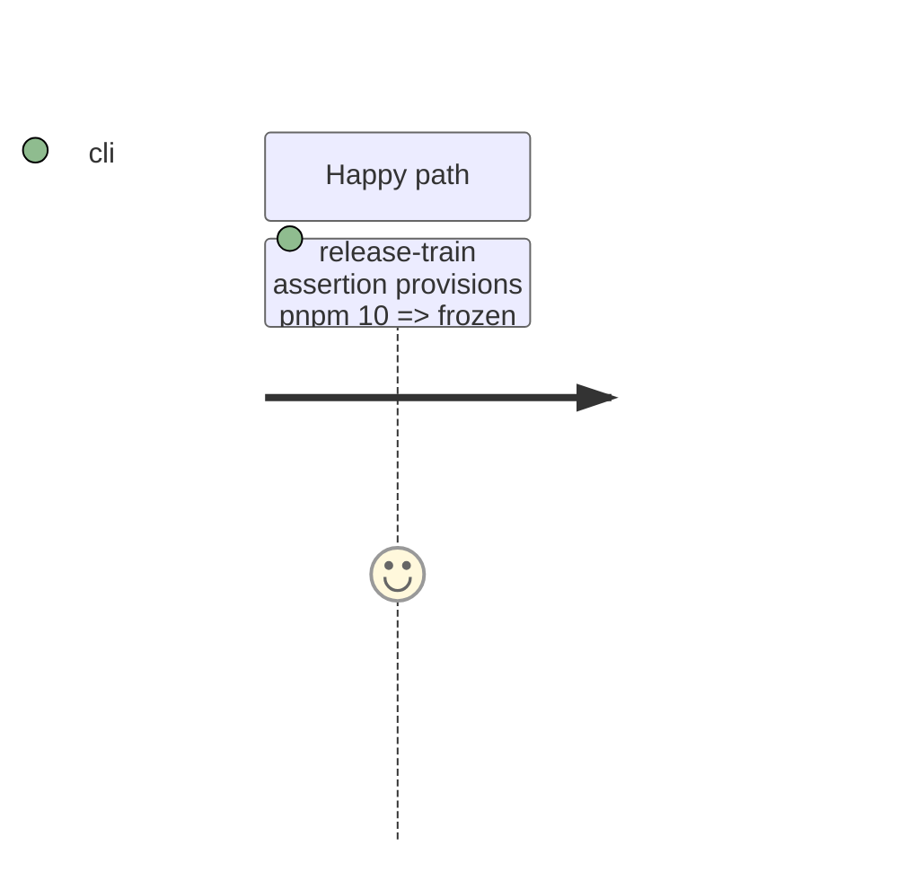

# Instruction: Deterministic isolated installation

## Architecture projection

```txt
tools/
└── release-train-assert.mjs ✏️ expose and execute one provisioned frozen-install command
```

## User Journey



## Test Scope



## Tasks to do

### `1)` Replace the implicit package-manager dependency

> Execute the existing install arguments through a provisioned pnpm 10 command.

1. Extract the frozen-install command construction as a testable helper in the assertion module.
2. Keep the frozen lockfile, ignored lifecycle scripts, and temporary store arguments unchanged.
3. Route that command through `npx --yes pnpm@10`.

## Test acceptance criteria

| Task | Acceptance criteria |
| --- | --- |
| 1 | The assertion installs the candidate from its committed lockfile without requiring `pnpm` in PATH. |
| 1 | The temporary store is still removed after a successful or failed install. |
