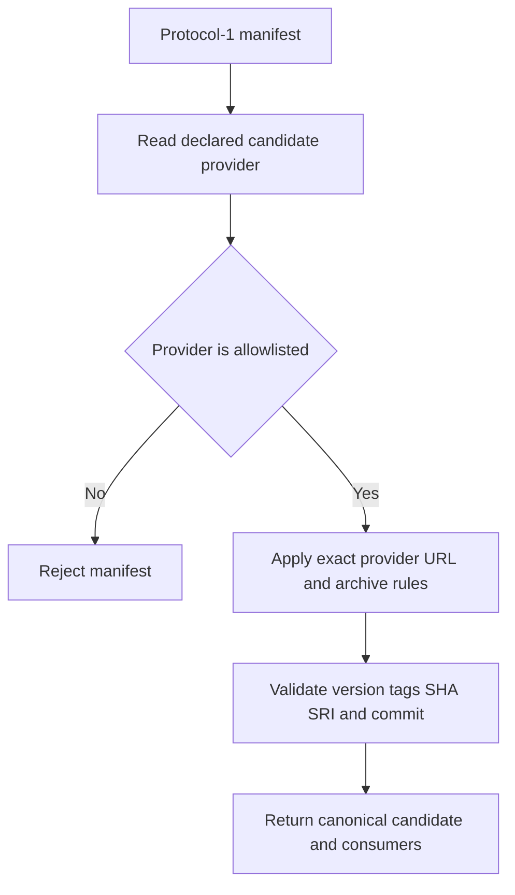
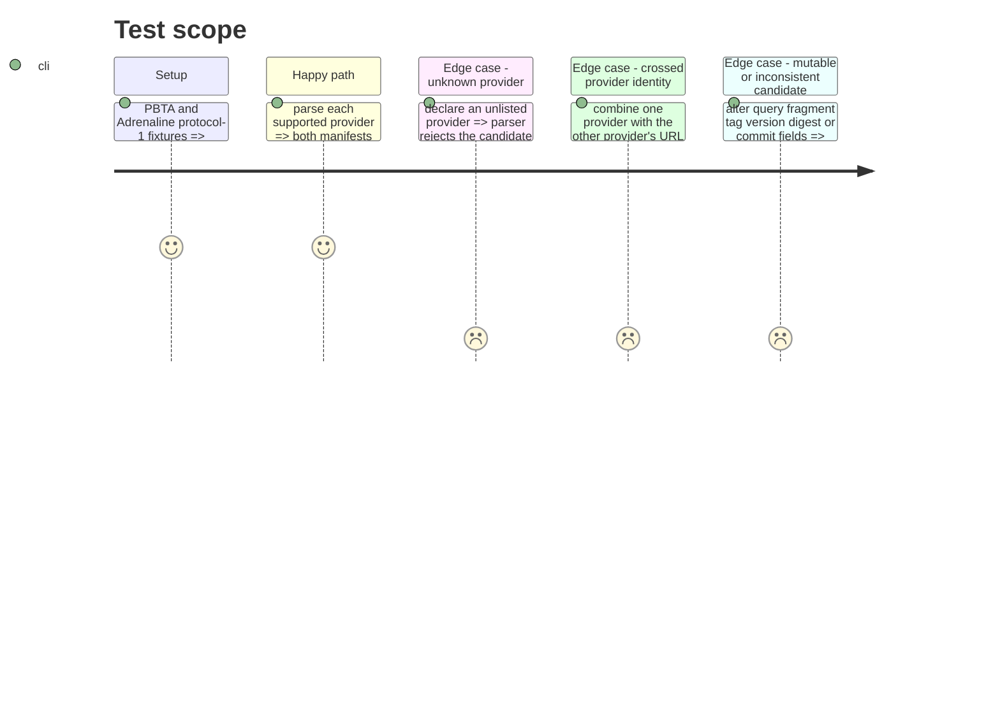

# Instruction: Strict provider-aware protocol

## Architecture projection

> Tree of the final files. ✅ create · ✏️ modify · ❌ delete

```txt
tools/
├── release-train-protocol.mjs ✏️ validate each declared provider against its exact repository, archive name, version, tags, digests, and commit contract
└── release-train-protocol.harness.mjs ✏️ cover valid PBTA and Adrenaline manifests plus provider-specific rejection cases
```

## User Journey



## Test Scope



## Tasks to do

### `1)` Model strict provider identities

> Generalize only the candidate identity while keeping the protocol envelope closed.

1. Define the supported provider facts for `schema-pbta` and `schema-adrenaline`, including the canonical GitHub repository path and archive basename.
2. Select validation from `candidate.provider`; reject unknown providers and retain exact candidate keys.
3. Validate stable HTTPS release URLs with no query or fragment, exact staging/final tags, SemVer, SHA-256, SHA-512 SRI, and full provider commits against the selected provider.
4. Preserve the canonical two-consumer envelope and checked-out Lantern ref verification.

### `2)` Lock the generalized parser with regressions

> Prove that supporting Adrenaline does not make either provider's contract permissive.

1. Add a valid protocol-1 Adrenaline fixture alongside the existing PBTA fixture.
2. Cover unknown providers, provider/URL crossings, malformed archive names, tags, hashes, integrity, commits, signed query strings, and URL fragments.
3. Keep the harness Node-only and independent of network downloads or dependency installation.

## Test acceptance criteria

| Task | Acceptance criteria |
| --- | --- |
| 1 | A canonical `schema-adrenaline` candidate and the existing canonical `schema-pbta` candidate both parse without changing the protocol-1 envelope. |
| 1 | Each provider accepts only its own stable GitHub release path and exact `<provider>-<version>.tgz` archive name. |
| 1 | Unknown providers and any inconsistent URL, version, tag, SHA-256, SRI, or full commit are rejected, including URLs with a query or fragment. |
| 1 | Consumer roles, repositories, and 40-character refs remain strict and Lantern selection still matches checked-out HEAD. |
| 2 | The local protocol harness covers both supported providers and all named rejection cases without network access. |
