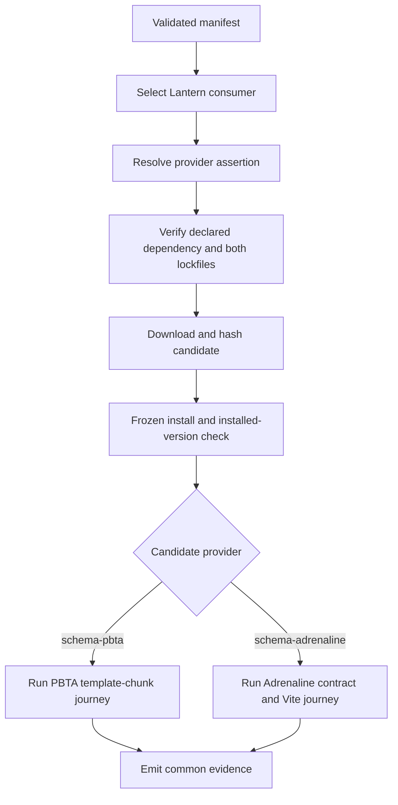
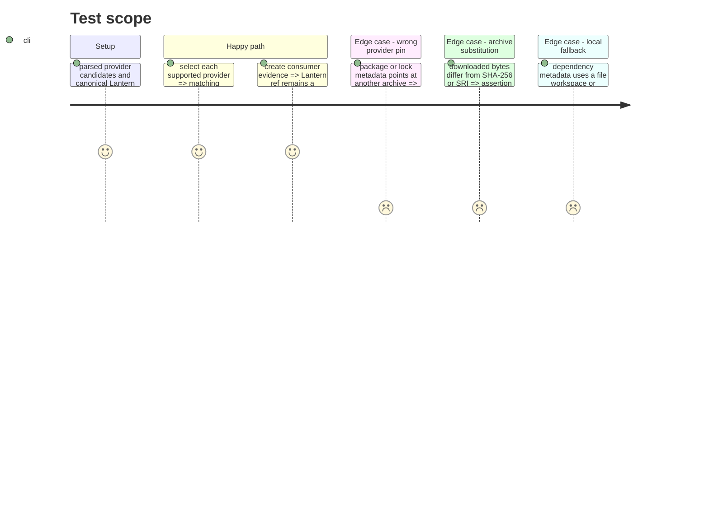

# Instruction: Provider-specific proof dispatch

## Architecture projection

> Tree of the final files. ✅ create · ✏️ modify · ❌ delete

```txt
tools/
├── release-train-assert.mjs ✏️ dispatch lock, install, and consumer-journey checks from the validated provider while emitting common evidence
└── release-train-protocol.harness.mjs ✏️ assert provider dispatch and full-commit evidence without executing the network journey
```

## User Journey



## Test Scope



## Tasks to do

### `1)` Dispatch provider-owned dependency and journey checks

> Reuse the common proof mechanics while selecting the package and runnable consumer journey explicitly by provider.

1. Use the already allowlisted `candidate.provider` directly as the dependency package name; dispatch `schema-pbta` to its template-chunk journey and `schema-adrenaline` to contract conformance plus a Vite build.
2. Reuse the behavior of the former dedicated Adrenaline assertion behind the parsed protocol-1 candidate; do not restore its legacy `manifestVersion`/`provider` envelope.
3. Generalize package and lock resolution checks to the selected provider and require the exact published URL, version, and SRI in `package.json`, `pnpm-lock.yaml`, and `package-lock.json`.
4. Keep archive download, SHA-256/SRI verification, isolated frozen installation, installed package version verification, and repository cleanliness common.
5. Reject any unsupported provider or local/workspace resolution instead of supplying a fallback assertion.

### `2)` Preserve common consumer evidence

> Make either provider produce the same orchestration-facing proof shape.

1. Record the selected provider checks and journey identifier without changing the protocol-1 candidate or canonical consumer identity.
2. Keep `consumer.ref` as the checked-out 40-character Lantern commit and preserve the exact shared `lock: { file, releaseUrl, integrity }` object for the active `pnpm-lock.yaml`.
3. Record successful `package-lock.json` verification as a named journey check rather than changing the externally validated evidence shape.
4. Extend the Node harness around exported dispatch/evidence helpers so provider selection is covered without downloads or installs.

## Test acceptance criteria

| Task | Acceptance criteria |
| --- | --- |
| 1 | A PBTA manifest retains the existing PBTA package and template-chunk proof behavior. |
| 1 | An Adrenaline manifest resolves the validated `schema-adrenaline` provider as its package, verifies both lockfiles, and runs contract conformance plus a production Vite build after an isolated frozen install. |
| 1 | SHA-256 or SRI mismatch, installed-version drift, wrong dependency URL, and every local/workspace fallback prevent evidence creation. |
| 2 | Evidence from either provider preserves the existing single-`lock` envelope, names secondary npm-lock verification in `journey.checks`, and carries the exact full Lantern commit under `consumer.ref`. |
| 2 | The Node harness proves dispatch and evidence behavior without network or installation side effects. |
