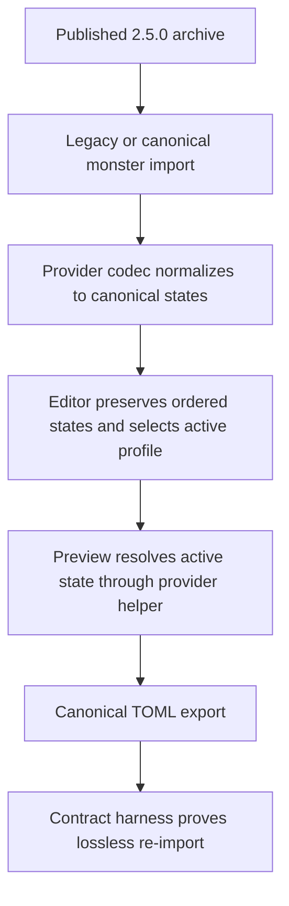
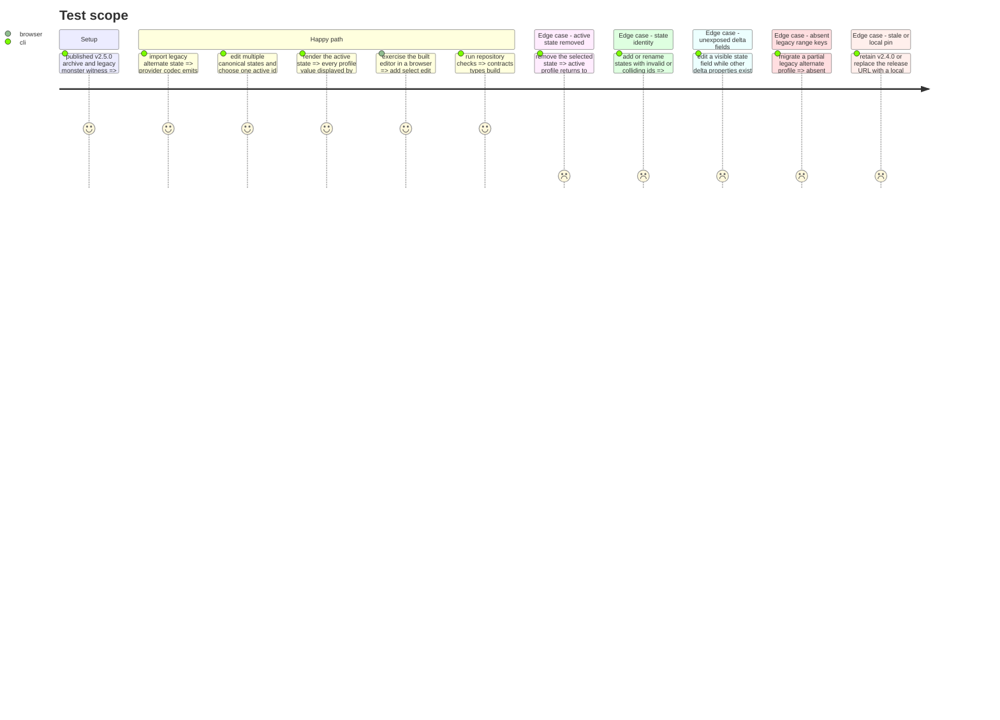

# Instruction: Candidate and canonical-state adoption

## Architecture projection

> Tree of the final files. ✅ create · ✏️ modify · ❌ delete

```txt
.
├── package.json ✏️ pin schema-adrenaline to the published v2.5.0-rc.2 archive
├── package-lock.json ✏️ record the exact Adrenaline archive resolution, version, and integrity for npm
├── pnpm-lock.yaml ✏️ record the same archive resolution, version, and integrity for pnpm
├── src/
│   ├── i18n/locales/
│   │   ├── en/adrenaline.ts ✏️ name canonical monster-state controls
│   │   └── fr/adrenaline.ts ✏️ provide the matching French controls
│   └── templates/adrenaline/
│       ├── monstre/
│       │   ├── states.ts ✅ centralize lossless validated state edits and published profile resolution
│       │   ├── editor/MonstreEditorPanel.tsx ✏️ edit ordered canonical states and the active profile
│       │   └── preview/MonstrePreview.tsx ✏️ render the provider-resolved active profile and state summary
│       └── shared/legacyRanges.ts ✏️ avoid materializing absent optional legacy range keys
└── tools/assertContracts.harness.mts ✏️ accept the published legacy-to-canonical migration and prove state preservation
```

## User Journey



## Test Scope



## Wireframe

```txt
┌──────────────────────────────────────┬──────────────────────────────┐
│ (1) Monster editor                   │ (4) Monster preview          │
│ Existing creature sections           │ Header and base information  │
├──────────────────────────────────────┤ Resolved active profile      │
│ (2) States                           ├──────────────────────────────┤
│ Active profile [ Base / state id ▾ ] │ (5) State summary            │
│ ┌──────────────────────────────────┐ │ Active state name            │
│ │ (3) State card                  │ │ Available state names        │
│ │ id · name · triggers            │ │                              │
│ │ replacement profile fields      │ │                              │
│ │ remove                          │ │                              │
│ └──────────────────────────────────┘ │                              │
│ [ add state ]                        │                              │
└──────────────────────────────────────┴──────────────────────────────┘
```

1. Monster editor: keeps the existing form sections around the changed state region.
2. States: owns the active-profile selector and the ordered canonical state list.
3. State card: edits identity, triggers, and the existing replacement-profile controls without discarding unexposed delta fields.
4. Monster preview: reads the profile resolved by the provider helper rather than reproducing delta semantics.
5. State summary: identifies the active state and the other available named states.

## Tasks to do

### `1)` Pin the immutable Adrenaline candidate

> Make every package-manager view resolve the same published v2.5.0 bytes.

1. Set `schema-adrenaline` to `https://github.com/RebelliousSmile/schema-adrenaline/releases/download/v2.5.0-rc.2/schema-adrenaline-2.5.0.tgz`.
2. Regenerate the npm and pnpm lock entries with version `2.5.0` and SRI `sha512-cb/ZUmHy5LYaMQPmit7tRQIybBQWW8fFN4fgeaHZYoSZHKFuQJgIFVc3p/BhgRVhT00dT7r9DZCk7gmPMTpkjQ==` while preserving unrelated resolutions.
3. Confirm no file, link, workspace, override, or signed URL replaces the published archive in either lockfile.

### `2)` Adopt canonical monster states

> Replace the single legacy editor path with lossless provider-owned state semantics.

1. Add pure state helpers that read ordered `etats`, preserve complete state/delta objects during edits, repair `etatActif` when an active state is renamed or removed, generate the next available slug from the `etat` base, validate edited state objects with the provider-exported `EtatDeCreature` schema, add a list-level duplicate-id check, and delegate profile resolution to `resoudreEtatMonstre` from `schema-adrenaline`.
2. Replace `etatAlternatif` controls with ordered state cards for `id`, `nom`, `declencheurs`, and the currently exposed replacement fields under `delta`; preserve every provider field the UI does not expose and keep the existing list order across additions, edits, active selection, and removals. The add action creates `{ id: nextAvailableId, nom: localizedNewStateName, delta: {} }`; an invalid or duplicate id leaves the last valid canonical document unchanged and displays a localized inline error.
3. Add an active-profile selector containing `base` and the declared state ids, with localized English and French labels; selecting `base` removes `etatActif` instead of persisting the sentinel value.
4. Resolve the complete monster value supplied to every existing preview section through the published helper, then show the active/available state summary without retaining consumer-local merge rules.

### `3)` Prove canonical migration and preservation

> Distinguish an intentional provider migration from accidental field loss.

1. Change the shared legacy range upgrader so it converts a key only when the source object owns that key. In the harness, compare the exact own-key set of a partial `etatAlternatif.caracteristiques` before and after preprocessing, assert that no absent characteristic is materialized with `undefined`, and assert that every present scalar characteristic is still converted to its `{ minimum, current, maximum }` range.
2. Keep strict raw-field loss checks for ordinary witnesses in both the published-codec loop and Lantern's template-module loop, but recognize the published monster migration only when legacy `etatAlternatif` becomes the exact canonical `etats` representation and disappears from output.
3. Assert parse-render-parse identity for the migrated witness, including `alternatif-historique`, its triggers, complete replacement characteristics, movement/detection/action values, and notes.
4. Add pure state-helper coverage for multiple ordered states, the minimal new-state object, collision-free id generation, provider-schema rejection, duplicate-id rejection without canonical-document mutation, base selection, active selection, rename/removal repair, unexposed delta preservation, and provider-resolved profile values.
5. Run frozen installation and the complete repository check suite, then exercise the rendered monster editor and preview in a browser: add two states, select one, edit an exposed delta value, observe the resolved preview, verify invalid/duplicate ids show the inline error without changing the canonical export, remove the active state, and verify fallback to base. Perform this smoke journey before committing the phase and leave no tracked artifacts.

## Test acceptance criteria

| Task | Acceptance criteria |
| --- | --- |
| 1 | `package.json`, `package-lock.json`, and `pnpm-lock.yaml` all resolve `schema-adrenaline` 2.5.0 from the exact v2.5.0-rc.2 archive with the verified SRI. |
| 1 | Frozen package installation succeeds without a local, workspace, override, or mutable URL fallback. |
| 2 | A legacy `etatAlternatif` import is normalized by the published codec and Lantern stores/exports only canonical `etats`/`etatActif`. |
| 2 | Multiple states remain ordered and lossless; additions create a provider-valid minimal state with a collision-free id; provider-invalid or duplicate edits leave the canonical document unchanged and show a localized error; editing one visible field preserves all unexposed delta properties; and removing or renaming the active state cannot leave a dangling `etatActif`. |
| 2 | Selecting the base profile omits `etatActif`, and the complete value consumed by every existing preview section comes from `resoudreEtatMonstre` for a selected state or from its base-profile result otherwise. |
| 3 | Legacy range upgrading preserves the exact own-key set of a partial state, creates no `undefined` characteristic properties, and still converts every present scalar characteristic to its truthful range before provider migration. |
| 3 | The contract harness accepts only the exact published legacy migration while continuing to reject unrelated dropped or altered fields. |
| 3 | The legacy witness re-exports canonically with its full state delta, and canonical multi-state data survives a second import/export unchanged. |
| 3 | The browser smoke journey proves that the rendered controls wire add/select/edit/validation/remove actions to canonical export and provider-resolved preview behavior. |
| 3 | Lint, typecheck, production build, contract, workspace, and release-protocol assertions all pass with Adrenaline 2.5.0 installed. |
