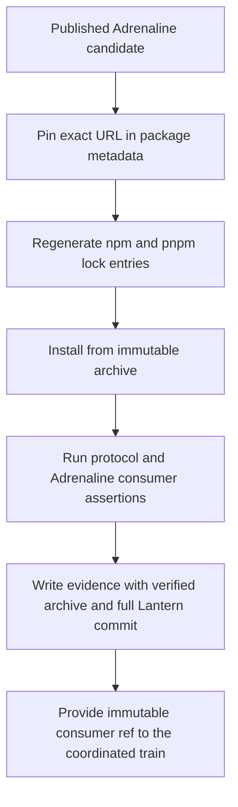
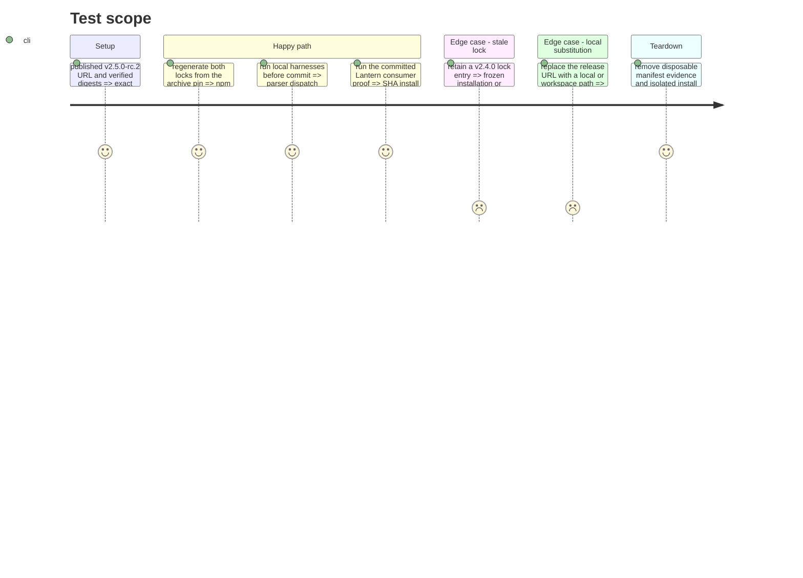

# Instruction: Published candidate adoption

## Architecture projection

> Tree of the final files. ✅ create · ✏️ modify · ❌ delete

```txt
.
├── package.json ✏️ pin schema-adrenaline to the published v2.5.0-rc.2 archive
├── package-lock.json ✏️ record the exact Adrenaline archive resolution, version, and integrity for npm
└── pnpm-lock.yaml ✏️ record the same archive resolution, version, and integrity for pnpm
```

## User Journey



## Test Scope



## Tasks to do

### `1)` Pin the immutable Adrenaline candidate

> Make every package-manager view resolve the same published v2.5.0 bytes.

1. Set `schema-adrenaline` to `https://github.com/RebelliousSmile/schema-adrenaline/releases/download/v2.5.0-rc.2/schema-adrenaline-2.5.0.tgz`.
2. Regenerate the npm and pnpm lock entries with version `2.5.0` and SRI `sha512-cb/ZUmHy5LYaMQPmit7tRQIybBQWW8fFN4fgeaHZYoSZHKFuQJgIFVc3p/BhgRVhT00dT7r9DZCk7gmPMTpkjQ==` while preserving unrelated resolutions.
3. Confirm no file, link, workspace, override, or signed URL replaces the published archive in either lockfile.

### `2)` Prove the consumer and hand off its immutable ref

> Validate the complete Adrenaline path and expose the committed Lantern revision to the shared train.

1. Before commit, run the protocol harness and normal repository checks to validate parser, dispatch, lock, and evidence-shape behavior without presenting the working tree as immutable proof.
2. After the adoption is committed, build the protocol-1 candidate with provider `schema-adrenaline`, version `2.5.0`, staging tag `v2.5.0-rc.2`, final tag `v2.5.0`, SHA-256 `62033e75384f17ee21e4e5e76d231b84c25b3fdcb0d5de74ecdbc89c94be95cc`, SRI `sha512-cb/ZUmHy5LYaMQPmit7tRQIybBQWW8fFN4fgeaHZYoSZHKFuQJgIFVc3p/BhgRVhT00dT7r9DZCk7gmPMTpkjQ==`, tagged provider commit `31c4576bc45e1fc16e4bf6592d3f3d62e7cf8b58`, and the revision's full Lantern SHA.
3. From that clean committed revision, run `release-train:assert` and verify the emitted evidence without changing tracked files.
4. Provide the proven immutable Lantern SHA to `schema-pbta#40`; do not modify or dispatch the external coordinator from this Lantern plan.

## Test acceptance criteria

| Task | Acceptance criteria |
| --- | --- |
| 1 | `package.json`, `package-lock.json`, and `pnpm-lock.yaml` all resolve `schema-adrenaline` 2.5.0 from the exact v2.5.0-rc.2 archive with the verified SRI. |
| 1 | Frozen package installation succeeds without a local, workspace, override, or mutable URL fallback. |
| 2 | Before commit, the local protocol harness and repository checks pass with both PBTA and Adrenaline support without claiming an immutable consumer proof. |
| 2 | The committed Adrenaline proof verifies the declared SHA-256, installed version, contract conformance, and production Vite build while leaving tracked files unchanged. |
| 2 | The emitted common evidence contains the exact 40-character Lantern adoption commit accepted by the coordinated release-train manifest. |
| 2 | Lantern's handoff consists only of the verified evidence and immutable SHA; coordinator changes and the final train dispatch remain in `schema-pbta#40`. |
