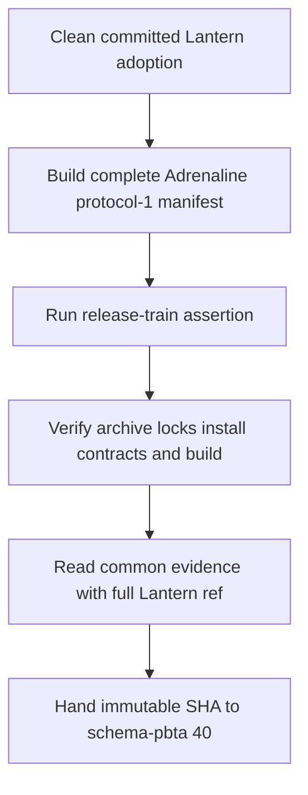
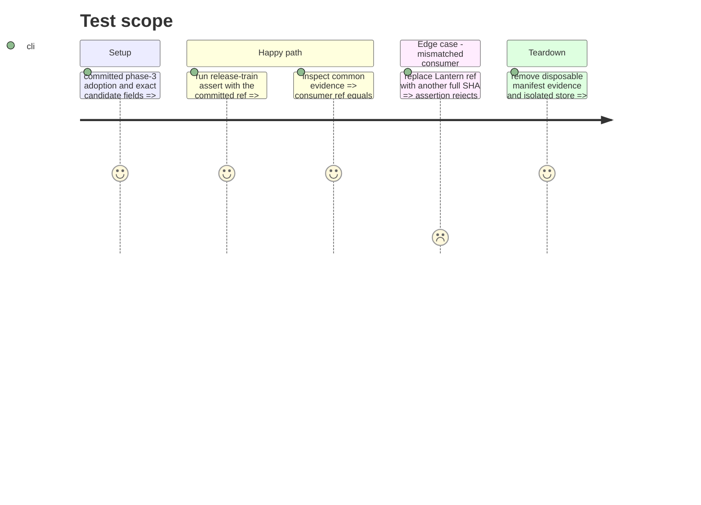

# Instruction: Committed consumer proof

## Architecture projection

> Tree of the final files. ✅ create · ✏️ modify · ❌ delete

```txt
(no tracked product files)
└── /tmp/lantern-schema-adrenaline-protocol-1.json 🧪 disposable manifest and evidence used against the clean phase-3 commit
```

## User Journey



## Test Scope



## Tasks to do

### `1)` Prove the committed Adrenaline consumer

> Exercise the real release-train entry point from the clean commit produced by phase 3.

1. Build a disposable protocol-1 manifest with provider `schema-adrenaline`, version `2.5.0`, staging tag `v2.5.0-rc.2`, final tag `v2.5.0`, SHA-256 `62033e75384f17ee21e4e5e76d231b84c25b3fdcb0d5de74ecdbc89c94be95cc`, SRI `sha512-cb/ZUmHy5LYaMQPmit7tRQIybBQWW8fFN4fgeaHZYoSZHKFuQJgIFVc3p/BhgRVhT00dT7r9DZCk7gmPMTpkjQ==`, provider commit `31c4576bc45e1fc16e4bf6592d3f3d62e7cf8b58`, and the checked-out full Lantern SHA.
2. Run `release-train:assert` from the clean committed revision and require the Adrenaline journey to pass without tracked changes.
3. Confirm the emitted evidence retains the single-`lock` contract, names both lock checks in `journey.checks`, and carries the exact Lantern SHA under `consumer.ref`.
4. Provide the proven SHA to `schema-pbta#40`; do not modify or dispatch the external coordinator from this plan.

## Test acceptance criteria

| Task | Acceptance criteria |
| --- | --- |
| 1 | The real Adrenaline release-train assertion verifies the published archive SHA/SRI, both lockfiles, frozen installation, installed version, contract conformance, and production build. |
| 1 | The generated common evidence preserves its externally accepted shape and contains the exact 40-character checked-out Lantern commit. |
| 1 | A mismatched Lantern ref is rejected and the successful proof leaves the committed repository clean. |
| 1 | Lantern's only cross-repository output is the verified evidence and immutable SHA handed to `schema-pbta#40`. |
