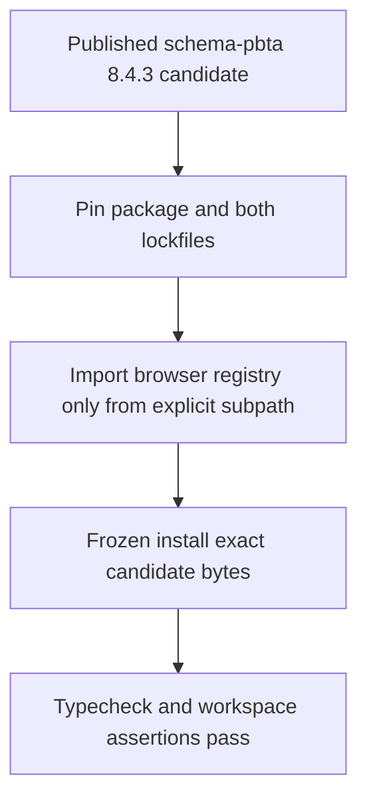
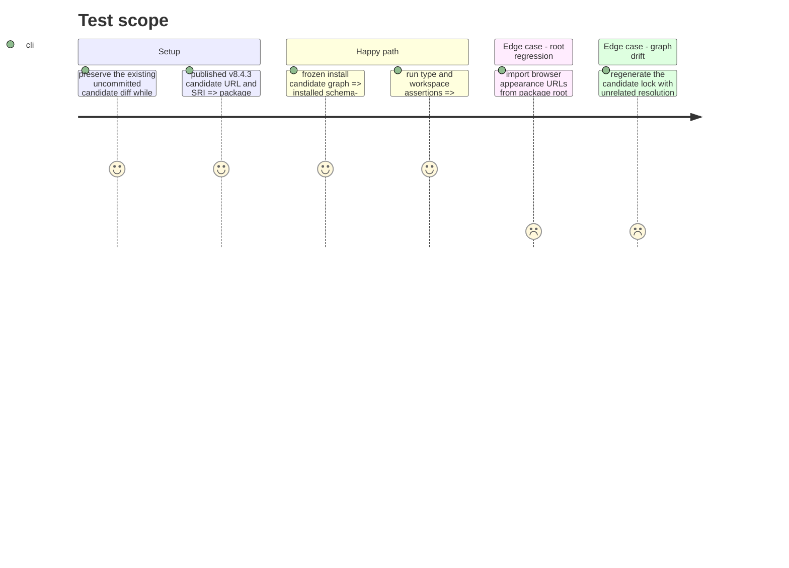

# Instruction: PbtA browser-subpath candidate adoption

## Architecture projection

> Tree of the final files. ✅ create · ✏️ modify · ❌ delete

```txt
.
├── package.json ✏️ pin the exact schema-pbta 8.4.3-rc.1 archive
├── package-lock.json ✏️ record the candidate URL, version, and SRI for npm
├── pnpm-lock.yaml ✏️ record the same candidate bytes without unrelated graph drift
├── src/templates/monsterhearts/playbook/preview/MonsterheartsPlaybookPreview.tsx ✏️ opt into the browser-only appearance URL export while retaining Vite asset imports
└── tools
    ├── assertWorkspace.harness.mts ✏️ consume the browser registry through its explicit export path
    └── prepare-schema-pbta-candidate.mjs ✏️ preserve deterministic direct-archive lock rewriting across current pnpm formatting
```

## User Journey



## Test Scope



## Tasks to do

### `1)` Adopt the staged PbtA archive

> Materialize the exact v8.4.3-rc.1 bytes in every dependency source without accepting unrelated lock changes.

1. Before product edits, move the current uncommitted candidate work onto `main` without creating another branch or worktree, and verify the diff is unchanged.
2. Pin the published candidate URL in `package.json`, `package-lock.json`, and `pnpm-lock.yaml` with version `8.4.3` and SRI `sha512-ZMPKlxqMjZlfkLVQs/ufpGVBDtP9BXpee+C2hFX6ZknNSw7PMDPNIdCTmaXWe525kQouBpsi2HSrH0CguxxYaw==`.
3. Keep the candidate preparation helper compatible with pnpm's current resolution-field ordering and reject any transitive graph drift outside the three direct schema archives.
4. Verify an isolated frozen install resolves the same candidate URL, version, and integrity in both lock formats.

### `2)` Move browser URL access behind the explicit export

> Keep runtime-neutral contracts on `schema-pbta` while opting the Vite surface into browser assets deliberately.

1. Import `PBTA_MONSTERHEARTS_APPEARANCE_ASSET_URLS` only from `schema-pbta/presentation/monsterhearts-appearance-assets` in the preview and workspace harness.
2. Retain direct Vite URL imports for the two WOFF2 fonts and two SVG marks so production emission remains consumer-owned.
3. Assert ordinary root imports no longer request the browser registry and the published presentation/runtime contracts remain available.

## Test acceptance criteria

| Task | Acceptance criteria |
| --- | --- |
| 1 | The implementation starts on `main` with the pre-existing candidate diff preserved exactly and no branch or worktree created. |
| 1 | `package.json`, both lockfiles, and the installed package agree on the exact v8.4.3-rc.1 URL, version 8.4.3, and published SRI. |
| 1 | Candidate preparation rejects unrelated dependency changes and restores the original pnpm lock on failure. |
| 2 | No Lantern import obtains `PBTA_MONSTERHEARTS_APPEARANCE_ASSET_URLS` from the package root. |
| 2 | Typechecking and workspace assertions pass using the explicit browser subpath without a consumer-local fallback. |
