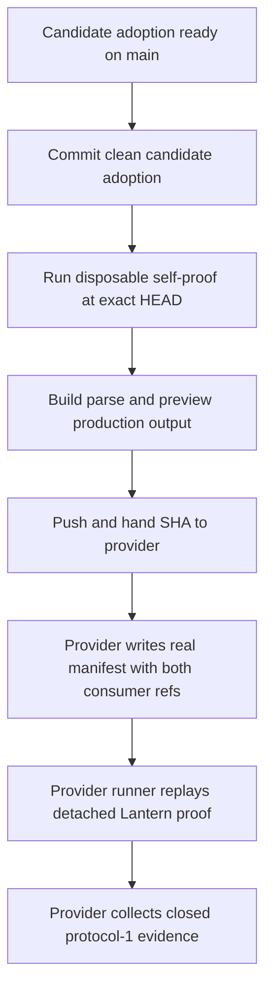
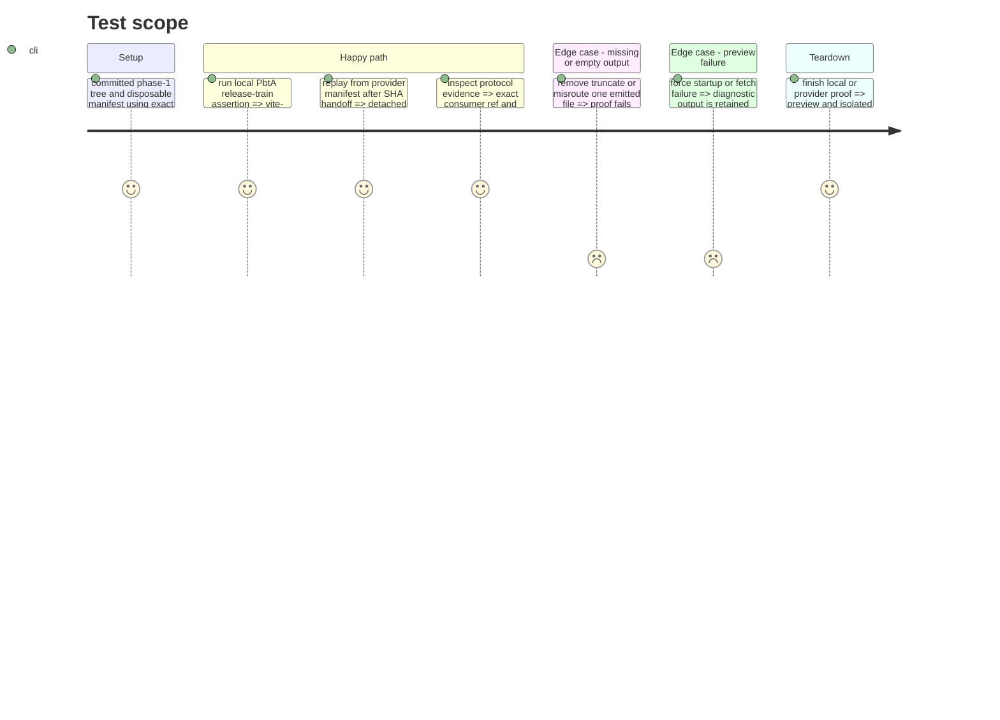

# Instruction: Runnable four-asset evidence

## Architecture projection

> Tree of the final files. ✅ create · ✏️ modify · ❌ delete

```txt
.
└── tools
    ├── assert-template-chunks.mjs ✏️ parse and fetch both fonts, both marks, the entry, and referenced JavaScript chunks through an ephemeral preview
    ├── release-train-assert.mjs ✏️ emit distinct build/four-asset checks in the closed protocol-1 evidence envelope
    └── release-train-protocol.harness.mjs ✏️ cover PbtA journey dispatch, canonical checks, and rejection of evidence-shape drift
```

## User Journey



## Test Scope



## Tasks to do

### `1)` Prove runnable Vite output

> Upgrade the existing chunk assertion from build-manifest inspection to served artifact verification.

1. Require the Vite manifest to contain a non-empty application entry and every referenced JavaScript chunk, then syntax-check each emitted module before serving it.
2. Require both Monsterhearts WOFF2 fonts and both SVG marks to be emitted as non-empty files without `file:` URLs.
3. Allocate an ephemeral loopback port, start Vite preview, and fetch the entry/chunks and all four assets with successful non-empty responses.
4. On every exit path, send `SIGTERM`, wait only for a bounded grace period, then force termination if needed; cover early exit, unavailable content, graceful cleanup, and forced cleanup in the harness.

### `2)` Emit immutable candidate evidence

> Identify the provider bytes, immutable Lantern revision, and canonical artifact checks without changing the shared evidence schema.

1. Keep `vite-build` and `monsterhearts-four-assets` as separate required PbtA journey checks.
2. Preserve the exact six-field protocol-1 envelope and identify the built consumer through its full `consumer.ref` plus the canonical `vite-build` and `monsterhearts-four-assets` journey checks; reject extra top-level or nested evidence fields.
3. Commit the candidate adoption on `main`, then build a disposable protocol-1 manifest whose Lantern ref is that exact clean `HEAD`.
4. Run the local self-proof from the clean commit, require the evidence checks without tracked changes, then push and hand the full SHA to `schema-pbta#41`.
5. Require the provider-orchestrated detached replay to invoke Lantern's fixed assertion interface at that exact SHA and collect matching closed evidence; keep local disposable evidence only until the real run is recorded.
6. Do not promote or rewrite final URLs in this phase.

## Test acceptance criteria

| Task | Acceptance criteria |
| --- | --- |
| 1 | The production build emits, syntax-checks, and preview-serves the application entry and JavaScript chunks, plus two WOFF2 fonts and two SVG marks with non-empty responses. |
| 1 | Preview startup, fetch, and assertion failures all terminate the preview process within a bounded timeout, including a forced-kill fallback, and expose useful diagnostics. |
| 2 | Passing evidence retains the closed protocol-1 shape and explicitly lists `vite-build` and `monsterhearts-four-assets`. |
| 2 | The local self-proof passes from the clean candidate commit, then the provider's real manifest names that pushed SHA and its detached replay collects matching evidence. |
