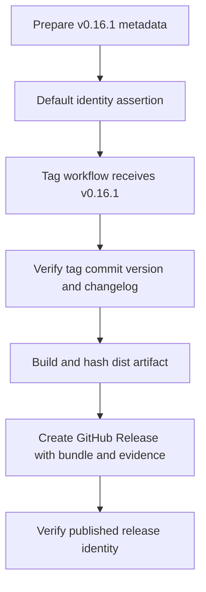
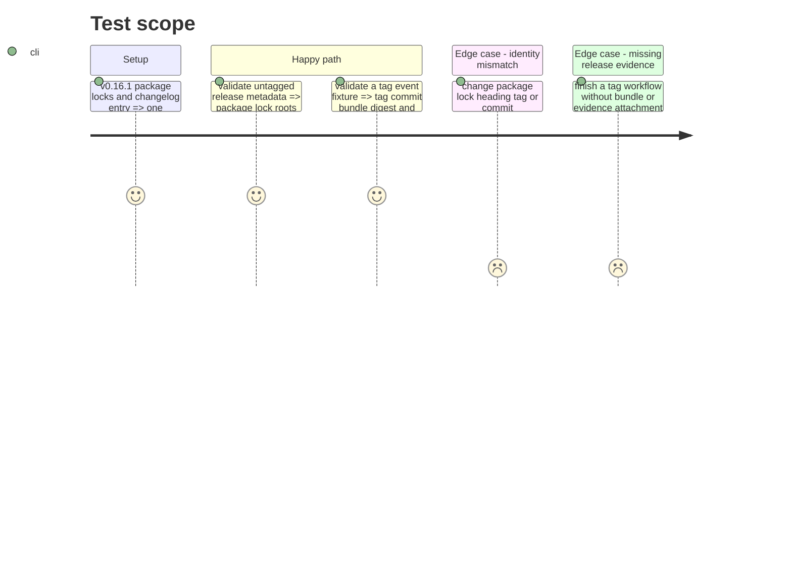

# Instruction: Lantern release identity contract

## Architecture projection

> Tree of the final files. ✅ create · ✏️ modify · ❌ delete

```txt
.
├── .github/workflows
│   ├── check.yml ✏️ run deterministic identity validation on proposed changes
│   └── release.yml ✅ build, attest, and publish one GitHub Release for a matching version tag
├── CHANGELOG.md ✏️ stage v0.16.1 release notes above the immutable v0.16.0 history
├── docs
│   └── releasing.md ✅ document the GitHub Release and artifact-evidence contract
├── package.json ✏️ declare v0.16.1 and expose identity/evidence assertions
├── package-lock.json ✏️ synchronize root package version 0.16.1
└── tools
    ├── assert-release-identity.mjs ✅ compare package locks changelog tag commit and release evidence
    └── release-identity.harness.mjs ✅ prove mismatch cases without creating tags or releases
```

## User Journey



## Test Scope



## Tasks to do

### `1)` Define and assert release identity

> Make one version and commit the authority for source metadata, user-visible versioning, and release automation.

1. Set the prospective corrective version to `0.16.1` in `package.json` and both npm lock roots, and add its changelog material without rewriting the existing v0.16.0 tag.
2. Add a pure validator for package version, lock versions, top release changelog heading, `v<version>` tag, tag commit, and expected GitHub Release/evidence metadata.
3. Add fixture-driven positive and negative coverage so ordinary checks need neither a real tag nor GitHub mutation.
4. Run the local metadata portion in `npm run check`; run tag/release portions only in the release workflow or explicit verification mode.

### `2)` Automate the GitHub Release contract

> Ensure a Lantern release tag produces auditable downloadable bytes or fails visibly.

1. Document that every `v*` Lantern tag requires a same-name GitHub Release, a production `dist` bundle, and a JSON evidence attachment; deployment evidence is not Lantern's release authority.
2. Add a least-privilege tag workflow that installs frozen dependencies, runs the complete default check, performs a fresh release build, and packages it deterministically with sorted paths and normalized archive metadata.
3. Record the version, full commit, per-file digests, and deterministic bundle digest, then publish that exact bundle plus evidence to the same existing tag.
4. Refuse prerelease dependency channels, a non-main tag commit, or any mismatch among tag, package, locks, changelog, and evidence.
5. Create the Release when absent; on retry, accept and verify an already-existing Release only when its tag, target, bundle, evidence, and digests are identical, and reject every conflict.
6. Verify the resulting GitHub Release and attachments after publication and retain actionable workflow diagnostics on failure.

## Test acceptance criteria

| Task | Acceptance criteria |
| --- | --- |
| 1 | Package metadata, npm lock roots, top release notes, and prospective `v0.16.1` identity agree, while v0.16.0 history remains untouched. |
| 1 | Fixture tests reject each independently divergent version, tag, commit, changelog, or artifact digest. |
| 2 | A valid tag fixture reaches the release step with exactly one same-name GitHub Release contract containing the production bundle and machine-readable evidence tied to the tagged commit. |
| 2 | Rebuilding unchanged `dist` files produces the same normalized release archive digest, allowing an identical workflow retry to verify rather than conflict. |
| 2 | The release workflow cannot proceed with candidate schema URLs, missing attachments, or mismatched release identity. |
